# 变更记录 (Changelog)

**[2025-01-13 更新]** 完成了 Monibuca v5 流媒体服务器项目的全面架构分析，重点分析了插件系统、任务系统、配置系统等核心组件的实现机制。添加了中文解释和模块结构图，完善了开发指引。

---

# CLAUDE.md

本文件为 Claude Code (claude.ai/code) 在此代码库中工作时提供指导。

## 项目愿景

Monibuca 是一个用 Go 语言编写的高性能流媒体服务器框架。它被设计为一个模块化、可扩展的平台，用于实时音视频流媒体传输，支持多种协议，包括 RTMP、RTSP、HLS、WebRTC、GB28181 等。

## 架构总览

### 核心设计理念

Monibuca 采用了**插件化架构**和**任务系统**作为核心设计理念：

1. **插件化架构**: 所有功能通过插件提供，包括协议处理、媒体转换、录制等
2. **任务系统**: 基于 `github.com/langhuihui/gotask` 的异步任务管理框架
3. **零拷贝设计**: 音视频数据采用环形缓冲区和零拷贝传输
4. **事件驱动**: 发布/订阅模式处理流事件和插件间通信

### 系统层次结构

```
Server (服务器实例)
├── Plugin System (插件系统)
│   ├── Protocol Plugins (协议插件: RTMP, RTSP, HLS, WebRTC, GB28181)
│   ├── Transform Plugins (转换插件: 转码、截图、水印)
│   ├── Storage Plugins (存储插件: MP4录制, FLV录制)
│   └── Utility Plugins (工具插件: 调试、定时任务、级联)
├── Task System (任务系统)
│   ├── Work (队列管理器)
│   ├── Job (任务容器)
│   └── Task (基本工作单元)
├── Stream Management (流管理)
│   ├── Publisher (发布者)
│   ├── Subscriber (订阅者)
│   └── AV Tracks (音视频轨道)
└── Configuration System (配置系统)
    ├── Global Config (全局配置)
    ├── Plugin Config (插件配置)
    └── Dynamic Config (动态配置)
```

## 模块结构图

```mermaid
graph TD
    A["(根) Monibuca 服务器"] --> B["核心模块"];
    A --> C["插件模块"];
    A --> D["工具包模块"];
    A --> E["示例配置"];

    B --> F["server.go - 服务器核心"];
    B --> G["publisher.go - 发布者"];
    B --> H["subscriber.go - 订阅者"];
    B --> I["plugin.go - 插件框架"];

    C --> J["plugin/rtmp"];
    C --> K["plugin/rtsp"];
    C --> L["plugin/hls"];
    C --> M["plugin/webrtc"];
    C --> N["plugin/gb28181"];
    C --> O["plugin/mp4"];
    C --> P["plugin/debug"];
    C --> Q["plugin/crontab"];

    D --> R["pkg/config - 配置系统"];
    D --> S["pkg/util - 通用工具"];
    D --> T["pkg/codec - 编解码器"];
    D --> U["pkg/auth - 认证系统"];
    D --> V["pkg/storage - 存储抽象"];

    E --> W["example/default"];

    click F "./server.go" "服务器核心实现"
    click G "./publisher.go" "发布者实现"
    click H "./subscriber.go" "订阅者实现"
    click I "./plugin.go" "插件框架实现"
    click R "./pkg/config/" "配置系统实现"
    click J "./plugin/rtmp/" "RTMP 协议插件"
    click K "./plugin/rtsp/" "RTSP 协议插件"
```



## 模块索引

| 模块路径 | 职责描述 | 主要接口 |
|---------|---------|---------|
| `./` | 服务器核心 | `Server`, `Publisher`, `Subscriber`, `Plugin` |
| `pkg/config/` | 分层配置系统 | 环境变量 > 配置文件 > 默认值的优先级处理 |
| `pkg/auth/` | JWT认证系统 | Token生成、验证、中间件 |
| `pkg/codec/` | 音视频编解码 | H264/H265/AV1/AAC/MP3 编解码器 |
| `pkg/util/` | 通用工具库 | 集合管理、环形缓冲区、内存池 |
| `pkg/storage/` | 存储抽象层 | S3/OSS/COS/本地存储统一接口 |
| `plugin/rtmp/` | RTMP 协议插件 | 推流、拉流、转发 |
| `plugin/rtsp/` | RTSP 协议插件 | 拉流、推流、UDP/TCP传输 |
| `plugin/hls/` | HLS 协议插件 | 直播、点播、分段传输 |
| `plugin/webrtc/` | WebRTC 插件 | P2P 流媒体传输 |
| `plugin/gb28181/` | GB28181 插件 | 国标视频监控协议 |
| `plugin/mp4/` | MP4 录制插件 | 流录制、存储集成 |
| `plugin/debug/` | 调试插件 | 性能监控、pprof 集成 |
| `plugin/crontab/` | 定时任务插件 | 定时录制计划管理 |

## 运行与开发

### 基础运行 (使用 SQLite)
```bash
cd example/default
go run -tags sqlite main.go
```

### 构建标签说明
- `sqlite` - 启用 SQLite 数据库支持
- `sqliteCGO` - 启用带 CGO 的 SQLite
- `mysql` - 启用 MySQL 数据库支持
- `postgres` - 启用 PostgreSQL 数据库支持
- `duckdb` - 启用 DuckDB 数据库支持
- `disable_rm` - 禁用内存池
- `fasthttp` - 使用 fasthttp 替代 net/http
- `taskpanic` - 启用测试时的 panic

### Protocol Buffer 生成
```bash
# 生成所有 proto 文件
sh scripts/protoc.sh

# 生成特定插件的 proto
sh scripts/protoc.sh plugin_name
```

### 发布构建
```bash
# 使用 goreleaser 配置
goreleaser build
```

## 测试策略

### 单元测试
```bash
go test ./...
```

### 集成测试
- 使用 example 配置进行多协议测试
- mock.py 脚本用于协议测试

### 性能测试
- 内置 pprof 集成用于性能分析
- VictoriaMetrics 集成用于指标监控
- 压力测试通过 `/stress` 端点进行

## 编码规范

### 插件开发规范

1. **插件结构**: 实现 `IPlugin` 接口
2. **配置管理**: 使用分层配置系统
3. **任务管理**: 使用 Work/Job/Task 模式进行异步处理
4. **错误处理**: 统一的错误处理和重试机制
5. **日志记录**: 结构化日志记录

### 异步任务开发最佳实践

#### 1. 实现 Task 接口
```go
type MyTask struct {
    task.Task
    // ... 自定义字段
}

func (t *MyTask) Start() error {
    // 初始化资源，验证输入
    return nil
}

func (t *MyTask) Run() error {
    // 主要工作执行
    // 返回 task.ErrTaskComplete 表示成功完成
    return nil
}
```

#### 2. 使用 Work 进行队列管理
```go
type MyQueueManager struct {
    task.Work
}

var myQueue MyQueueManager

func init() {
    m7s.Servers.AddTask(&myQueue)
}

// 从任何地方排队任务
myQueue.AddTask(&MyTask{...}, logger)
```

#### 3. 错误处理和重试
- 任务自动支持重试机制
- 使用 `task.SetRetry(maxRetry, interval)` 自定义重试行为
- 返回 `task.ErrTaskComplete` 表示成功完成
- 返回其他错误以触发重试或失败处理

### 跨插件通信模式

#### 1. 全局实例模式
```go
// 公开全局实例用于跨插件访问
var s3PluginInstance *S3Plugin

func (p *S3Plugin) Start() error {
    s3PluginInstance = p  // 设置全局实例
    // ... 其余启动逻辑
}

// 提供公共 API 函数
func TriggerUpload(filePath string, deleteAfter bool) {
    if s3PluginInstance != nil {
        s3PluginInstance.QueueUpload(filePath, objectKey, deleteAfter)
    }
}
```

#### 2. 事件驱动集成
```go
// 在一个插件中：完成后触发事件
if t.filePath != "" {
    t.Info("MP4 文件处理完成，触发 S3 上传")
    s3plugin.TriggerUpload(t.filePath, false)
}
```

## AI 使用指引

### 开发建议

1. **架构理解**: 重点关注插件系统和任务系统的协作模式
2. **异步处理**: 所有 I/O 操作都应使用任务系统进行异步处理
3. **内存管理**: 利用内存池和零拷贝设计提升性能
4. **配置优先级**: 理解动态修改 > 环境变量 > 配置文件 > 默认值的优先级
5. **流媒体处理**: 了解 Publisher/Subscriber 模式和 AV Track 管理

### 常见开发模式

1. **新建协议插件**: 实现 `IPlugin` 接口，注册协议处理器
2. **媒体处理**: 使用 `PublishWriter` 和 `SubscribeReader` 进行流处理
3. **存储集成**: 实现 `IRecorder` 接口进行录制功能
4. **跨插件协作**: 使用全局实例模式或事件系统进行通信

### 任务系统调试

- 任务自动包含详细的日志记录，包括任务 ID 和类型
- 使用 `task.Debug/Info/Warn/Error` 方法进行一致的日志记录
- 任务状态和进度可以通过描述进行监控
- 事件循环状态和队列长度会自动记录

### 性能注意事项

- 默认启用内存池（使用 `disable_rm` 禁用）
- 尽可能使用零拷贝设计处理媒体数据
- 高并发场景使用无锁数据结构
- 高效的缓冲区管理使用环形缓冲区
- 基于队列的处理防止阻塞主线程

---

## 原始英文文档

This file provides guidance to Claude Code (claude.ai/code) when working with code in this repository.

### Core Components

**Server (`server.go`):** Main server instance that manages plugins, streams, and configurations. Implements the central event loop and lifecycle management.

**Plugin System (`plugin.go`):** Modular architecture where functionality is provided through plugins. Each plugin implements the `IPlugin` interface and can provide:
- Protocol handlers (RTMP, RTSP, etc.)
- Media transformers
- Pull/Push proxies
- Recording capabilities
- Custom HTTP endpoints

**Configuration System (`pkg/config/`):** Hierarchical configuration system with priority order: dynamic modifications > environment variables > config files > default YAML > global config > defaults.

**Task System (`pkg/task/`):** Advanced asynchronous task management system with multiple layers:
- **Task:** Basic unit of work with lifecycle management (Start/Run/Dispose)
- **Job:** Container that manages multiple child tasks and provides event loops
- **Work:** Special type of Job that acts as a persistent queue manager (keepalive=true)
- **Channel:** Event-driven task for handling continuous data streams

### Task System Deep Dive

#### Task Hierarchy and Lifecycle
```
Work (Queue Manager)
  └── Job (Container with Event Loop)
      └── Task (Basic Work Unit)
          ├── Start() - Initialization phase
          ├── Run() - Main execution phase
          └── Dispose() - Cleanup phase
```

#### Queue-based Asynchronous Processing
The Task system supports sophisticated queue-based processing patterns:

1. **Work as Queue Manager:** Work instances stay alive indefinitely and manage queues of tasks
2. **Task Queuing:** Use `workInstance.AddTask(task, logger)` to queue tasks
3. **Automatic Lifecycle:** Tasks are automatically started, executed, and disposed
4. **Error Handling:** Built-in retry mechanisms and error propagation

**Example Pattern (from S3 plugin):**
```go
type UploadQueueTask struct {
    task.Work  // Persistent queue manager
}

type FileUploadTask struct {
    task.Task  // Individual work item
    // ... task-specific fields
}

// Initialize queue manager (typically in init())
var uploadQueueTask UploadQueueTask
m7s.Servers.AddTask(&uploadQueueTask)

// Queue individual tasks
uploadQueueTask.AddTask(&FileUploadTask{...}, logger)
```

#### Cross-Plugin Task Cooperation
Tasks can coordinate across different plugins through:

1. **Global Instance Pattern:** Plugins expose global instances for cross-plugin access
2. **Event-based Triggers:** One plugin triggers tasks in another plugin
3. **Shared Queue Managers:** Multiple plugins can use the same Work instance

**Example (MP4 → S3 Integration):**
```go
// In MP4 plugin: trigger S3 upload after recording completes
s3plugin.TriggerUpload(filePath, deleteAfter)

// S3 plugin receives trigger and queues upload task
func TriggerUpload(filePath string, deleteAfter bool) {
    if s3PluginInstance != nil {
        s3PluginInstance.QueueUpload(filePath, objectKey, deleteAfter)
    }
}
```

### Key Interfaces

**Publisher:** Handles incoming media streams and manages track information
**Subscriber:** Handles outgoing media streams to clients
**Puller:** Pulls streams from external sources
**Pusher:** Pushes streams to external destinations
**Transformer:** Processes/transcodes media streams
**Recorder:** Records streams to storage

### Stream Processing Flow

1. **Publisher** receives media data and creates tracks
2. **Tracks** handle audio/video data with specific codecs
3. **Subscribers** attach to publishers to receive media
4. **Transformers** can process streams between publishers and subscribers
5. **Plugins** provide protocol-specific implementations

### Post-Recording Workflow

Monibuca implements a sophisticated post-recording processing pipeline:

1. **Recording Completion:** MP4 recorder finishes writing stream data
2. **Trailer Writing:** Asynchronous task moves MOOV box to file beginning for web compatibility
3. **File Optimization:** Temporary file operations ensure atomic updates
4. **External Storage Integration:** Automatic upload to S3-compatible services
5. **Cleanup:** Optional local file deletion after successful upload

This workflow uses queue-based task processing to avoid blocking the main recording pipeline.

### Configuration Structure

#### Global Configuration
- HTTP/TCP/UDP/QUIC listeners
- Database connections (SQLite, MySQL, PostgreSQL, DuckDB)
- Authentication settings
- Admin interface settings
- Global stream alias mappings

#### Plugin Configuration
Each plugin can define its own configuration structure that gets merged with global settings.

### Database Integration

Supports multiple database backends:
- **SQLite:** Default lightweight option
- **MySQL:** Production deployments
- **PostgreSQL:** Production deployments
- **DuckDB:** Analytics use cases

Automatic migration is handled for core models including users, proxies, and stream aliases.

### Protocol Support

#### Built-in Plugins
- **RTMP:** Real-time messaging protocol
- **RTSP:** Real-time streaming protocol
- **HLS:** HTTP live streaming
- **WebRTC:** Web real-time communication
- **GB28181:** Chinese surveillance standard
- **FLV:** Flash video format
- **MP4:** MPEG-4 format with post-processing capabilities
- **SRT:** Secure reliable transport
- **S3:** File upload integration with AWS S3/MinIO compatibility

### Authentication & Security

- JWT-based authentication for admin interface
- Stream-level authentication with URL signing
- Role-based access control (admin/user)
- Webhook support for external auth integration

### Performance Considerations
- Memory pool is enabled by default (disable with `disable_rm`)
- Zero-copy design for media data where possible
- Lock-free data structures for high concurrency
- Efficient buffer management with ring buffers
- Queue-based processing prevents blocking main threads

### Common Issues

#### Port Conflicts
- Default HTTP port: 8080
- Default gRPC port: 50051
- Check plugin-specific port configurations

#### Database Connection
- Ensure proper build tags for database support
- Check DSN configuration strings
- Verify database file permissions

#### Plugin Loading
- Plugins are auto-discovered from imports
- Check plugin enable/disable status
- Verify configuration merging

#### Task System Issues
- Ensure Work instances are added to server during initialization
- Check task queue status if tasks aren't executing
- Verify proper error handling in task implementation
- Monitor task retry counts and failure reasons in logs

## 变更记录 (Changelog)

**[2025-01-13]**
- 完成项目架构全面分析
- 添加模块结构图和索引
- 整理核心组件实现机制
- 完善开发指引和最佳实践
- 增加中文解释和翻译
- 保留原始英文文档以供参考