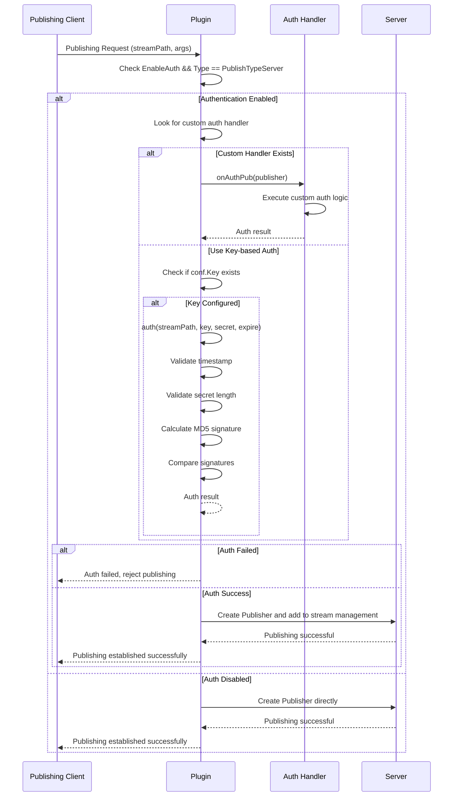
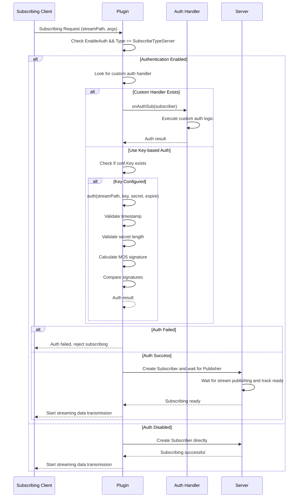

# Stream Authentication Mechanism

Monibuca V5 provides a comprehensive stream authentication mechanism to control access permissions for publishing and subscribing to streams. The authentication mechanism supports multiple methods, including key-based signature authentication and custom authentication handlers.

## Authentication Principles

### 1. Authentication Flow Sequence Diagrams

#### Publishing Authentication Sequence Diagram



#### Subscribing Authentication Sequence Diagram



### 2. Authentication Trigger Points

Authentication is triggered in the following two scenarios:

- **Publishing Authentication**: Triggered when there's a publishing request in the `PublishWithConfig` method
- **Subscribing Authentication**: Triggered when there's a subscribing request in the `SubscribeWithConfig` method

### 3. Authentication Condition Checks

Authentication is only executed when the following conditions are met simultaneously:

```go
if p.config.EnableAuth && publisher.Type == PublishTypeServer
```

- `EnableAuth`: Authentication is enabled in the plugin configuration
- `Type == PublishTypeServer/SubscribeTypeServer`: Only authenticate server-type publishing/subscribing

### 4. Authentication Method Priority

The system executes authentication in the following priority order:

1. **Custom Authentication Handler** (Highest priority)
2. **Key-based Signature Authentication**
3. **No Authentication** (Default pass)

## Custom Authentication Handlers

### Publishing Authentication Handler

```go
onAuthPub := p.Meta.OnAuthPub
if onAuthPub == nil {
    onAuthPub = p.Server.Meta.OnAuthPub
}
if onAuthPub != nil {
    if err = onAuthPub(publisher).Await(); err != nil {
        p.Warn("auth failed", "error", err)
        return
    }
}
```

Authentication handler lookup order:
1. Plugin-level authentication handler `p.Meta.OnAuthPub`
2. Server-level authentication handler `p.Server.Meta.OnAuthPub`

### Subscribing Authentication Handler

```go
onAuthSub := p.Meta.OnAuthSub
if onAuthSub == nil {
    onAuthSub = p.Server.Meta.OnAuthSub
}
if onAuthSub != nil {
    if err = onAuthSub(subscriber).Await(); err != nil {
        p.Warn("auth failed", "error", err)
        return
    }
}
```

## Key-based Signature Authentication

When there's no custom authentication handler, if a Key is configured, the system will use MD5-based signature authentication mechanism.

### Authentication Algorithm

```go
func (p *Plugin) auth(streamPath string, key string, secret string, expire string) (err error) {
    // 1. Validate expiration time
    if unixTime, err := strconv.ParseInt(expire, 16, 64); err != nil || time.Now().Unix() > unixTime {
        return fmt.Errorf("auth failed expired")
    }
    
    // 2. Validate secret length
    if len(secret) != 32 {
        return fmt.Errorf("auth failed secret length must be 32")
    }
    
    // 3. Calculate the true secret
    trueSecret := md5.Sum([]byte(key + streamPath + expire))
    
    // 4. Compare secrets
    if secret == hex.EncodeToString(trueSecret[:]) {
        return nil
    }
    return fmt.Errorf("auth failed invalid secret")
}
```

### Signature Calculation Steps

1. **Construct signature string**: `key + streamPath + expire`
2. **MD5 encryption**: Perform MD5 hash on the signature string
3. **Hexadecimal encoding**: Convert MD5 result to 32-character hexadecimal string
4. **Verify signature**: Compare calculation result with client-provided secret

### Parameter Description

| Parameter | Type | Description | Example |
|-----------|------|-------------|---------|
| key | string | Secret key set in configuration file | "mySecretKey" |
| streamPath | string | Stream path | "live/test" |
| expire | string | Expiration timestamp (hexadecimal) | "64a1b2c3" |
| secret | string | Client-calculated signature (32-char hex) | "5d41402abc4b2a76b9719d911017c592" |

### Timestamp Handling

- Expiration time uses hexadecimal Unix timestamp
- System validates if current time exceeds expiration time
- Timestamp parsing failure or expiration will cause authentication failure

## API Key Generation

The system also provides API interfaces for key generation, supporting authentication needs for admin dashboard:

```go
p.handle("/api/secret/{type}/{streamPath...}", http.HandlerFunc(func(rw http.ResponseWriter, r *http.Request) {
    // JWT Token validation
    authHeader := r.Header.Get("Authorization")
    tokenString := strings.TrimPrefix(authHeader, "Bearer ")
    _, err := p.Server.ValidateToken(tokenString)
    
    // Generate publishing or subscribing key
    streamPath := r.PathValue("streamPath")
    t := r.PathValue("type")
    expire := r.URL.Query().Get("expire")
    
    if t == "publish" {
        secret := md5.Sum([]byte(p.config.Publish.Key + streamPath + expire))
        rw.Write([]byte(hex.EncodeToString(secret[:])))
    } else if t == "subscribe" {
        secret := md5.Sum([]byte(p.config.Subscribe.Key + streamPath + expire))
        rw.Write([]byte(hex.EncodeToString(secret[:])))
    }
}))
```

## Configuration Examples

### Enable Authentication

```yaml
# Plugin configuration
rtmp:
  enableAuth: true
  publish:
    key: "your-publish-key"
  subscribe:
    key: "your-subscribe-key"
```

### Publishing URL Example

```
rtmp://localhost/live/test?secret=5d41402abc4b2a76b9719d911017c592&expire=64a1b2c3
```

### Subscribing URL Example

```
http://localhost:8080/flv/live/test.flv?secret=a1b2c3d4e5f6789012345678901234ab&expire=64a1b2c3
```

## Security Considerations

1. **Key Protection**: Keys in configuration files should be properly secured to prevent leakage
2. **Time Window**: Set reasonable expiration times to balance security and usability
3. **HTTPS Transport**: Use HTTPS for transmitting authentication parameters in production
4. **Logging**: Authentication failures are logged as warnings for security auditing

## Error Handling

Common causes of authentication failure:

- `auth failed expired`: Timestamp expired or format error
- `auth failed secret length must be 32`: Incorrect secret length
- `auth failed invalid secret`: Signature verification failed
- `invalid token`: JWT verification failed during API key generation
