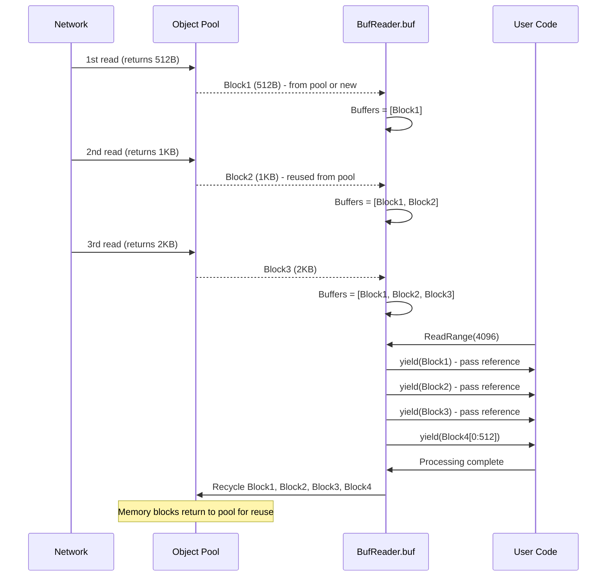
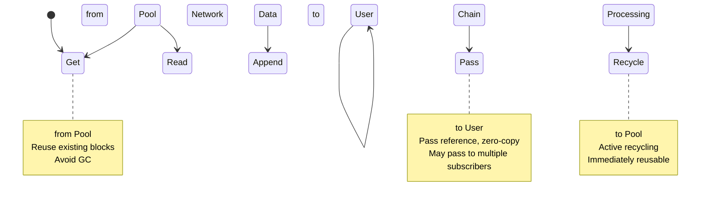

# BufReader: Zero-Copy Network Reading with Non-Contiguous Memory Buffers

## Table of Contents

- [1. Problem: Traditional Contiguous Memory Buffer Bottlenecks](#1-problem-traditional-contiguous-memory-buffer-bottlenecks)
- [2. Core Solution: Non-Contiguous Memory Buffer Passing Mechanism](#2-core-solution-non-contiguous-memory-buffer-passing-mechanism)
- [3. Performance Validation](#3-performance-validation)
- [4. Usage Guide](#4-usage-guide)

## TL;DR (Key Takeaways)

**Core Innovation**: Non-Contiguous Memory Buffer Passing Mechanism
- Data stored as **chained memory blocks**, non-contiguous layout
- Pass references via **ReadRange callback**, zero-copy
- Memory blocks **reused from object pool**, avoiding allocation and GC

**Performance Data** (Streaming server, 100 concurrent streams):
```
bufio.Reader: 79 GB allocated, 134 GCs, 374.6 ns/op
BufReader:    0.6 GB allocated, 2 GCs, 30.29 ns/op

Result: 98.5% GC reduction, 11.6x throughput improvement
```

**Ideal For**: High-concurrency network servers, streaming media, long-running services

---

## 1. Problem: Traditional Contiguous Memory Buffer Bottlenecks

### 1.1 bufio.Reader's Contiguous Memory Model

The standard library `bufio.Reader` uses a **fixed-size contiguous memory buffer**:

```go
type Reader struct {
    buf []byte    // Single contiguous buffer (e.g., 4KB)
    r, w int      // Read/write pointers
}

func (b *Reader) Read(p []byte) (n int, err error) {
    // Copy from contiguous buffer to target
    n = copy(p, b.buf[b.r:b.w])  // Must copy
    return
}
```

**Cost of Contiguous Memory**:

```
Reading 16KB data (with 4KB buffer):

Network → bufio buffer → User buffer
  ↓      (4KB contiguous)    ↓
1st      [████]  →  Copy to result[0:4KB]
2nd      [████]  →  Copy to result[4KB:8KB]
3rd      [████]  →  Copy to result[8KB:12KB]
4th      [████]  →  Copy to result[12KB:16KB]

Total: 4 network reads + 4 memory copies
Allocates result (16KB contiguous memory)
```

### 1.2 Issues in High-Concurrency Scenarios

In streaming servers (100 concurrent connections, 30fps each):

```go
// Typical processing pattern
func handleStream(conn net.Conn) {
    reader := bufio.NewReaderSize(conn, 4096)
    for {
        // Allocate contiguous buffer for each packet
        packet := make([]byte, 1024)  // Allocation 1
        n, _ := reader.Read(packet)   // Copy 1
        
        // Forward to multiple subscribers
        for _, sub := range subscribers {
            data := make([]byte, n)  // Allocations 2-N
            copy(data, packet[:n])   // Copies 2-N
            sub.Write(data)
        }
    }
}

// Performance impact:
// 100 connections × 30fps × (1 + subscribers) allocations = massive temporary memory
// Triggers frequent GC, system instability
```

**Core Problems**:
1. Must maintain contiguous memory layout → Frequent copying
2. Allocate new buffer for each packet → Massive temporary objects
3. Forwarding requires multiple copies → CPU wasted on memory operations

## 2. Core Solution: Non-Contiguous Memory Buffer Passing Mechanism

### 2.1 Design Philosophy

BufReader uses **non-contiguous memory block chains**:

```
No longer require data in contiguous memory:
1. Data scattered across multiple memory blocks (linked list)
2. Each block independently managed and reused
3. Pass by reference, no data copying
```

**Core Data Structures**:

```go
type BufReader struct {
    Allocator *ScalableMemoryAllocator  // Object pool allocator
    buf       MemoryReader               // Memory block chain
}

type MemoryReader struct {
    Buffers [][]byte  // Multiple memory blocks, non-contiguous!
    Size    int       // Total size
    Length  int       // Readable length
}
```

### 2.2 Non-Contiguous Memory Buffer Model

#### Contiguous vs Non-Contiguous Comparison

```
bufio.Reader (Contiguous Memory):
┌─────────────────────────────────┐
│ 4KB Fixed Buffer                │
│ [Read][Available]               │
└─────────────────────────────────┘
- Must copy to contiguous target buffer
- Fixed size limitation
- Read portion wastes space

BufReader (Non-Contiguous Memory):
┌──────┐ ┌──────┐ ┌────────┐ ┌──────┐
│Block1│→│Block2│→│ Block3 │→│Block4│
│ 512B │ │ 1KB  │ │  2KB   │ │ 3KB  │
└──────┘ └──────┘ └────────┘ └──────┘
- Directly pass reference to each block (zero-copy)
- Flexible block sizes
- Recycle immediately after processing
```

#### Memory Block Chain Workflow



### 2.3 Zero-Copy Passing: ReadRange API

**Core API**:

```go
func (r *BufReader) ReadRange(n int, yield func([]byte)) error
```

**How It Works**:

```go
// Internal implementation (simplified)
func (r *BufReader) ReadRange(n int, yield func([]byte)) error {
    remaining := n
    
    // Iterate through memory block chain
    for _, block := range r.buf.Buffers {
        if remaining <= 0 {
            break
        }
        
        if len(block) <= remaining {
            // Pass entire block
            yield(block)  // Zero-copy: pass reference directly!
            remaining -= len(block)
        } else {
            // Pass portion
            yield(block[:remaining])
            remaining = 0
        }
    }
    
    // Recycle processed blocks
    r.recycleFront()
    return nil
}
```

**Usage Example**:

```go
// Read 4096 bytes of data
reader.ReadRange(4096, func(chunk []byte) {
    // chunk is reference to original memory block
    // May be called multiple times with different sized blocks
    // e.g.: 512B, 1KB, 2KB, 512B
    
    processData(chunk)  // Process directly, zero-copy!
})

// Characteristics:
// - No need to allocate target buffer
// - No need to copy data
// - Each chunk automatically recycled after processing
```

### 2.4 Advantages in Real Network Scenarios

**Scenario: Read 10KB from network, each read returns 500B-2KB**

```
bufio.Reader (Contiguous Memory):
1. Read 2KB to internal buffer (contiguous)
2. Copy 2KB to user buffer ← Copy
3. Read 1.5KB to internal buffer
4. Copy 1.5KB to user buffer ← Copy
5. Read 2KB...
6. Copy 2KB... ← Copy
... Repeat ...
Total: Multiple network reads + Multiple memory copies
Must allocate 10KB contiguous buffer

BufReader (Non-Contiguous Memory):
1. Read 2KB → Block1, append to chain
2. Read 1.5KB → Block2, append to chain
3. Read 2KB → Block3, append to chain
4. Read 2KB → Block4, append to chain
5. Read 2.5KB → Block5, append to chain
6. ReadRange(10KB):
   → yield(Block1) - 2KB
   → yield(Block2) - 1.5KB
   → yield(Block3) - 2KB
   → yield(Block4) - 2KB
   → yield(Block5) - 2.5KB
Total: Multiple network reads + 0 memory copies
No contiguous memory needed, process block by block
```

### 2.5 Real Application: Stream Forwarding

**Problem Scenario**: 100 concurrent streams, each forwarded to 10 subscribers

**Traditional Approach** (Contiguous Memory):

```go
func forwardStream_Traditional(reader *bufio.Reader, subscribers []net.Conn) {
    packet := make([]byte, 4096)  // Alloc 1: contiguous memory
    n, _ := reader.Read(packet)   // Copy 1: from bufio buffer
    
    // Copy for each subscriber
    for _, sub := range subscribers {
        data := make([]byte, n)  // Allocs 2-11: 10 times
        copy(data, packet[:n])   // Copies 2-11: 10 times
        sub.Write(data)
    }
}
// Per packet: 11 allocations + 11 copies
// 100 concurrent × 30fps × 11 = 33,000 allocations/sec
```

**BufReader Approach** (Non-Contiguous Memory):

```go
func forwardStream_BufReader(reader *BufReader, subscribers []net.Conn) {
    reader.ReadRange(4096, func(chunk []byte) {
        // chunk is original memory block reference, may be non-contiguous
        // All subscribers share the same memory block!
        
        for _, sub := range subscribers {
            sub.Write(chunk)  // Send reference directly, zero-copy
        }
    })
}
// Per packet: 0 allocations + 0 copies
// 100 concurrent × 30fps × 0 = 0 allocations/sec
```

**Performance Comparison**:
- Allocations: 33,000/sec → 0/sec
- Memory copies: 33,000/sec → 0/sec
- GC pressure: High → Very low

### 2.6 Memory Block Lifecycle



**Key Points**:
1. Memory blocks **circularly reused** in pool, bypassing GC
2. Pass references instead of copying data, achieving zero-copy
3. Recycle immediately after processing, minimizing memory footprint

### 2.7 Core Code Implementation

```go
// Create BufReader
func NewBufReader(reader io.Reader) *BufReader {
    return &BufReader{
        Allocator: NewScalableMemoryAllocator(16384), // Object pool
        feedData: func() error {
            // Get memory block from pool, read network data directly
            buf, err := r.Allocator.Read(reader, r.BufLen)
            if err != nil {
                return err
            }
            // Append to chain (only add reference)
            r.buf.Buffers = append(r.buf.Buffers, buf)
            r.buf.Length += len(buf)
            return nil
        },
    }
}

// Zero-copy reading
func (r *BufReader) ReadRange(n int, yield func([]byte)) error {
    for r.buf.Length < n {
        r.feedData()  // Read more data from network
    }
    
    // Pass references block by block
    for _, block := range r.buf.Buffers {
        yield(block)  // Zero-copy passing
    }
    
    // Recycle processed blocks
    r.recycleFront()
    return nil
}

// Recycle memory blocks to pool
func (r *BufReader) Recycle() {
    if r.Allocator != nil {
        r.Allocator.Recycle()  // Return all blocks to pool
    }
}
```

## 3. Performance Validation

### 3.1 Test Design

**Real Network Simulation**: Each read returns random size (64-2048 bytes), simulating real network fluctuations

**Core Test Scenarios**:
1. **Concurrent Network Connection Reading** - Simulate 100+ concurrent connections
2. **GC Pressure Test** - Demonstrate long-term running differences
3. **Streaming Server** - Real business scenario (100 streams × forwarding)

### 3.2 Performance Test Results

**Test Environment**: Apple M2 Pro, Go 1.23.0

#### GC Pressure Test (Core Comparison)

| Metric | bufio.Reader | BufReader | Improvement |
|--------|-------------|-----------|-------------|
| Operation Latency | 1874 ns/op | 112.7 ns/op | **16.6x faster** |
| Allocation Count | 5,576,659 | 3,918 | **99.93% reduction** |
| Per Operation | 2 allocs/op | 0 allocs/op | **Zero allocation** |
| Throughput | 2.8M ops/s | 45.7M ops/s | **16x improvement** |

#### Streaming Server Scenario

| Metric | bufio.Reader | BufReader | Improvement |
|--------|-------------|-----------|-------------|
| Operation Latency | 374.6 ns/op | 30.29 ns/op | **12.4x faster** |
| Memory Allocation | 79,508 MB | 601 MB | **99.2% reduction** |
| **GC Runs** | **134** | **2** | **98.5% reduction** ⭐ |
| Throughput | 10.1M ops/s | 117M ops/s | **11.6x improvement** |

#### Performance Visualization

```
📊 GC Runs Comparison (Core Advantage)
━━━━━━━━━━━━━━━━━━━━━━━━━━━━━━━━━━━━━━━━━━━
bufio.Reader   ████████████████████████████████████████████████████████████████  134 runs
BufReader      █  2 runs  ← 98.5% reduction!

📊 Total Memory Allocation
━━━━━━━━━━━━━━━━━━━━━━━━━━━━━━━━━━━━━━━━━━━
bufio.Reader   ████████████████████████████████████████████████████████████████  79 GB
BufReader      █  0.6 GB  ← 99.2% reduction!

📊 Throughput Comparison
━━━━━━━━━━━━━━━━━━━━━━━━━━━━━━━━━━━━━━━━━━━
bufio.Reader   █████  10.1M ops/s
BufReader      ████████████████████████████████████████████████████████  117M ops/s
```

### 3.3 Why Non-Contiguous Memory Is So Fast

**Reason 1: Zero-Copy Passing**
```go
// bufio - Must copy
buf := make([]byte, 1024)
reader.Read(buf)  // Copy to contiguous memory

// BufReader - Pass reference
reader.ReadRange(1024, func(chunk []byte) {
    // chunk is original memory block, no copy
})
```

**Reason 2: Memory Block Reuse**
```
bufio: Allocate → Use → GC → Reallocate → ...
BufReader: Allocate → Use → Return to pool → Reuse from pool → ...
         ↑ Same memory block reused repeatedly, no GC
```

**Reason 3: Multi-Subscriber Sharing**
```
Traditional: 1 packet → Copy 10 times → 10 subscribers
BufReader: 1 packet → Pass reference → 10 subscribers share
          ↑ Only 1 memory block, all 10 subscribers reference it
```

## 4. Usage Guide

### 4.1 Basic Usage

```go
func handleConnection(conn net.Conn) {
    // Create BufReader
    reader := util.NewBufReader(conn)
    defer reader.Recycle()  // Return all blocks to pool
    
    // Zero-copy read and process
    reader.ReadRange(4096, func(chunk []byte) {
        // chunk is non-contiguous memory block
        // Process directly, no copy needed
        processChunk(chunk)
    })
}
```

### 4.2 Real-World Use Cases

**Scenario 1: Protocol Parsing**

```go
// Parse FLV packet (header + data)
func parseFLV(reader *BufReader) {
    // Read packet type (1 byte)
    packetType, _ := reader.ReadByte()
    
    // Read data size (3 bytes)
    dataSize, _ := reader.ReadBE32(3)
    
    // Skip timestamp etc (7 bytes)
    reader.Skip(7)
    
    // Zero-copy read data (may span multiple non-contiguous blocks)
    reader.ReadRange(int(dataSize), func(chunk []byte) {
        // chunk may be complete data or partial
        // Parse block by block, no need to wait for complete data
        parseDataChunk(packetType, chunk)
    })
}
```

**Scenario 2: High-Concurrency Forwarding**

```go
// Read from one source, forward to multiple targets
func relay(source *BufReader, targets []io.Writer) {
    reader.ReadRange(8192, func(chunk []byte) {
        // All targets share the same memory block
        for _, target := range targets {
            target.Write(chunk)  // Zero-copy forwarding
        }
    })
}
```

**Scenario 3: Streaming Server**

```go
// Receive RTSP stream and distribute to subscribers
type Stream struct {
    reader      *BufReader
    subscribers []*Subscriber
}

func (s *Stream) Process() {
    s.reader.ReadRange(65536, func(frame []byte) {
        // frame may be part of video frame (non-contiguous)
        // Send directly to all subscribers
        for _, sub := range s.subscribers {
            sub.WriteFrame(frame)  // Shared memory, zero-copy
        }
    })
}
```

### 4.3 Best Practices

**✅ Correct Usage**:

```go
// 1. Always recycle resources
reader := util.NewBufReader(conn)
defer reader.Recycle()

// 2. Process directly in callback, don't save references
reader.ReadRange(1024, func(data []byte) {
    processData(data)  // ✅ Process immediately
})

// 3. Explicitly copy when retention needed
var saved []byte
reader.ReadRange(1024, func(data []byte) {
    saved = append(saved, data...)  // ✅ Explicit copy
})
```

**❌ Wrong Usage**:

```go
// ❌ Don't save references
var dangling []byte
reader.ReadRange(1024, func(data []byte) {
    dangling = data  // Wrong: data will be recycled
})
// dangling is now a dangling reference!

// ❌ Don't forget to recycle
reader := util.NewBufReader(conn)
// Missing defer reader.Recycle()
// Memory blocks cannot be returned to pool
```

### 4.4 Performance Optimization Tips

**Tip 1: Batch Processing**

```go
// ✅ Optimized: Read multiple packets at once
reader.ReadRange(65536, func(chunk []byte) {
    // One chunk may contain multiple packets
    for len(chunk) >= 4 {
        size := int(binary.BigEndian.Uint32(chunk[:4]))
        packet := chunk[4 : 4+size]
        processPacket(packet)
        chunk = chunk[4+size:]
    }
})
```

**Tip 2: Choose Appropriate Block Size**

```go
// Choose based on application scenario
const (
    SmallPacket  = 4 << 10   // 4KB  - RTSP/HTTP
    MediumPacket = 16 << 10  // 16KB - Audio streams
    LargePacket  = 64 << 10  // 64KB - Video streams
)

reader := util.NewBufReaderWithBufLen(conn, LargePacket)
```

## 5. Summary

### Core Innovation: Non-Contiguous Memory Buffering

BufReader's core is not "better buffering" but **fundamentally changing the memory layout model**:

```
Traditional thinking: Data must be in contiguous memory
BufReader: Data can be scattered across blocks, passed by reference

Result:
✓ Zero-copy: No need to reassemble into contiguous memory
✓ Zero allocation: Memory blocks reused from object pool
✓ Zero GC pressure: No temporary objects created
```

### Key Advantages

| Feature | Implementation | Performance Impact |
|---------|---------------|-------------------|
| **Zero-Copy** | Pass memory block references | No copy overhead |
| **Zero Allocation** | Object pool reuse | 98.5% GC reduction |
| **Multi-Subscriber Sharing** | Same block referenced multiple times | 10x+ memory savings |
| **Flexible Block Sizes** | Adapt to network fluctuations | No reassembly needed |

### Ideal Use Cases

| Scenario | Recommended | Reason |
|----------|------------|---------|
| **High-concurrency network servers** | BufReader ⭐ | 98% GC reduction, 10x+ throughput |
| **Stream forwarding** | BufReader ⭐ | Zero-copy multicast, memory sharing |
| **Protocol parsers** | BufReader ⭐ | Parse block by block, no complete packet needed |
| **Long-running services** | BufReader ⭐ | Stable system, minimal GC impact |
| Simple file reading | bufio.Reader | Standard library sufficient |

### Key Points

Remember when using BufReader:

1. **Accept non-contiguous data**: Process each block via callback
2. **Don't hold references**: Data recycled after callback returns
3. **Leverage ReadRange**: This is the core zero-copy API
4. **Must call Recycle()**: Return memory blocks to pool

### Performance Data

**Streaming Server (100 concurrent streams, continuous running)**:

```
1-hour running estimation:

bufio.Reader (Contiguous Memory):
- Allocates 2.8 TB memory
- Triggers 4,800 GCs
- Frequent system pauses

BufReader (Non-Contiguous Memory):
- Allocates 21 GB memory (133x less)
- Triggers 72 GCs (67x less)
- Almost no GC impact
```

### Testing and Documentation

**Run Tests**:
```bash
sh scripts/benchmark_bufreader.sh
```

**Complete Documentation**:
- Chinese: `doc_CN/bufreader_analysis.md`
- English: `doc/bufreader_analysis.md`
- Non-Contiguous Memory Guide: `doc/bufreader_non_contiguous_buffer.md`

## References

- [GoMem Project](https://github.com/langhuihui/gomem) - Memory object pool implementation
- [Monibuca v5](https://m7s.live) - Streaming media server
- Test Code: `pkg/util/buf_reader_benchmark_test.go`

---

**Core Idea**: Eliminate traditional contiguous buffer copying overhead through non-contiguous memory block chains and zero-copy reference passing, achieving high-performance network data processing.
