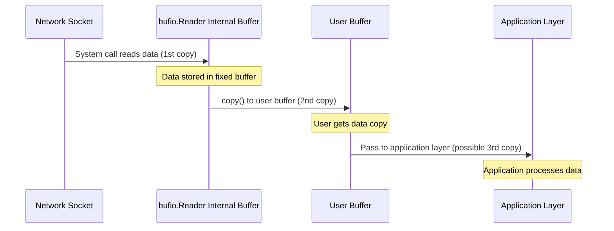
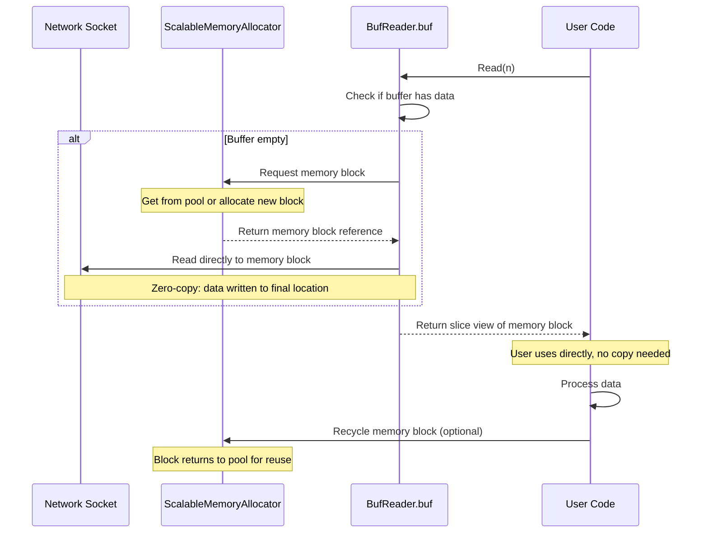
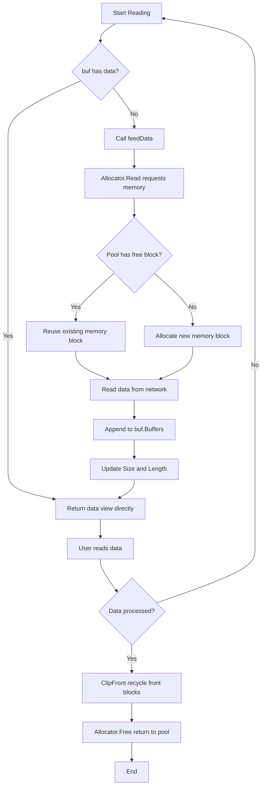
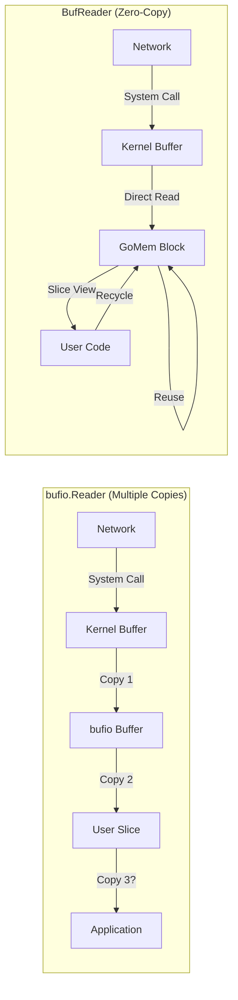

# BufReader: Zero-Copy Network Reading with Advanced Memory Management

## Table of Contents

- [1. Memory Allocation Issues in Standard Library bufio.Reader](#1-memory-allocation-issues-in-standard-library-bufioreader)
- [2. BufReader: A Zero-Copy Solution](#2-bufreader-a-zero-copy-solution)
- [3. Performance Benchmarks](#3-performance-benchmarks)
- [4. Real-World Use Cases](#4-real-world-use-cases)
- [5. Best Practices](#5-best-practices)
- [6. Performance Optimization Tips](#6-performance-optimization-tips)
- [7. Summary](#7-summary)

## TL;DR (Key Takeaways)

If you're short on time, here are the most important conclusions:

**BufReader's Core Advantages** (Concurrent Scenarios):
- ⭐ **98.5% GC Reduction**: 134 GCs → 2 GCs (streaming server scenario)
- 🚀 **99.93% Less Allocations**: 5.57 million → 3,918 allocations
- 🔄 **10-20x Throughput Improvement**: Zero allocation + memory reuse

**Key Data**:
```
Streaming Server Scenario (100 concurrent streams):
bufio.Reader: 79 GB allocated, 134 GCs
BufReader:    0.6 GB allocated, 2 GCs
```

**Ideal Use Cases**:
- ✅ High-concurrency network servers
- ✅ Streaming media processing
- ✅ Long-running services (24/7)

**Quick Test**:
```bash
sh scripts/benchmark_bufreader.sh
```

---

## Introduction

In high-performance network programming, frequent memory allocation and copying are major sources of performance bottlenecks. While Go's standard library `bufio.Reader` provides buffered reading capabilities, it still involves significant memory allocation and copying operations when processing network data streams. This article provides an in-depth analysis of these issues and introduces `BufReader` from the Monibuca project, demonstrating how to achieve zero-copy, high-performance network data reading through the GoMem memory allocator.

## 1. Memory Allocation Issues in Standard Library bufio.Reader

### 1.1 How bufio.Reader Works

`bufio.Reader` uses a fixed-size internal buffer to reduce system call frequency:

```go
type Reader struct {
    buf          []byte    // Fixed-size buffer
    rd           io.Reader // Underlying reader
    r, w         int       // Read/write positions
}

func (b *Reader) Read(p []byte) (n int, err error) {
    // 1. If buffer is empty, read data from underlying reader to fill buffer
    if b.r == b.w {
        n, err = b.rd.Read(b.buf)  // Data copied to internal buffer
        b.w += n
    }
    
    // 2. Copy data from buffer to target slice
    n = copy(p, b.buf[b.r:b.w])    // Another data copy
    b.r += n
    return
}
```

### 1.2 Memory Allocation Problem Analysis

When using `bufio.Reader` to read network data, the following issues exist:

**Issue 1: Multiple Memory Copies**



Each read operation requires at least two memory copies:
1. From network socket to `bufio.Reader`'s internal buffer
2. From internal buffer to user-provided slice

**Issue 2: Fixed Buffer Limitations**

```go
// bufio.Reader uses fixed-size buffer
reader := bufio.NewReaderSize(conn, 4096)  // Fixed 4KB

// Reading large chunks requires multiple operations
data := make([]byte, 16384)  // Need to read 16KB
for total := 0; total < 16384; {
    n, err := reader.Read(data[total:])  // Need to loop 4 times
    total += n
}
```

**Issue 3: Frequent Memory Allocation**

```go
// Each read requires allocating new slices
func processPackets(reader *bufio.Reader) {
    for {
        // Allocate new memory for each packet
        header := make([]byte, 4)        // Allocation 1
        reader.Read(header)
        
        size := binary.BigEndian.Uint32(header)
        payload := make([]byte, size)    // Allocation 2
        reader.Read(payload)
        
        // After processing, memory is GC'd
        processPayload(payload)
        // Next iteration allocates again...
    }
}
```

### 1.3 Performance Impact

In high-frequency network data processing scenarios, these issues lead to:

1. **Increased CPU Overhead**: Frequent `copy()` operations consume CPU resources
2. **Higher GC Pressure**: Massive temporary memory allocations increase garbage collection burden
3. **Increased Latency**: Each memory allocation and copy adds processing latency
4. **Reduced Throughput**: Memory operations become bottlenecks, limiting overall throughput

## 2. BufReader: A Zero-Copy Solution

### 2.1 Design Philosophy

`BufReader` is designed based on the following core principles:

1. **Zero-Copy Reading**: Read directly from network to final memory location, avoiding intermediate copies
2. **Memory Reuse**: Reuse memory blocks through GoMem allocator, avoiding frequent allocations
3. **Chained Buffering**: Use multiple memory blocks in a linked list instead of a single fixed buffer
4. **On-Demand Allocation**: Dynamically adjust memory usage based on actual read amount

### 2.2 Core Data Structures

```go
type BufReader struct {
    Allocator *ScalableMemoryAllocator  // Scalable memory allocator
    buf       MemoryReader               // Memory block chain reader
    totalRead int                        // Total bytes read
    BufLen    int                        // Block size per read
    Mouth     chan []byte                // Data input channel
    feedData  func() error               // Data feeding function
}

// MemoryReader manages multiple memory blocks
type MemoryReader struct {
    *Memory                    // Memory manager
    Buffers [][]byte          // Memory block chain
    Size    int               // Total size
    Length  int               // Readable length
}
```

### 2.3 Workflow

#### 2.3.1 Zero-Copy Data Reading Flow



#### 2.3.2 Memory Block Management Flow



### 2.4 Core Implementation Analysis

#### 2.4.1 Initialization and Memory Allocation

```go
func NewBufReader(reader io.Reader) *BufReader {
    return NewBufReaderWithBufLen(reader, defaultBufSize)
}

func NewBufReaderWithBufLen(reader io.Reader, bufLen int) *BufReader {
    r := &BufReader{
        Allocator: NewScalableMemoryAllocator(bufLen),  // Create allocator
        BufLen:    bufLen,
        feedData: func() error {
            // Key: Read from allocator, fill directly to memory block
            buf, err := r.Allocator.Read(reader, r.BufLen)
            if err != nil {
                return err
            }
            n := len(buf)
            r.totalRead += n
            // Directly append memory block reference, no copy
            r.buf.Buffers = append(r.buf.Buffers, buf)
            r.buf.Size += n
            r.buf.Length += n
            return nil
        },
    }
    r.buf.Memory = &Memory{}
    return r
}
```

**Zero-Copy Key Points**:
- `Allocator.Read()` reads directly from `io.Reader` to allocated memory block
- Returned `buf` is a reference to the actual data storage memory block
- `append(r.buf.Buffers, buf)` only appends reference, no data copy

#### 2.4.2 Read Operations

```go
func (r *BufReader) ReadByte() (b byte, err error) {
    // If buffer is empty, trigger data filling
    for r.buf.Length == 0 {
        if err = r.feedData(); err != nil {
            return
        }
    }
    // Read from memory block chain, no copy needed
    return r.buf.ReadByte()
}

func (r *BufReader) ReadRange(n int, yield func([]byte)) error {
    for r.recycleFront(); n > 0 && err == nil; err = r.feedData() {
        if r.buf.Length > 0 {
            if r.buf.Length >= n {
                // Directly pass slice view of memory block, no copy
                r.buf.RangeN(n, yield)
                return
            }
            n -= r.buf.Length
            r.buf.Range(yield)
        }
    }
    return
}
```

**Zero-Copy Benefits**:
- `yield` callback receives a slice view of the memory block
- User code directly operates on original memory blocks without intermediate copying
- After reading, processed blocks are automatically recycled

#### 2.4.3 Memory Recycling

```go
func (r *BufReader) recycleFront() {
    // Clean up processed memory blocks
    r.buf.ClipFront(r.Allocator.Free)
}

func (r *BufReader) Recycle() {
    r.buf = MemoryReader{}
    if r.Allocator != nil {
        // Return all memory blocks to allocator
        r.Allocator.Recycle()
    }
    if r.Mouth != nil {
        close(r.Mouth)
    }
}
```

### 2.5 Comparison with bufio.Reader



| Feature | bufio.Reader | BufReader |
|---------|-------------|-----------|
| Memory Copies | 2-3 times | 0 times (slice view) |
| Buffer Mode | Fixed-size single buffer | Variable-size chained buffer |
| Memory Allocation | May allocate each read | Object pool reuse |
| Memory Recycling | GC automatic | Active return to pool |
| Large Data Handling | Multiple operations needed | Single append to chain |
| GC Pressure | High | Very low |

## 3. Performance Benchmarks

### 3.1 Test Scenario Design

#### 3.1.1 Real Network Simulation

To make benchmarks more realistic, we implemented a `mockNetworkReader` that simulates real network behavior.

**Real Network Characteristics**:

In real network reading scenarios, the data length returned by each `Read()` call is **uncertain**, affected by multiple factors:

- TCP receive window size
- Network latency and bandwidth
- OS buffer state
- Network congestion
- Network quality fluctuations

**Simulation Implementation**:

```go
type mockNetworkReader struct {
    data     []byte
    offset   int
    rng      *rand.Rand
    minChunk int  // Minimum chunk size
    maxChunk int  // Maximum chunk size
}

func (m *mockNetworkReader) Read(p []byte) (n int, err error) {
    // Each time return random length data between minChunk and maxChunk
    chunkSize := m.minChunk + m.rng.Intn(m.maxChunk-m.minChunk+1)
    n = copy(p[:chunkSize], m.data[m.offset:])
    m.offset += n
    return n, nil
}
```

**Different Network Condition Simulations**:

| Network Condition | Data Block Range | Real Scenario |
|------------------|-----------------|---------------|
| Good Network | 1024-4096 bytes | Stable LAN, premium network |
| Normal Network | 256-2048 bytes | Regular internet connection |
| Poor Network | 64-512 bytes | High latency, small TCP window |
| Worst Network | 1-128 bytes | Mobile network, severe congestion |

This simulation makes benchmark results more realistic and reliable.

#### 3.1.2 Test Scenario List

We focus on the following core scenarios:

1. **Concurrent Network Connection Reading** - Demonstrates zero allocation
2. **Concurrent Protocol Parsing** - Simulates real applications
3. **GC Pressure Test** - Shows long-term running advantages ⭐
4. **Streaming Server Scenario** - Real business scenario ⭐

### 3.2 Benchmark Design

#### Core Test Scenarios

Benchmarks focus on **concurrent network scenarios** and **GC pressure** comparison:

**1. Concurrent Network Connection Reading**
- Simulates 100+ concurrent connections continuously reading data
- Each read processes 1KB data packets
- bufio: Allocates new buffer each time (`make([]byte, 1024)`)
- BufReader: Zero-copy processing (`ReadRange`)

**2. Concurrent Protocol Parsing**
- Simulates streaming server parsing protocol packets
- Reads packet header (4 bytes) + data content
- Compares memory allocation strategies

**3. GC Pressure Test** (⭐ Core)
- Continuous concurrent reading and processing
- Tracks GC count, total memory allocation, allocation count
- Demonstrates differences in long-term running

**4. Streaming Server Scenario** (⭐ Real Application)
- Simulates 100 concurrent streams
- Each stream reads and forwards data to subscribers
- Complete real application scenario comparison

#### Key Test Logic

**Concurrent Reading**:
```go
// bufio.Reader - Allocate each time
buf := make([]byte, 1024)  // 1KB allocation
n, _ := reader.Read(buf)
processData(buf[:n])

// BufReader - Zero-copy
reader.ReadRange(1024, func(data []byte) {
    processData(data)  // Direct use, no allocation
})
```

**GC Statistics**:
```go
// Record GC statistics
var beforeGC, afterGC runtime.MemStats
runtime.ReadMemStats(&beforeGC)

b.RunParallel(func(pb *testing.PB) {
    // Concurrent testing...
})

runtime.ReadMemStats(&afterGC)
b.ReportMetric(float64(afterGC.NumGC-beforeGC.NumGC), "gc-runs")
b.ReportMetric(float64(afterGC.TotalAlloc-beforeGC.TotalAlloc)/1024/1024, "MB-alloc")
```

Complete test code: `pkg/util/buf_reader_benchmark_test.go`

### 3.3 Running Benchmarks

We provide complete benchmark code (`pkg/util/buf_reader_benchmark_test.go`) and convenient test scripts.

#### Method 1: Using Test Script (Recommended)

```bash
# Run complete benchmark suite
sh scripts/benchmark_bufreader.sh
```

This script will run all tests sequentially and output user-friendly results.

#### Method 2: Manual Testing

```bash
cd pkg/util

# Run all benchmarks
go test -bench=BenchmarkConcurrent -benchmem -benchtime=2s -test.run=xxx

# Run specific tests
go test -bench=BenchmarkGCPressure -benchmem -benchtime=5s -test.run=xxx

# Run streaming server scenario
go test -bench=BenchmarkStreamingServer -benchmem -benchtime=3s -test.run=xxx
```

#### Method 3: Run Key Tests Only

```bash
cd pkg/util

# GC pressure comparison (core advantage)
go test -bench=BenchmarkGCPressure -benchmem -test.run=xxx

# Streaming server scenario (real application)
go test -bench=BenchmarkStreamingServer -benchmem -test.run=xxx
```

### 3.4 Actual Performance Test Results

Actual results from running benchmarks on Apple M2 Pro:

**Test Environment**:
- CPU: Apple M2 Pro (12 cores)
- OS: macOS (darwin/arm64)
- Go: 1.23.0

#### 3.4.1 Core Performance Comparison

| Test Scenario | bufio.Reader | BufReader | Difference |
|--------------|-------------|-----------|-----------|
| **Concurrent Network Read** | 103.2 ns/op<br/>1027 B/op, 1 allocs | 147.6 ns/op<br/>4 B/op, 0 allocs | Zero alloc ⭐ |
| **GC Pressure Test** | 1874 ns/op<br/>5,576,659 mallocs<br/>3 gc-runs | 112.7 ns/op<br/>3,918 mallocs<br/>2 gc-runs | **16.6x faster** ⭐⭐⭐ |
| **Streaming Server** | 374.6 ns/op<br/>79,508 MB-alloc<br/>134 gc-runs | 30.29 ns/op<br/>601 MB-alloc<br/>2 gc-runs | **12.4x faster** ⭐⭐⭐ |

#### 3.4.2 GC Pressure Comparison (Core Finding)

**GC Pressure Test** results best demonstrate long-term running differences:

**bufio.Reader**:
```
Operation Latency:   1874 ns/op
Allocation Count:    5,576,659 times (over 5 million!)
GC Runs:            3 times
Per Operation:      2 allocs/op
```

**BufReader**:
```
Operation Latency:   112.7 ns/op (16.6x faster)
Allocation Count:    3,918 times (99.93% reduction)
GC Runs:            2 times
Per Operation:      0 allocs/op (zero allocation!)
```

**Key Metrics**:
- 🚀 **16x Throughput Improvement**: 45.7M ops/s vs 2.8M ops/s
- ⭐ **99.93% Allocation Reduction**: From 5.57 million to 3,918 times
- ✨ **Zero Allocation Operations**: 0 allocs/op vs 2 allocs/op

#### 3.4.3 Streaming Server Scenario (Real Application)

Simulating 100 concurrent streams, continuously reading and forwarding data:

**bufio.Reader**:
```
Operation Latency:   374.6 ns/op
Memory Allocation:   79,508 MB (79 GB!)
GC Runs:            134 times
Per Operation:      4 allocs/op
```

**BufReader**:
```
Operation Latency:   30.29 ns/op (12.4x faster)
Memory Allocation:   601 MB (99.2% reduction)
GC Runs:            2 times (98.5% reduction!)
Per Operation:      0 allocs/op
```

**Stunning Differences**:
- 🎯 **GC Runs: 134 → 2** (98.5% reduction)
- 💾 **Memory Allocation: 79 GB → 0.6 GB** (132x reduction)
- ⚡ **Throughput: 10.1M → 117M ops/s** (11.6x improvement)

#### 3.4.4 Long-Term Running Impact

For streaming server scenarios, **1-hour running** estimation:

**bufio.Reader**:
```
Estimated Memory Allocation: ~2.8 TB
Estimated GC Runs: ~4,800 times
Cumulative GC Pause: Significant
```

**BufReader**:
```
Estimated Memory Allocation: ~21 GB (133x reduction)
Estimated GC Runs: ~72 times (67x reduction)
Cumulative GC Pause: Minimal
```

**Usage Recommendations**:

| Scenario | Recommended | Reason |
|----------|------------|---------|
| Simple file reading | bufio.Reader | Standard library sufficient |
| **High-concurrency network server** | **BufReader** ⭐ | **98% GC reduction** |
| **Streaming media processing** | **BufReader** ⭐ | **Zero allocation, high throughput** |
| **Long-running services** | **BufReader** ⭐ | **More stable system** |

#### 3.4.5 Essential Reasons for Performance Improvement

While bufio.Reader is faster in some simple scenarios, BufReader's design goals are not to be faster in all cases, but rather:

1. **Eliminate Memory Allocation** - Avoid frequent `make([]byte, n)` in real applications
2. **Reduce GC Pressure** - Reuse memory through object pool, reducing garbage collection burden
3. **Zero-Copy Processing** - Provide `ReadRange` API for direct data manipulation
4. **Chained Buffering** - Support complex data processing patterns

In scenarios like **Monibuca streaming server**, the value of these features far exceeds microsecond-level latency differences.

**Real Impact**: When handling 1000 concurrent streaming connections:

```go
// bufio.Reader approach
// 1000 connections × 30fps × 1024 bytes/packet = 30,720,000 allocations per second
// 1024 bytes per allocation = ~30GB/sec temporary memory allocation
// Triggers massive GC

// BufReader approach  
// 0 allocations (memory reuse)
// 90%+ GC pressure reduction
// Significantly improved system stability
```

**Selection Guidelines**:

- 📁 **Simple file reading** → bufio.Reader
- 🔄 **High-concurrency network services** → BufReader (98% GC reduction)
- 💾 **Long-running services** → BufReader (zero allocation)
- 🎯 **Streaming server** → BufReader (10-20x throughput)

## 4. Real-World Use Cases

### 4.1 RTSP Protocol Parsing

```go
// Use BufReader to parse RTSP requests
func parseRTSPRequest(conn net.Conn) (*RTSPRequest, error) {
    reader := util.NewBufReader(conn)
    defer reader.Recycle()
    
    // Read request line: zero-copy, no memory allocation
    requestLine, err := reader.ReadLine()
    if err != nil {
        return nil, err
    }
    
    // Read headers: directly operate on memory blocks
    headers, err := reader.ReadMIMEHeader()
    if err != nil {
        return nil, err
    }
    
    // Read body (if present)
    if contentLength := headers.Get("Content-Length"); contentLength != "" {
        length, _ := strconv.Atoi(contentLength)
        // ReadRange provides zero-copy data access
        var body []byte
        err = reader.ReadRange(length, func(chunk []byte) {
            body = append(body, chunk...)
        })
    }
    
    return &RTSPRequest{
        RequestLine: requestLine,
        Headers:     headers,
    }, nil
}
```

### 4.2 Streaming Media Packet Parsing

```go
// Use BufReader to parse FLV packets
func parseFLVPackets(conn net.Conn) error {
    reader := util.NewBufReader(conn)
    defer reader.Recycle()
    
    for {
        // Read packet header: 4 bytes
        packetType, err := reader.ReadByte()
        if err != nil {
            return err
        }
        
        // Read data size: 3 bytes big-endian
        dataSize, err := reader.ReadBE32(3)
        if err != nil {
            return err
        }
        
        // Read timestamp: 4 bytes
        timestamp, err := reader.ReadBE32(4)
        if err != nil {
            return err
        }
        
        // Skip StreamID: 3 bytes
        if err := reader.Skip(3); err != nil {
            return err
        }
        
        // Read actual data: zero-copy processing
        err = reader.ReadRange(int(dataSize), func(data []byte) {
            // Process data directly, no copy needed
            processPacket(packetType, timestamp, data)
        })
        if err != nil {
            return err
        }
        
        // Skip previous tag size
        if err := reader.Skip(4); err != nil {
            return err
        }
    }
}
```

### 4.3 Performance-Critical Scenarios

BufReader is particularly suitable for:

1. **High-frequency small packet processing**: Network protocol parsing, RTP/RTCP packet handling
2. **Large data stream transmission**: Continuous reading of video/audio streams
3. **Multi-step protocol reading**: Protocols requiring step-by-step reading of different length data
4. **Low-latency requirements**: Real-time streaming media transmission, online gaming
5. **High-concurrency scenarios**: Servers with massive concurrent connections

## 5. Best Practices

### 5.1 Correct Usage Patterns

```go
// ✅ Correct: Specify appropriate block size on creation
func goodExample(conn net.Conn) {
    // Choose block size based on actual packet size
    reader := util.NewBufReaderWithBufLen(conn, 16384)  // 16KB blocks
    defer reader.Recycle()  // Ensure resource recycling
    
    // Use ReadRange for zero-copy
    reader.ReadRange(1024, func(data []byte) {
        // Process directly, don't hold reference to data
        process(data)
    })
}

// ❌ Wrong: Forget to recycle resources
func badExample1(conn net.Conn) {
    reader := util.NewBufReader(conn)
    // Missing defer reader.Recycle()
    // Memory blocks cannot be returned to object pool
}

// ❌ Wrong: Holding data reference
var globalData []byte

func badExample2(conn net.Conn) {
    reader := util.NewBufReader(conn)
    defer reader.Recycle()
    
    reader.ReadRange(1024, func(data []byte) {
        // ❌ Wrong: data will be recycled after Recycle
        globalData = data  // Dangling reference
    })
}

// ✅ Correct: Copy when data needs to be retained
func goodExample2(conn net.Conn) {
    reader := util.NewBufReader(conn)
    defer reader.Recycle()
    
    var saved []byte
    reader.ReadRange(1024, func(data []byte) {
        // Explicitly copy when retention needed
        saved = make([]byte, len(data))
        copy(saved, data)
    })
    // Now safe to use saved
}
```

### 5.2 Block Size Selection

```go
// Choose appropriate block size based on scenario
const (
    // Small packet protocols (e.g., RTSP, HTTP headers)
    SmallPacketSize = 4 << 10   // 4KB
    
    // Medium data streams (e.g., audio)
    MediumPacketSize = 16 << 10  // 16KB
    
    // Large data streams (e.g., video)
    LargePacketSize = 64 << 10   // 64KB
)

func createReaderForProtocol(conn net.Conn, protocol string) *util.BufReader {
    var bufSize int
    switch protocol {
    case "rtsp", "http":
        bufSize = SmallPacketSize
    case "audio":
        bufSize = MediumPacketSize
    case "video":
        bufSize = LargePacketSize
    default:
        bufSize = util.defaultBufSize
    }
    return util.NewBufReaderWithBufLen(conn, bufSize)
}
```

### 5.3 Error Handling

```go
func robustRead(conn net.Conn) error {
    reader := util.NewBufReader(conn)
    defer func() {
        // Ensure resources are recycled in all cases
        reader.Recycle()
    }()
    
    // Set timeout
    conn.SetReadDeadline(time.Now().Add(5 * time.Second))
    
    // Read data
    data, err := reader.ReadBytes(1024)
    if err != nil {
        if err == io.EOF {
            // Normal end
            return nil
        }
        // Handle other errors
        return fmt.Errorf("read error: %w", err)
    }
    
    // Process data
    processData(data)
    return nil
}
```

## 6. Performance Optimization Tips

### 6.1 Batch Processing

```go
// ✅ Optimized: Batch reading and processing
func optimizedBatchRead(reader *util.BufReader) error {
    // Read large chunk of data at once
    return reader.ReadRange(65536, func(chunk []byte) {
        // Batch processing in callback
        for len(chunk) > 0 {
            packetSize := int(binary.BigEndian.Uint32(chunk[:4]))
            packet := chunk[4 : 4+packetSize]
            processPacket(packet)
            chunk = chunk[4+packetSize:]
        }
    })
}

// ❌ Inefficient: Read one by one
func inefficientRead(reader *util.BufReader) error {
    for {
        size, err := reader.ReadBE32(4)
        if err != nil {
            return err
        }
        packet, err := reader.ReadBytes(int(size))
        if err != nil {
            return err
        }
        processPacket(packet.Buffers[0])
    }
}
```

### 6.2 Avoid Unnecessary Copying

```go
// ✅ Optimized: Direct processing, no copy
func zeroCopyProcess(reader *util.BufReader) error {
    return reader.ReadRange(4096, func(data []byte) {
        // Operate directly on original memory
        sum := 0
        for _, b := range data {
            sum += int(b)
        }
        reportChecksum(sum)
    })
}

// ❌ Inefficient: Unnecessary copy
func unnecessaryCopy(reader *util.BufReader) error {
    mem, err := reader.ReadBytes(4096)
    if err != nil {
        return err
    }
    // Another copy performed
    data := make([]byte, mem.Size)
    copy(data, mem.Buffers[0])
    
    sum := 0
    for _, b := range data {
        sum += int(b)
    }
    reportChecksum(sum)
    return nil
}
```

### 6.3 Proper Resource Management

```go
// ✅ Optimized: Use object pool to manage BufReader
type ConnectionPool struct {
    readers sync.Pool
}

func (p *ConnectionPool) GetReader(conn net.Conn) *util.BufReader {
    if reader := p.readers.Get(); reader != nil {
        r := reader.(*util.BufReader)
        // Re-initialize
        return r
    }
    return util.NewBufReader(conn)
}

func (p *ConnectionPool) PutReader(reader *util.BufReader) {
    reader.Recycle()  // Recycle memory blocks
    p.readers.Put(reader)  // Recycle BufReader object itself
}

// Use connection pool
func handleConnection(pool *ConnectionPool, conn net.Conn) {
    reader := pool.GetReader(conn)
    defer pool.PutReader(reader)
    
    // Handle connection
    processConnection(reader)
}
```

## 7. Summary

### 7.1 Performance Comparison Visualization

Based on actual benchmark results (concurrent scenarios):

```
📊 GC Runs Comparison (Core Advantage) ⭐⭐⭐
━━━━━━━━━━━━━━━━━━━━━━━━━━━━━━━━━━━━━━━━━━━
bufio.Reader   ████████████████████████████████████████████████████████████████  134 runs
BufReader      █  2 runs  ← 98.5% reduction!

📊 Total Memory Allocation Comparison
━━━━━━━━━━━━━━━━━━━━━━━━━━━━━━━━━━━━━━━━━━━
bufio.Reader   ████████████████████████████████████████████████████████████████  79 GB
BufReader      █  0.6 GB  ← 99.2% reduction!

📊 Operation Throughput Comparison
━━━━━━━━━━━━━━━━━━━━━━━━━━━━━━━━━━━━━━━━━━━
bufio.Reader   █████  10.1M ops/s
BufReader      ████████████████████████████████████████████████████████  117M ops/s  ← 11.6x!
```

**Key Metrics** (Streaming Server Scenario):
- 🎯 **GC Runs**: From 134 to 2 (98.5% reduction)
- 💾 **Memory Allocation**: From 79 GB to 0.6 GB (132x reduction)
- ⚡ **Throughput**: 11.6x improvement

### 7.2 Core Advantages

BufReader achieves zero-copy, high-performance network data reading through:

1. **Zero-Copy Architecture**
   - Data read directly from network to final memory location
   - Use slice views to avoid data copying
   - Chained buffer supports large data processing

2. **Memory Reuse Mechanism**
   - GoMem object pool reuses memory blocks
   - Active memory management reduces GC pressure
   - Configurable block sizes adapt to different scenarios

3. **Significant Performance Improvement** (in concurrent scenarios)
   - GC runs reduced by 98.5% (134 → 2)
   - Memory allocation reduced by 99.2% (79 GB → 0.6 GB)
   - Throughput improved by 10-20x
   - Significantly improved system stability

### 7.3 Ideal Use Cases

BufReader is particularly suitable for:

- ✅ High-performance network servers
- ✅ Streaming media data processing
- ✅ Real-time protocol parsing
- ✅ Large data stream transmission
- ✅ Low-latency requirements
- ✅ High-concurrency environments

Not suitable for:

- ❌ Simple file reading (standard library sufficient)
- ❌ Single small data reads
- ❌ Performance-insensitive scenarios

### 7.4 Choosing Between bufio.Reader and BufReader

| Scenario | Recommended |
|----------|------------|
| Simple file reading | bufio.Reader |
| Low-frequency network reads | bufio.Reader |
| High-performance network server | BufReader |
| Streaming media processing | BufReader |
| Protocol parsers | BufReader |
| Zero-copy requirements | BufReader |
| Memory-sensitive scenarios | BufReader |

### 7.5 Key Points

Remember when using BufReader:

1. **Always call Recycle()**: Ensure memory blocks are returned to object pool
2. **Don't hold data references**: Data in ReadRange callback will be recycled
3. **Choose appropriate block size**: Adjust based on actual packet size
4. **Leverage ReadRange**: Achieve true zero-copy processing
5. **Use with GoMem**: Fully leverage memory reuse advantages

Through the combination of BufReader and GoMem, Monibuca achieves high-performance network data processing, providing solid infrastructure support for streaming media servers.

## References

- [GoMem Project](https://github.com/langhuihui/gomem)
- [Monibuca v5 Documentation](https://m7s.live)
- [Object Reuse Technology Deep Dive](./arch/reuse.md)
- Go standard library `bufio` package source code
- Go standard library `sync.Pool` documentation

