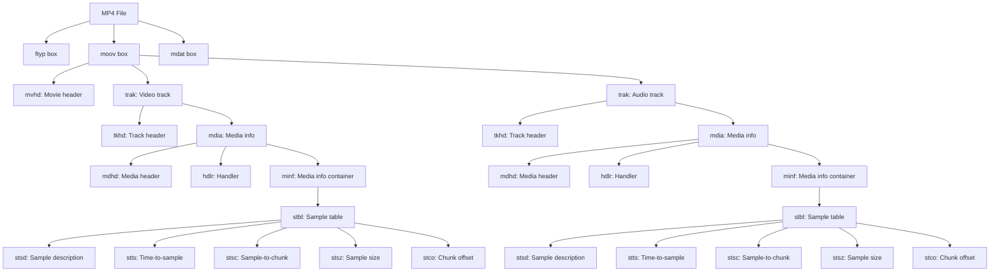
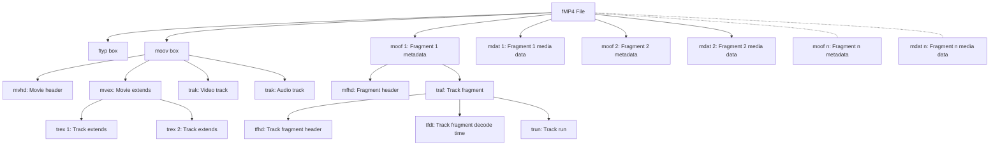
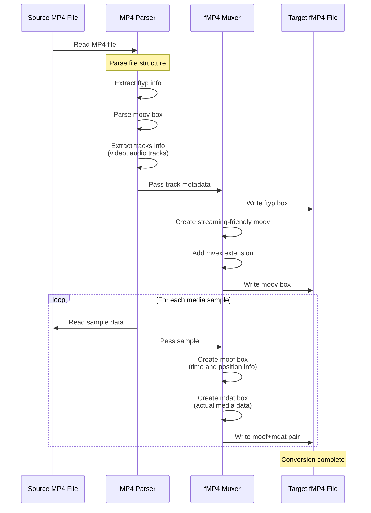
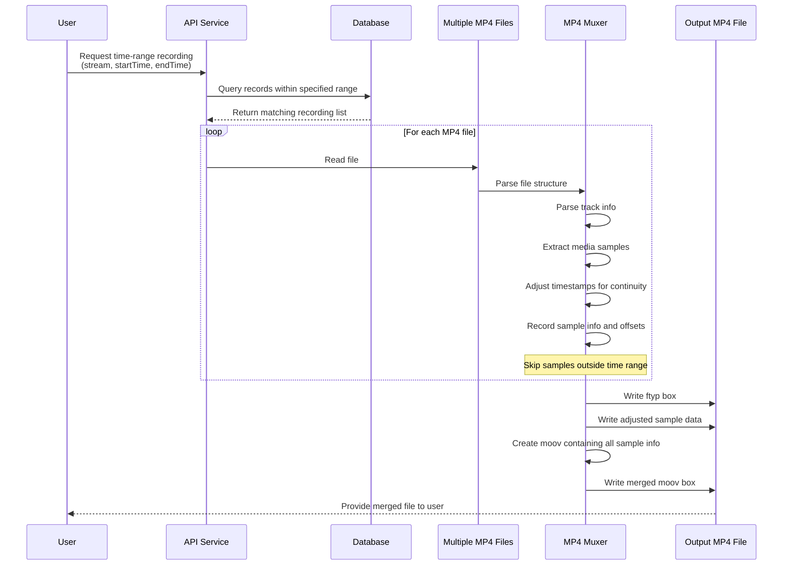
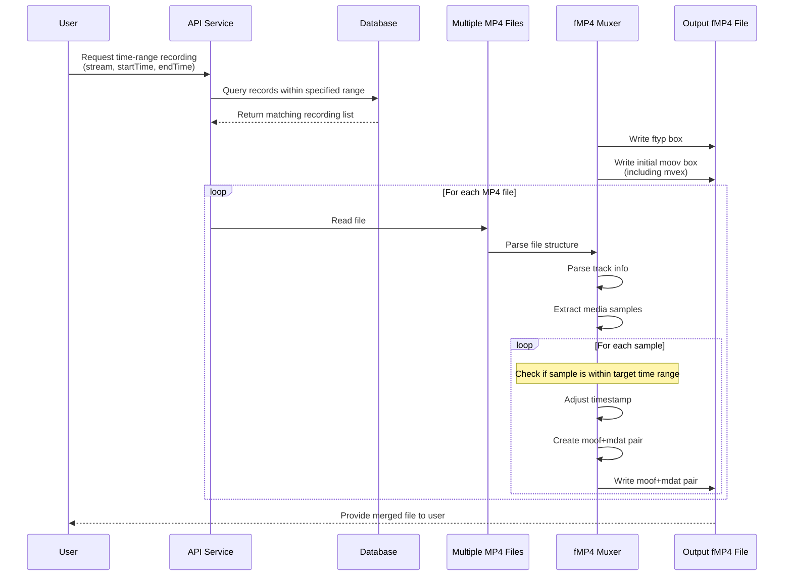
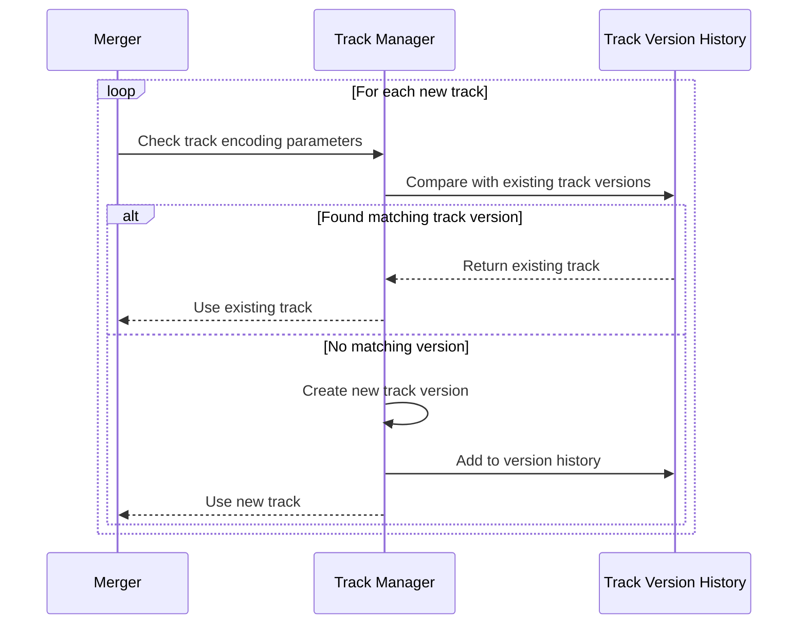
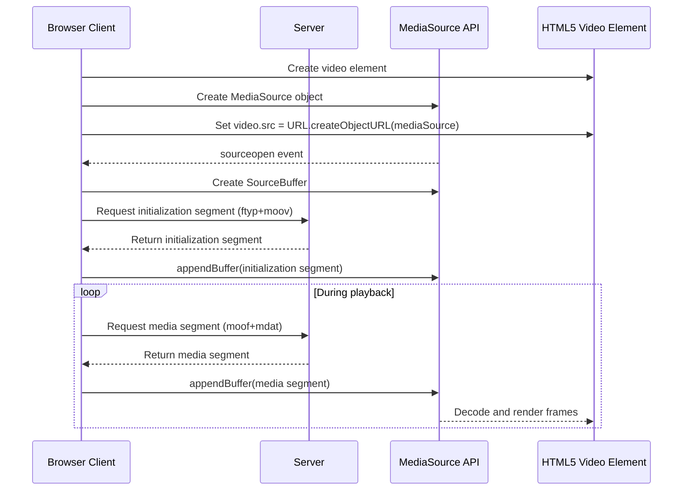
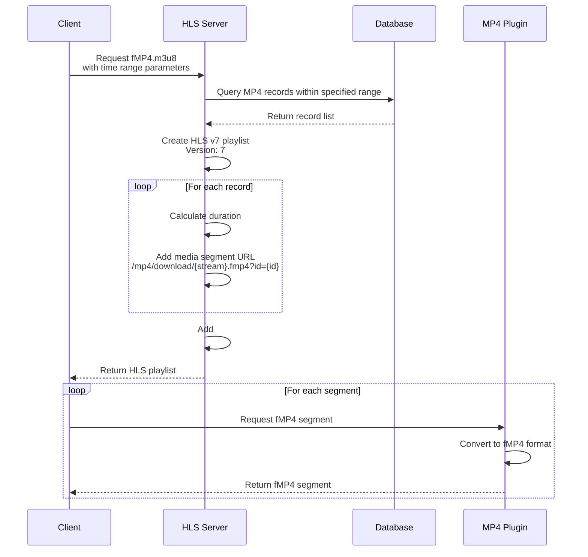

# fMP4 Technology Implementation and Application Based on HLS v7

## Author's Foreword

As developers of the Monibuca streaming server, we have been continuously seeking to provide more efficient and flexible streaming solutions. With the evolution of Web frontend technologies, especially the widespread application of Media Source Extensions (MSE), we gradually recognized that traditional streaming transmission solutions can no longer meet the demands of modern applications. During our exploration and practice, we discovered that fMP4 (fragmented MP4) technology effectively bridges traditional media formats with modern Web technologies, providing users with a smoother video experience.

In the implementation of the MP4 plugin for the Monibuca project, we faced the challenge of efficiently converting recorded MP4 files into a format compatible with MSE playback. Through in-depth research on the HLS v7 protocol and fMP4 container format, we ultimately developed a comprehensive solution supporting real-time conversion from MP4 to fMP4, seamless merging of multiple MP4 segments, and optimizations for frontend MSE playback. This article shares our technical exploration and implementation approach during this process.

## Introduction

As streaming media technology evolves, video distribution methods continue to advance. From traditional complete downloads to progressive downloads, and now to widely used adaptive bitrate streaming technology, each advancement has significantly enhanced the user experience. This article will explore the implementation of fMP4 (fragmented MP4) technology based on HLS v7, and how it integrates with Media Source Extensions (MSE) in modern Web frontends to create efficient and smooth video playback experiences.

## Evolution of HLS Protocol and Introduction of fMP4

### Traditional HLS and Its Limitations

HTTP Live Streaming (HLS) is an HTTP adaptive bitrate streaming protocol developed by Apple. In earlier versions, HLS primarily used TS (Transport Stream) segments as the media container format. Although the TS format has good error resilience and streaming characteristics, it also has several limitations:

1. Larger file size compared to container formats like MP4
2. Each TS segment needs to contain complete initialization information, causing redundancy
3. Lower integration with other parts of the Web technology stack

### HLS v7 and fMP4

HLS v7 introduced support for fMP4 (fragmented MP4) segments, marking a significant advancement in the HLS protocol. As a media container format, fMP4 offers the following advantages over TS:

1. Smaller file size, higher transmission efficiency
2. Shares the same underlying container format with other streaming protocols like DASH, facilitating a unified technology stack
3. Better support for modern codecs
4. Better compatibility with MSE (Media Source Extensions)

In HLS v7, seamless playback of fMP4 segments is achieved by specifying initialization segments using the `#EXT-X-MAP` tag in the playlist.

## MP4 File Structure and fMP4 Basic Principles

### Traditional MP4 Structure

Traditional MP4 files follow the ISO Base Media File Format (ISO BMFF) specification and mainly consist of the following parts:

1. **ftyp** (File Type Box): Indicates the format and compatibility information of the file
2. **moov** (Movie Box): Contains metadata about the media, such as track information, codec parameters, etc.
3. **mdat** (Media Data Box): Contains the actual media data

In traditional MP4, the `moov` is usually located at the beginning or end of the file and contains all the metadata and index data for the entire video. This structure is not friendly for streaming transmission because the player needs to acquire the complete `moov` before playback can begin.

Below is a diagram of the MP4 file box structure:



### fMP4 Structural Characteristics

fMP4 (fragmented MP4) restructures the traditional MP4 format with the following key features:

1. Divides media data into multiple fragments
2. Each fragment contains its own metadata and media data
3. The file structure is more suitable for streaming transmission

The main components of fMP4:

1. **ftyp**: Same as traditional MP4, located at the beginning of the file
2. **moov**: Contains overall track information, but not specific sample information
3. **moof** (Movie Fragment Box): Contains metadata for specific fragments
4. **mdat**: Contains media data associated with the preceding moof

Below is a diagram of the fMP4 file box structure:



This structure allows the player to immediately begin processing subsequent `moof`+`mdat` fragments after receiving the initial `ftyp` and `moov`, making it highly suitable for streaming transmission and real-time playback.

## Conversion Principles from MP4 to fMP4

The MP4 to fMP4 conversion process can be illustrated by the following sequence diagram:



As shown in the diagram, the conversion process consists of three key steps:

1. **Parse the source MP4 file**: Read and parse the structure of the original MP4 file, extract information about video and audio tracks, including codec type, frame rate, resolution, and other metadata.

2. **Create the initialization part of fMP4**: Build the file header and initialization section, including the ftyp and moov boxes. These serve as the initialization segment, containing all the information needed by the decoder, but without actual media sample data.

3. **Create fragments for each sample**: Read the sample data from the original MP4 one by one, then create corresponding moof and mdat box pairs for each sample (or group of samples).

This conversion method transforms MP4 files that were only suitable for download-and-play into fMP4 format suitable for streaming transmission.

## Multiple MP4 Segment Merging Technology

### User Requirement: Time-Range Recording Downloads

In scenarios such as video surveillance, course playback, and live broadcast recording, users often need to download recorded content within a specific time range. For example, a security system operator might only need to export video segments containing specific events, or a student on an educational platform might only want to download key parts of a course. However, since systems typically divide recorded files by fixed durations (e.g., 30 minutes or 1 hour) or specific events (such as the start/end of a live broadcast), the time range needed by users often spans multiple independent MP4 files.

In the Monibuca project, we developed a solution based on time range queries and multi-file merging to address this need. Users only need to specify the start and end times of the content they require, and the system will:

1. Query the database to find all recording files that overlap with the specified time range
2. Extract relevant time segments from each file
3. Seamlessly merge these segments into a single downloadable file

This approach greatly enhances the user experience, allowing them to precisely obtain the content they need without having to download and browse through large amounts of irrelevant video content.

### Database Design and Time Range Queries

To support time range queries, our recording file metadata in the database includes the following key fields:

- Stream Path: Identifies the video source
- Start Time: The start time of the recording segment
- End Time: The end time of the recording segment
- File Path: The storage location of the actual recording file
- Type: The file format, such as "mp4"

When a user requests recordings within a specific time range, the system executes a query similar to the following:

```sql
SELECT * FROM record_streams 
WHERE stream_path = ? AND type = 'mp4' 
AND start_time <= ? AND end_time >= ?
```

This returns all recording segments that intersect with the requested time range, after which the system needs to extract the relevant parts and merge them.

### Technical Challenges of Multiple MP4 Merging

Merging multiple MP4 files is not a simple file concatenation but requires addressing the following technical challenges:

1. **Timestamp Continuity**: Ensuring that the timestamps in the merged video are continuous, without jumps or overlaps
2. **Codec Consistency**: Handling cases where different MP4 files may use different encoding parameters
3. **Metadata Merging**: Correctly merging the moov box information from various files
4. **Precise Cutting**: Precisely extracting content within the user-specified time range from each file

In practical applications, we implemented two merging strategies: regular MP4 merging and fMP4 merging. These strategies each have their advantages and are suitable for different application scenarios.

### Regular MP4 Merging Process



In this approach, the merging process primarily involves arranging media samples from different MP4 files in sequence and adjusting timestamps to ensure continuity. Finally, a new `moov` box containing all sample information is generated. The advantage of this method is its good compatibility, as almost all players can play the merged file normally, making it suitable for download and offline playback scenarios.

It's particularly worth noting that in the code implementation, we handle the overlap relationship between the time range in the parameters and the actual recording time, extracting only the content that users truly need:

```go
if i == 0 {
    startTimestamp := startTime.Sub(stream.StartTime).Milliseconds()
    var startSample *box.Sample
    if startSample, err = demuxer.SeekTime(uint64(startTimestamp)); err != nil {
        tsOffset = 0
        continue
    }
    tsOffset = -int64(startSample.Timestamp)
}

// In the last file, frames beyond the end time are skipped
if i == streamCount-1 && int64(sample.Timestamp) > endTime.Sub(stream.StartTime).Milliseconds() {
    break
}
```

### fMP4 Merging Process



The fMP4 merging is more flexible, with each sample packed into an independent `moof`+`mdat` fragment, maintaining independently decodable characteristics, which is more conducive to streaming transmission and random access. This approach is particularly suitable for integration with MSE and HLS, providing support for real-time streaming playback, allowing users to efficiently play merged content directly in the browser without waiting for the entire file to download.

### Handling Codec Compatibility in Merging

In the process of merging multiple recordings, a key challenge we face is handling potential codec parameter differences between files. For example, during long-term recording, a camera might adjust video resolution due to environmental changes, or an encoder might reinitialize, causing changes in encoding parameters.

To solve this problem, Monibuca implements a smart track version management system that identifies changes by comparing encoder-specific data (ExtraData):



This design ensures that even if there are encoding parameter changes in the original recordings, the merged file can maintain correct decoding parameters, providing users with a smooth playback experience.

### Performance Optimization

When processing large video files or a large number of concurrent requests, the performance of the merging process is an important consideration. We have adopted the following optimization measures:

1. **Streaming Processing**: Process samples frame by frame to avoid loading entire files into memory
2. **Parallel Processing**: Use parallel processing for multiple independent tasks (such as file parsing)
3. **Smart Caching**: Cache commonly used encoding parameters and file metadata
4. **On-demand Reading**: Only read and process samples within the target time range

These optimizations enable the system to efficiently process large-scale recording merging requests, completing processing within a reasonable time even for long-term recordings spanning hours or days.

The multiple MP4 merging functionality greatly enhances the flexibility and user experience of Monibuca as a streaming server, allowing users to precisely obtain the recorded content they need, regardless of how the original recordings are segmented and stored.

## Media Source Extensions (MSE) and fMP4 Compatibility Implementation

### MSE Technology Overview

Media Source Extensions (MSE) is a JavaScript API that allows web developers to directly manipulate media stream data. It enables custom adaptive bitrate streaming players to be implemented entirely in the browser without relying on external plugins.

The core working principle of MSE is:
1. Create a MediaSource object
2. Create one or more SourceBuffer objects
3. Append media fragments to the SourceBuffer
4. The browser is responsible for decoding and playing these fragments

### Perfect Integration of fMP4 with MSE

The fMP4 format has natural compatibility with MSE, mainly reflected in:

1. Each fragment of fMP4 can be independently decoded
2. The clear separation of initialization segments and media segments conforms to MSE's buffer management model
3. Precise timestamp control enables seamless splicing

The following sequence diagram shows how fMP4 works with MSE:



In Monibuca's implementation, we've made special optimizations for MSE: creating independent moof and mdat for each frame. Although this approach adds some overhead, it provides high flexibility, particularly suitable for low-latency real-time streaming scenarios and precise frame-level operations.

## Integration of HLS and fMP4 in Practical Applications

In practical applications, we combine fMP4 technology with the HLS v7 protocol to implement time-range-based on-demand playback. The system can find the corresponding MP4 records from the database based on the time range specified by the user, and then generate an fMP4 format HLS playlist:



Through this approach, we maintain compatibility with existing HLS clients while leveraging the advantages of the fMP4 format to provide more efficient streaming services.

## Conclusion

As a modern media container format, fMP4 combines the efficient compression of MP4 with the flexibility of streaming transmission, making it highly suitable for video distribution needs in modern web applications. Through integration with HLS v7 and MSE technologies, more efficient and flexible streaming services can be achieved.

In the practice of the Monibuca project, we have successfully built a complete streaming solution by implementing MP4 to fMP4 conversion, merging multiple MP4 files, and optimizing fMP4 fragment generation for MSE. The application of these technologies enables our system to provide a better user experience, including faster startup times, smoother quality transitions, and lower bandwidth consumption.

As video technology continues to evolve, fMP4, as a bridge connecting traditional media formats with modern Web technologies, will continue to play an important role in the streaming media field. The Monibuca project will also continue to explore and optimize this technology to provide users with higher quality streaming services. 