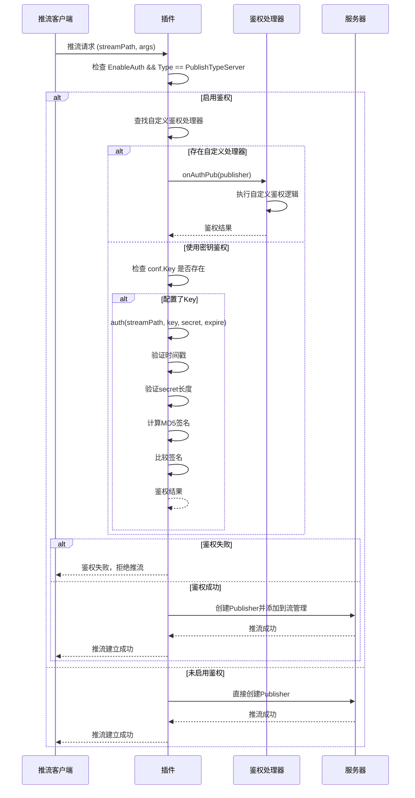
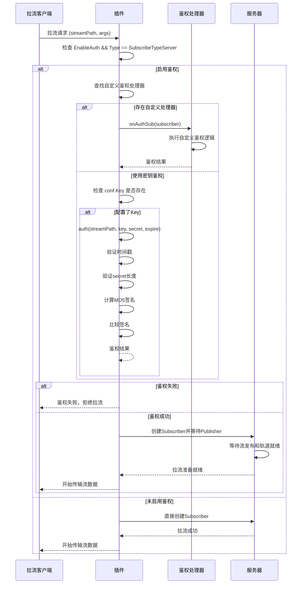

# 流鉴权机制

Monibuca V5 提供了完善的流鉴权机制，用于控制推流和拉流的访问权限。鉴权机制支持多种方式，包括基于密钥的签名鉴权和自定义鉴权处理器。

## 鉴权原理

### 1. 鉴权流程时序图

#### 推流鉴权时序图



#### 拉流鉴权时序图



### 2. 鉴权触发时机

鉴权在以下两种情况下触发：

- **推流鉴权**：当有推流请求时，在`PublishWithConfig`方法中触发
- **拉流鉴权**：当有拉流请求时，在`SubscribeWithConfig`方法中触发

### 3. 鉴权条件判断

鉴权只在以下条件同时满足时才会执行：

```go
if p.config.EnableAuth && publisher.Type == PublishTypeServer
```

- `EnableAuth`：插件配置中启用了鉴权
- `Type == PublishTypeServer/SubscribeTypeServer`：只对服务端类型的推流/拉流进行鉴权

### 4. 鉴权方式优先级

系统按以下优先级执行鉴权：

1. **自定义鉴权处理器**（最高优先级）
2. **基于密钥的签名鉴权**
3. **无鉴权**（默认通过）

## 自定义鉴权处理器

### 推流鉴权处理器

```go
onAuthPub := p.Meta.OnAuthPub
if onAuthPub == nil {
    onAuthPub = p.Server.Meta.OnAuthPub
}
if onAuthPub != nil {
    if err = onAuthPub(publisher).Await(); err != nil {
        p.Warn("auth failed", "error", err)
        return
    }
}
```

鉴权处理器查找顺序：
1. 插件级别的鉴权处理器 `p.Meta.OnAuthPub`
2. 服务器级别的鉴权处理器 `p.Server.Meta.OnAuthPub`

### 拉流鉴权处理器

```go
onAuthSub := p.Meta.OnAuthSub
if onAuthSub == nil {
    onAuthSub = p.Server.Meta.OnAuthSub
}
if onAuthSub != nil {
    if err = onAuthSub(subscriber).Await(); err != nil {
        p.Warn("auth failed", "error", err)
        return
    }
}
```

## 基于密钥的签名鉴权

当没有自定义鉴权处理器时，如果配置了Key，系统将使用基于MD5的签名鉴权机制。

### 鉴权算法

```go
func (p *Plugin) auth(streamPath string, key string, secret string, expire string) (err error) {
    // 1. 验证过期时间
    if unixTime, err := strconv.ParseInt(expire, 16, 64); err != nil || time.Now().Unix() > unixTime {
        return fmt.Errorf("auth failed expired")
    }
    
    // 2. 验证secret长度
    if len(secret) != 32 {
        return fmt.Errorf("auth failed secret length must be 32")
    }
    
    // 3. 计算真实的secret
    trueSecret := md5.Sum([]byte(key + streamPath + expire))
    
    // 4. 比较secret
    if secret == hex.EncodeToString(trueSecret[:]) {
        return nil
    }
    return fmt.Errorf("auth failed invalid secret")
}
```

### 签名计算步骤

1. **构造签名字符串**：`key + streamPath + expire`
2. **MD5加密**：对签名字符串进行MD5哈希
3. **十六进制编码**：将MD5结果转换为32位十六进制字符串
4. **验证签名**：比较计算结果与客户端提供的secret

### 参数说明

| 参数 | 类型 | 说明 | 示例 |
|------|------|------|------|
| key | string | 密钥，在配置文件中设置 | "mySecretKey" |
| streamPath | string | 流路径 | "live/test" |
| expire | string | 过期时间戳（16进制） | "64a1b2c3" |
| secret | string | 客户端计算的签名（32位十六进制） | "5d41402abc4b2a76b9719d911017c592" |

### 时间戳处理

- 过期时间使用16进制Unix时间戳
- 系统会验证当前时间是否超过过期时间
- 时间戳解析失败或已过期都会导致鉴权失败

## API密钥生成

系统还提供了API接口用于生成密钥，支持管理后台的鉴权需求：

```go
p.handle("/api/secret/{type}/{streamPath...}", http.HandlerFunc(func(rw http.ResponseWriter, r *http.Request) {
    // JWT Token验证
    authHeader := r.Header.Get("Authorization")
    tokenString := strings.TrimPrefix(authHeader, "Bearer ")
    _, err := p.Server.ValidateToken(tokenString)
    
    // 生成推流或拉流密钥
    streamPath := r.PathValue("streamPath")
    t := r.PathValue("type")
    expire := r.URL.Query().Get("expire")
    
    if t == "publish" {
        secret := md5.Sum([]byte(p.config.Publish.Key + streamPath + expire))
        rw.Write([]byte(hex.EncodeToString(secret[:])))
    } else if t == "subscribe" {
        secret := md5.Sum([]byte(p.config.Subscribe.Key + streamPath + expire))
        rw.Write([]byte(hex.EncodeToString(secret[:])))
    }
}))
```

## 配置示例

### 启用鉴权

```yaml
# 插件配置
rtmp:
  enableAuth: true
  publish:
    key: "your-publish-key"
  subscribe:
    key: "your-subscribe-key"
```

### 推流URL示例

```
rtmp://localhost/live/test?secret=5d41402abc4b2a76b9719d911017c592&expire=64a1b2c3
```

### 拉流URL示例

```
http://localhost:8080/flv/live/test.flv?secret=a1b2c3d4e5f6789012345678901234ab&expire=64a1b2c3
```

## 安全考虑

1. **密钥保护**：配置文件中的key应当妥善保管，避免泄露
2. **时间窗口**：合理设置过期时间，平衡安全性和可用性
3. **HTTPS传输**：生产环境建议使用HTTPS传输鉴权参数
4. **日志记录**：鉴权失败会记录警告日志，便于安全审计

## 错误处理

鉴权失败的常见原因：

- `auth failed expired`：时间戳已过期或格式错误
- `auth failed secret length must be 32`：secret长度不正确
- `auth failed invalid secret`：签名验证失败
- `invalid token`：API密钥生成时JWT验证失败