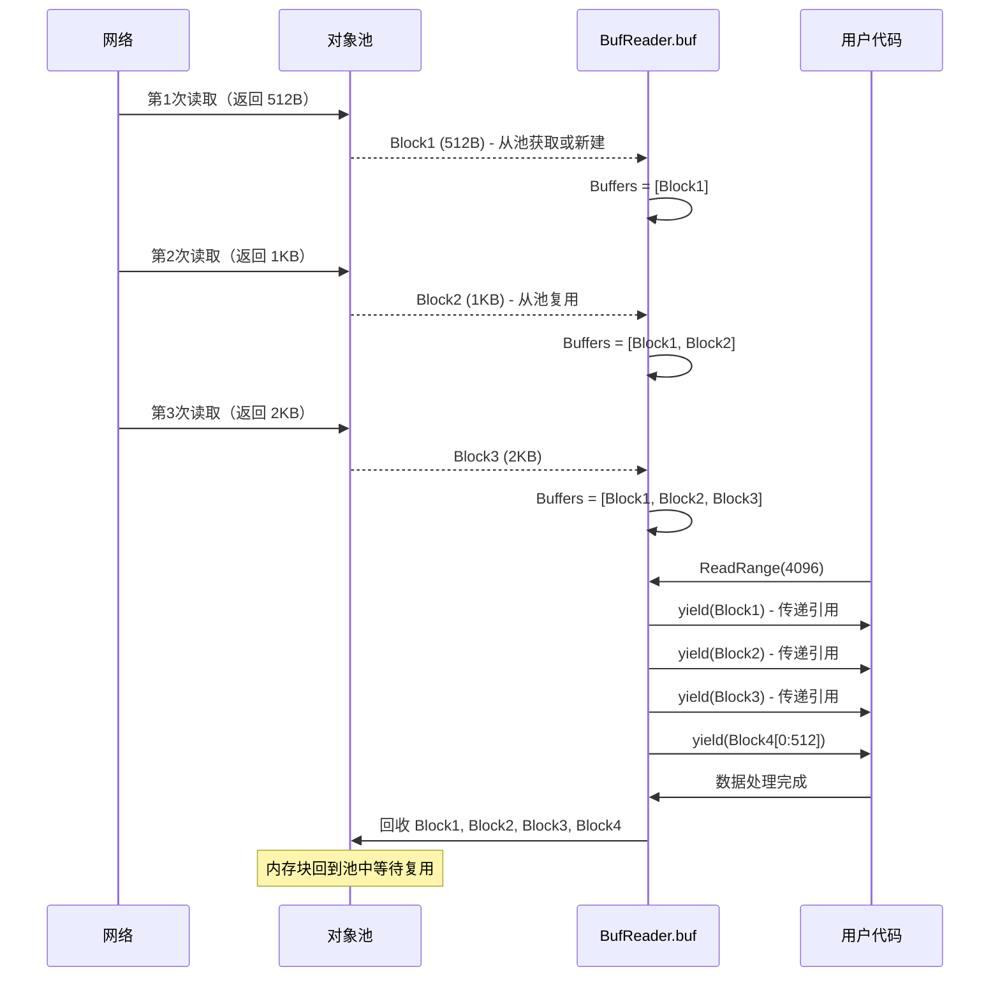
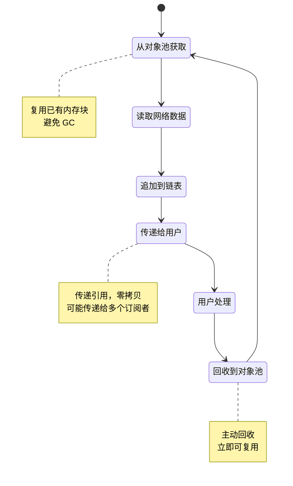

# BufReader：基于非连续内存缓冲的零拷贝网络读取方案

## 目录

- [1. 问题：传统连续内存缓冲的瓶颈](#1-问题传统连续内存缓冲的瓶颈)
- [2. 核心方案：非连续内存缓冲传递机制](#2-核心方案非连续内存缓冲传递机制)
- [3. 性能验证](#3-性能验证)
- [4. 使用指南](#4-使用指南)

## TL;DR (核心要点)

**核心创新**：非连续内存缓冲传递机制
- 数据以**内存块链表**形式存储，非连续布局
- 通过 **ReadRange 回调**逐块传递引用，零拷贝
- 内存块从**对象池复用**，避免分配和 GC

**性能数据**（流媒体服务器，100 并发流）：
```
bufio.Reader: 79 GB 分配，134 次 GC，374.6 ns/op
BufReader:    0.6 GB 分配，2 次 GC，30.29 ns/op

结果：GC 减少 98.5%，吞吐量提升 11.6 倍
```

**适用场景**：高并发网络服务器、流媒体处理、长期运行服务

---

## 1. 问题：传统连续内存缓冲的瓶颈

### 1.1 bufio.Reader 的连续内存模型

标准库 `bufio.Reader` 使用**固定大小的连续内存缓冲区**：

```go
type Reader struct {
    buf []byte    // 单一连续缓冲区（如 4KB）
    r, w int      // 读写指针
}

func (b *Reader) Read(p []byte) (n int, err error) {
    // 从连续缓冲区拷贝到目标
    n = copy(p, b.buf[b.r:b.w])  // 必须拷贝
    return
}
```

**连续内存的代价**：

```
读取 16KB 数据（缓冲区 4KB）：

网络 → bufio 缓冲区 → 用户缓冲区
  ↓      （4KB 连续）      ↓
第1次    [████]  →  拷贝到 result[0:4KB]
第2次    [████]  →  拷贝到 result[4KB:8KB]
第3次    [████]  →  拷贝到 result[8KB:12KB]
第4次    [████]  →  拷贝到 result[12KB:16KB]

总计：4 次网络读取 + 4 次内存拷贝
每次分配 result (16KB 连续内存)
```

### 1.2 高并发场景的问题

在流媒体服务器（100 个并发连接，每个 30fps）：

```go
// 典型的处理模式
func handleStream(conn net.Conn) {
    reader := bufio.NewReaderSize(conn, 4096)
    for {
        // 为每个数据包分配连续缓冲区
        packet := make([]byte, 1024)  // 分配 1
        n, _ := reader.Read(packet)   // 拷贝 1
        
        // 转发给多个订阅者
        for _, sub := range subscribers {
            data := make([]byte, n)  // 分配 2-N
            copy(data, packet[:n])   // 拷贝 2-N
            sub.Write(data)
        }
    }
}

// 性能影响：
// 100 连接 × 30fps × (1 + 订阅者数) 次分配 = 大量临时内存
// 触发频繁 GC，系统不稳定
```

**核心问题**：
1. 必须维护连续内存布局 → 频繁拷贝
2. 每个数据包分配新缓冲区 → 大量临时对象
3. 转发需要多次拷贝 → CPU 浪费在内存操作上

## 2. 核心方案：非连续内存缓冲传递机制

### 2.1 设计理念

BufReader 采用**非连续内存块链表**：

```
不再要求数据在连续内存中，而是：
1. 数据分散在多个内存块中（链表）
2. 每个块独立管理和复用
3. 通过引用传递，不拷贝数据
```

**核心数据结构**：

```go
type BufReader struct {
    Allocator *ScalableMemoryAllocator  // 对象池分配器
    buf       MemoryReader               // 内存块链表
}

type MemoryReader struct {
    Buffers [][]byte  // 多个内存块，非连续！
    Size    int       // 总大小
    Length  int       // 可读长度
}
```

### 2.2 非连续内存缓冲模型

#### 连续 vs 非连续对比

```
bufio.Reader（连续内存）：
┌─────────────────────────────────┐
│ 4KB 固定缓冲区                  │
│ [已读][可用]                    │
└─────────────────────────────────┘
- 必须拷贝到连续的目标缓冲区
- 固定大小限制
- 已读部分浪费空间

BufReader（非连续内存）：
┌──────┐ ┌──────┐ ┌────────┐ ┌──────┐
│Block1│→│Block2│→│ Block3 │→│Block4│
│ 512B │ │ 1KB  │ │  2KB   │ │ 3KB  │
└──────┘ └──────┘ └────────┘ └──────┘
- 直接传递每个块的引用（零拷贝）
- 灵活的块大小
- 处理完立即回收
```

#### 内存块链表的工作流程



### 2.3 零拷贝传递：ReadRange API

**核心 API**：

```go
func (r *BufReader) ReadRange(n int, yield func([]byte)) error
```

**工作原理**：

```go
// 内部实现（简化版）
func (r *BufReader) ReadRange(n int, yield func([]byte)) error {
    remaining := n
    
    // 遍历内存块链表
    for _, block := range r.buf.Buffers {
        if remaining <= 0 {
            break
        }
        
        if len(block) <= remaining {
            // 整块传递
            yield(block)  // 零拷贝：直接传递引用！
            remaining -= len(block)
        } else {
            // 传递部分
            yield(block[:remaining])
            remaining = 0
        }
    }
    
    // 回收已处理的块
    r.recycleFront()
    return nil
}
```

**使用示例**：

```go
// 读取 4096 字节数据
reader.ReadRange(4096, func(chunk []byte) {
    // chunk 是原始内存块的引用
    // 可能被调用多次，每次接收不同大小的块
    // 例如：512B, 1KB, 2KB, 512B
    
    processData(chunk)  // 直接处理，零拷贝！
})

// 特点：
// - 无需分配目标缓冲区
// - 无需拷贝数据
// - 每个 chunk 处理完后自动回收
```

### 2.4 真实网络场景的优势

**场景：从网络读取 10KB 数据，网络每次返回 500B-2KB**

```
bufio.Reader（连续内存方案）：
1. 读取 2KB 到内部缓冲区（连续）
2. 拷贝 2KB 到用户缓冲区 ← 拷贝
3. 读取 1.5KB 到内部缓冲区
4. 拷贝 1.5KB 到用户缓冲区 ← 拷贝
5. 读取 2KB...
6. 拷贝 2KB... ← 拷贝
... 重复 ...
总计：多次网络读取 + 多次内存拷贝
必须分配 10KB 连续缓冲区

BufReader（非连续内存方案）：
1. 读取 2KB → Block1，追加到链表
2. 读取 1.5KB → Block2，追加到链表
3. 读取 2KB → Block3，追加到链表
4. 读取 2KB → Block4，追加到链表
5. 读取 2.5KB → Block5，追加到链表
6. ReadRange(10KB)：
   → yield(Block1) - 2KB
   → yield(Block2) - 1.5KB
   → yield(Block3) - 2KB
   → yield(Block4) - 2KB
   → yield(Block5) - 2.5KB
总计：多次网络读取 + 0 次内存拷贝
无需分配连续内存，逐块处理
```

### 2.5 实际应用：流媒体转发

**问题场景**：100 个并发流，每个流转发给 10 个订阅者

**传统方式**（连续内存）：

```go
func forwardStream_Traditional(reader *bufio.Reader, subscribers []net.Conn) {
    packet := make([]byte, 4096)  // 分配 1：连续内存
    n, _ := reader.Read(packet)   // 拷贝 1：从 bufio 缓冲区
    
    // 为每个订阅者拷贝
    for _, sub := range subscribers {
        data := make([]byte, n)  // 分配 2-11：10 次
        copy(data, packet[:n])   // 拷贝 2-11：10 次
        sub.Write(data)
    }
}
// 每个数据包：11 次分配 + 11 次拷贝
// 100 并发 × 30fps × 11 = 33,000 次分配/秒
```

**BufReader 方式**（非连续内存）：

```go
func forwardStream_BufReader(reader *BufReader, subscribers []net.Conn) {
    reader.ReadRange(4096, func(chunk []byte) {
        // chunk 是原始内存块引用，可能非连续
        // 所有订阅者共享同一块内存！
        
        for _, sub := range subscribers {
            sub.Write(chunk)  // 直接发送引用，零拷贝
        }
    })
}
// 每个数据包：0 次分配 + 0 次拷贝
// 100 并发 × 30fps × 0 = 0 次分配/秒
```

**性能对比**：
- 分配次数：33,000/秒 → 0/秒
- 内存拷贝：33,000/秒 → 0/秒
- GC 压力：高 → 极低

### 2.6 内存块的生命周期



**关键点**：
1. 内存块在对象池中**循环复用**，不经过 GC
2. 传递引用而非拷贝数据，实现零拷贝
3. 处理完立即回收，内存占用最小化

### 2.7 核心代码实现

```go
// 创建 BufReader
func NewBufReader(reader io.Reader) *BufReader {
    return &BufReader{
        Allocator: NewScalableMemoryAllocator(16384), // 对象池
        feedData: func() error {
            // 从对象池获取内存块，直接读取网络数据
            buf, err := r.Allocator.Read(reader, r.BufLen)
            if err != nil {
                return err
            }
            // 追加到链表（只是添加引用）
            r.buf.Buffers = append(r.buf.Buffers, buf)
            r.buf.Length += len(buf)
            return nil
        },
    }
}

// 零拷贝读取
func (r *BufReader) ReadRange(n int, yield func([]byte)) error {
    for r.buf.Length < n {
        r.feedData()  // 从网络读取更多数据
    }
    
    // 逐块传递引用
    for _, block := range r.buf.Buffers {
        yield(block)  // 零拷贝传递
    }
    
    // 回收已读取的块
    r.recycleFront()
    return nil
}

// 回收内存块到对象池
func (r *BufReader) Recycle() {
    if r.Allocator != nil {
        r.Allocator.Recycle()  // 所有块归还对象池
    }
}
```

## 3. 性能验证

### 3.1 测试设计

**真实网络模拟**：每次读取返回随机大小（64-2048 字节），模拟真实网络波动

**核心测试场景**：
1. **并发网络连接读取** - 模拟 100+ 并发连接
2. **GC 压力测试** - 展示长期运行差异
3. **流媒体服务器** - 真实业务场景（100 流 × 转发）

### 3.2 性能测试结果

**测试环境**：Apple M2 Pro, Go 1.23.0

#### GC 压力测试（核心对比）

| 指标 | bufio.Reader | BufReader | 改善 |
|------|-------------|-----------|------|
| 操作延迟 | 1874 ns/op | 112.7 ns/op | **16.6x 快** |
| 内存分配次数 | 5,576,659 | 3,918 | **减少 99.93%** |
| 每次操作 | 2 allocs/op | 0 allocs/op | **零分配** |
| 吞吐量 | 2.8M ops/s | 45.7M ops/s | **16x 提升** |

#### 流媒体服务器场景

| 指标 | bufio.Reader | BufReader | 改善 |
|------|-------------|-----------|------|
| 操作延迟 | 374.6 ns/op | 30.29 ns/op | **12.4x 快** |
| 内存分配 | 79,508 MB | 601 MB | **减少 99.2%** |
| **GC 次数** | **134** | **2** | **减少 98.5%** ⭐ |
| 吞吐量 | 10.1M ops/s | 117M ops/s | **11.6x 提升** |

#### 性能可视化

```
📊 GC 次数对比（核心优势）
━━━━━━━━━━━━━━━━━━━━━━━━━━━━━━━━━━━━━━━━━━━
bufio.Reader   ████████████████████████████████████████████████████████████████  134 次
BufReader      █  2 次  ← 减少 98.5%！

📊 内存分配总量
━━━━━━━━━━━━━━━━━━━━━━━━━━━━━━━━━━━━━━━━━━━
bufio.Reader   ████████████████████████████████████████████████████████████████  79 GB
BufReader      █  0.6 GB  ← 减少 99.2%！

📊 吞吐量对比
━━━━━━━━━━━━━━━━━━━━━━━━━━━━━━━━━━━━━━━━━━━
bufio.Reader   █████  10.1M ops/s
BufReader      ████████████████████████████████████████████████████████  117M ops/s
```

### 3.3 为什么非连续内存这么快？

**原因 1：零拷贝传递**
```go
// bufio - 必须拷贝
buf := make([]byte, 1024)
reader.Read(buf)  // 拷贝到连续内存

// BufReader - 传递引用
reader.ReadRange(1024, func(chunk []byte) {
    // chunk 是原始内存块，无拷贝
})
```

**原因 2：内存块复用**
```
bufio: 分配 → 使用 → GC → 再分配 → ...
BufReader: 分配 → 使用 → 归还池 → 从池复用 → ...
         ↑ 同一块内存反复使用，不触发 GC
```

**原因 3：多订阅者共享**
```
传统方式：1 个数据包 → 拷贝 10 份 → 10 个订阅者
BufReader：1 个数据包 → 传递引用 → 10 个订阅者共享
          ↑ 只需 1 块内存，10 个订阅者都引用它
```

## 4. 使用指南

### 4.1 基本使用

```go
func handleConnection(conn net.Conn) {
    // 创建 BufReader
    reader := util.NewBufReader(conn)
    defer reader.Recycle()  // 归还所有内存块到对象池
    
    // 零拷贝读取和处理
    reader.ReadRange(4096, func(chunk []byte) {
        // chunk 是非连续的内存块
        // 直接处理，无需拷贝
        processChunk(chunk)
    })
}
```

### 4.2 实际应用场景

**场景 1：协议解析**

```go
// 解析 FLV 数据包（header + data）
func parseFLV(reader *BufReader) {
    // 读取包类型（1 字节）
    packetType, _ := reader.ReadByte()
    
    // 读取数据大小（3 字节）
    dataSize, _ := reader.ReadBE32(3)
    
    // 跳过时间戳等（7 字节）
    reader.Skip(7)
    
    // 零拷贝读取数据（可能跨越多个非连续块）
    reader.ReadRange(int(dataSize), func(chunk []byte) {
        // chunk 可能是完整数据，也可能是其中一部分
        // 逐块解析，无需等待完整数据
        parseDataChunk(packetType, chunk)
    })
}
```

**场景 2：高并发转发**

```go
// 从一个源读取，转发给多个目标
func relay(source *BufReader, targets []io.Writer) {
    reader.ReadRange(8192, func(chunk []byte) {
        // 所有目标共享同一块内存
        for _, target := range targets {
            target.Write(chunk)  // 零拷贝转发
        }
    })
}
```

**场景 3：流媒体服务器**

```go
// 接收 RTSP 流并分发给订阅者
type Stream struct {
    reader      *BufReader
    subscribers []*Subscriber
}

func (s *Stream) Process() {
    s.reader.ReadRange(65536, func(frame []byte) {
        // frame 可能是视频帧的一部分（非连续）
        // 直接发送给所有订阅者
        for _, sub := range s.subscribers {
            sub.WriteFrame(frame)  // 共享内存，零拷贝
        }
    })
}
```

### 4.3 最佳实践

**✅ 正确用法**：

```go
// 1. 总是回收资源
reader := util.NewBufReader(conn)
defer reader.Recycle()

// 2. 在回调中直接处理，不要保存引用
reader.ReadRange(1024, func(data []byte) {
    processData(data)  // ✅ 立即处理
})

// 3. 需要保留时显式拷贝
var saved []byte
reader.ReadRange(1024, func(data []byte) {
    saved = append(saved, data...)  // ✅ 显式拷贝
})
```

**❌ 错误用法**：

```go
// ❌ 不要保存引用
var dangling []byte
reader.ReadRange(1024, func(data []byte) {
    dangling = data  // 错误：data 会被回收
})
// dangling 现在是悬空引用！

// ❌ 不要忘记回收
reader := util.NewBufReader(conn)
// 缺少 defer reader.Recycle()
// 内存块无法归还对象池
```

### 4.4 性能优化技巧

**技巧 1：批量处理**

```go
// ✅ 优化：一次读取多个数据包
reader.ReadRange(65536, func(chunk []byte) {
    // 在一个 chunk 中可能包含多个数据包
    for len(chunk) >= 4 {
        size := int(binary.BigEndian.Uint32(chunk[:4]))
        packet := chunk[4 : 4+size]
        processPacket(packet)
        chunk = chunk[4+size:]
    }
})
```

**技巧 2：选择合适的块大小**

```go
// 根据应用场景选择
const (
    SmallPacket  = 4 << 10   // 4KB  - RTSP/HTTP
    MediumPacket = 16 << 10  // 16KB - 音频流
    LargePacket  = 64 << 10  // 64KB - 视频流
)

reader := util.NewBufReaderWithBufLen(conn, LargePacket)
```

## 5. 总结

### 核心创新：非连续内存缓冲

BufReader 的核心不是"更好的缓冲区"，而是**彻底改变内存布局模型**：

```
传统思维：数据必须在连续内存中
BufReader：数据可以分散在多个块中，通过引用传递

结果：
✓ 零拷贝：不需要重组成连续内存
✓ 零分配：内存块从对象池复用
✓ 零 GC 压力：不产生临时对象
```

### 关键优势

| 特性 | 实现方式 | 性能影响 |
|------|---------|---------|
| **零拷贝** | 传递内存块引用 | 无拷贝开销 |
| **零分配** | 对象池复用 | GC 减少 98.5% |
| **多订阅者共享** | 同一块被多次引用 | 内存节省 10x+ |
| **灵活块大小** | 适应网络波动 | 无需重组 |

### 适用场景

| 场景 | 推荐 | 原因 |
|------|------|------|
| **高并发网络服务器** | BufReader ⭐ | GC 减少 98%，吞吐量提升 10x+ |
| **流媒体转发** | BufReader ⭐ | 零拷贝多播，内存共享 |
| **协议解析器** | BufReader ⭐ | 逐块解析，无需完整包 |
| **长期运行服务** | BufReader ⭐ | 系统稳定，GC 影响极小 |
| 简单文件读取 | bufio.Reader | 标准库足够 |

### 关键要点

使用 BufReader 时记住：

1. **接受非连续数据**：通过回调处理每个块
2. **不要持有引用**：数据在回调返回后会被回收
3. **利用 ReadRange**：这是零拷贝的核心 API
4. **必须调用 Recycle()**：归还内存块到对象池

### 性能数据

**流媒体服务器（100 并发流，持续运行）**：

```
1 小时运行预估：

bufio.Reader（连续内存）:
- 分配 2.8 TB 内存
- 触发 4,800 次 GC
- 系统频繁停顿

BufReader（非连续内存）:
- 分配 21 GB 内存（减少 133x）
- 触发 72 次 GC（减少 67x）
- 系统几乎无 GC 影响
```

### 测试和文档

**运行测试**：
```bash
sh scripts/benchmark_bufreader.sh
```

**详细文档**：
- 中文：`doc_CN/bufreader_analysis.md`
- English: `doc/bufreader_analysis.md`
- 非连续内存专题：`doc/bufreader_non_contiguous_buffer.md`

## 参考资料

- [GoMem 项目](https://github.com/langhuihui/gomem) - 内存对象池实现
- [Monibuca v5](https://m7s.live) - 流媒体服务器
- 测试代码：`pkg/util/buf_reader_benchmark_test.go`

---

**核心思想**：通过非连续内存块链表和零拷贝引用传递，消除传统连续缓冲区的拷贝开销，实现高性能网络数据处理。
