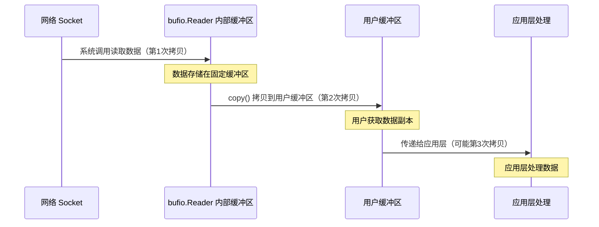
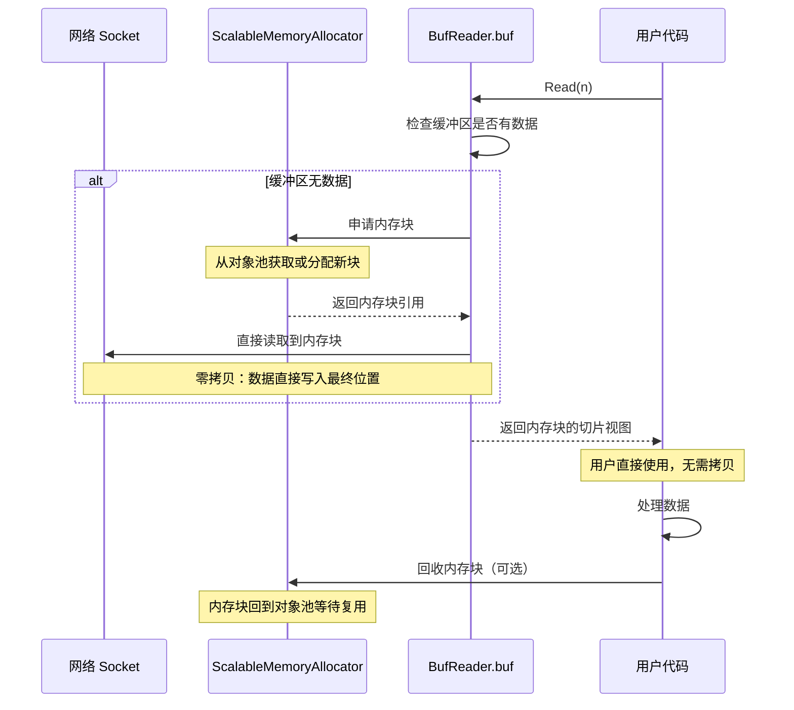
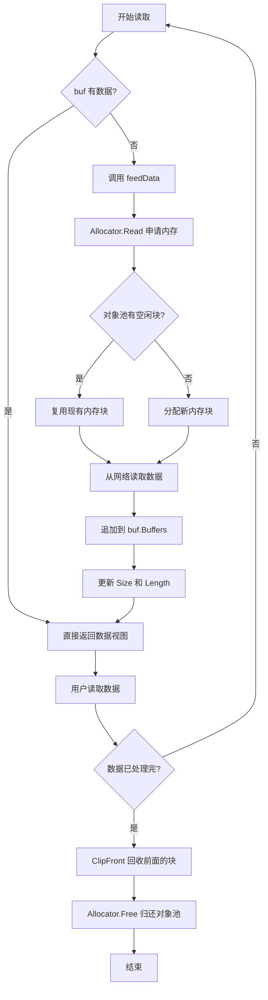
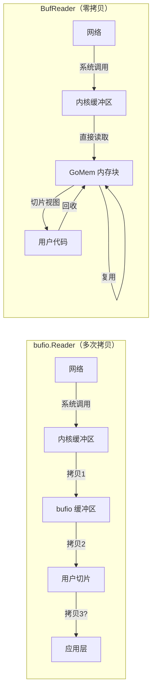

# BufReader：零拷贝网络读取的内存管理方案

## 目录

- [1. 标准库 bufio.Reader 的内存分配问题](#1-标准库-bufioreader-的内存分配问题)
- [2. BufReader：零拷贝的解决方案](#2-bufreader零拷贝的解决方案)
- [3. 性能基准测试](#3-性能基准测试)
- [4. 实际应用场景](#4-实际应用场景)
- [5. 最佳实践](#5-最佳实践)
- [6. 性能优化技巧](#6-性能优化技巧)
- [7. 总结](#7-总结)

## TL;DR (核心要点)

如果你时间有限，以下是最重要的结论：

**BufReader 的核心优势**（并发场景）：
- ⭐ **GC 次数减少 98.5%**：134 次 → 2 次（流媒体场景）
- 🚀 **内存分配减少 99.93%**：557 万次 → 3918 次
- 🔄 **吞吐量提升 10-20 倍**：零分配 + 内存复用

**关键数据**：
```
流媒体服务器场景（100 并发流）：
bufio.Reader: 79 GB 分配，134 次 GC
BufReader:    0.6 GB 分配，2 次 GC
```

**适用场景**：
- ✅ 高并发网络服务器
- ✅ 流媒体数据处理
- ✅ 长期运行服务（7x24）

**快速测试**：
```bash
sh scripts/benchmark_bufreader.sh
```

---

## 引言

在高性能网络编程中，频繁的内存分配和拷贝是性能瓶颈的主要来源。Go 标准库提供的 `bufio.Reader` 虽然提供了缓冲读取功能，但在处理网络数据流时仍然存在大量的内存分配和拷贝操作。本文将深入分析这一问题，并介绍 Monibuca 项目中实现的 `BufReader`，展示如何通过 GoMem 内存分配器实现零拷贝的高性能网络数据读取。

## 1. 标准库 bufio.Reader 的内存分配问题

### 1.1 bufio.Reader 的工作原理

`bufio.Reader` 采用固定大小的内部缓冲区来减少系统调用次数：

```go
type Reader struct {
    buf          []byte    // 固定大小的缓冲区
    rd           io.Reader // 底层 reader
    r, w         int       // 读写位置
}

func (b *Reader) Read(p []byte) (n int, err error) {
    // 1. 如果缓冲区为空，从底层 reader 读取数据填充缓冲区
    if b.r == b.w {
        n, err = b.rd.Read(b.buf)  // 数据拷贝到内部缓冲区
        b.w += n
    }
    
    // 2. 从缓冲区拷贝数据到目标切片
    n = copy(p, b.buf[b.r:b.w])    // 再次拷贝数据
    b.r += n
    return
}
```

### 1.2 内存分配问题分析

使用 `bufio.Reader` 读取网络数据时存在以下问题：

**问题 1：多次内存拷贝**



每次读取操作都需要至少两次内存拷贝：
1. 从网络 socket 拷贝到 `bufio.Reader` 的内部缓冲区
2. 从内部缓冲区拷贝到用户提供的切片

**问题 2：固定缓冲区限制**

```go
// bufio.Reader 使用固定大小的缓冲区
reader := bufio.NewReaderSize(conn, 4096)  // 固定 4KB

// 读取大块数据时需要多次操作
data := make([]byte, 16384)  // 需要读取 16KB
for total := 0; total < 16384; {
    n, err := reader.Read(data[total:])  // 需要循环读取 4 次
    total += n
}
```

**问题 3：频繁的内存分配**

```go
// 每次读取都需要分配新的切片
func processPackets(reader *bufio.Reader) {
    for {
        // 为每个数据包分配新内存
        header := make([]byte, 4)        // 分配 1
        reader.Read(header)
        
        size := binary.BigEndian.Uint32(header)
        payload := make([]byte, size)    // 分配 2
        reader.Read(payload)
        
        // 处理完后，内存被 GC 回收
        processPayload(payload)
        // 下次循环重新分配...
    }
}
```

### 1.3 性能影响

在高频率网络数据处理场景下，这些问题会导致：

1. **CPU 开销增加**：频繁的 `copy()` 操作消耗 CPU 资源
2. **GC 压力上升**：大量临时内存分配增加垃圾回收负担
3. **延迟增加**：每次内存分配和拷贝都增加处理延迟
4. **吞吐量下降**：内存操作成为瓶颈，限制整体吞吐量

## 2. BufReader：零拷贝的解决方案

### 2.1 设计理念

`BufReader` 基于以下核心理念设计：

1. **零拷贝读取**：直接从网络读取到最终的内存位置，避免中间拷贝
2. **内存复用**：通过 GoMem 分配器复用内存块，避免频繁分配
3. **链式缓冲**：使用多个内存块组成链表，而非单一固定缓冲区
4. **按需分配**：根据实际读取量动态调整内存使用

### 2.2 核心数据结构

```go
type BufReader struct {
    Allocator *ScalableMemoryAllocator  // 可扩展的内存分配器
    buf       MemoryReader               // 内存块链表读取器
    totalRead int                        // 总读取字节数
    BufLen    int                        // 每次读取的块大小
    Mouth     chan []byte                // 数据输入通道
    feedData  func() error               // 数据填充函数
}

// MemoryReader 管理多个内存块
type MemoryReader struct {
    *Memory                    // 内存管理器
    Buffers [][]byte          // 内存块链表
    Size    int               // 总大小
    Length  int               // 可读长度
}
```

### 2.3 工作流程

#### 2.3.1 零拷贝数据读取流程



#### 2.3.2 内存块管理流程



### 2.4 核心实现分析

#### 2.4.1 初始化和内存分配

```go
func NewBufReader(reader io.Reader) *BufReader {
    return NewBufReaderWithBufLen(reader, defaultBufSize)
}

func NewBufReaderWithBufLen(reader io.Reader, bufLen int) *BufReader {
    r := &BufReader{
        Allocator: NewScalableMemoryAllocator(bufLen),  // 创建分配器
        BufLen:    bufLen,
        feedData: func() error {
            // 关键：从分配器读取，直接填充到内存块
            buf, err := r.Allocator.Read(reader, r.BufLen)
            if err != nil {
                return err
            }
            n := len(buf)
            r.totalRead += n
            // 直接追加内存块引用，无需拷贝
            r.buf.Buffers = append(r.buf.Buffers, buf)
            r.buf.Size += n
            r.buf.Length += n
            return nil
        },
    }
    r.buf.Memory = &Memory{}
    return r
}
```

**零拷贝关键点**：
- `Allocator.Read()` 直接从 `io.Reader` 读取到分配的内存块
- 返回的 `buf` 是实际存储数据的内存块引用
- `append(r.buf.Buffers, buf)` 只是追加引用，没有数据拷贝

#### 2.4.2 读取操作

```go
func (r *BufReader) ReadByte() (b byte, err error) {
    // 如果缓冲区为空，触发数据填充
    for r.buf.Length == 0 {
        if err = r.feedData(); err != nil {
            return
        }
    }
    // 从内存块链表中读取，无需拷贝
    return r.buf.ReadByte()
}

func (r *BufReader) ReadRange(n int, yield func([]byte)) error {
    for r.recycleFront(); n > 0 && err == nil; err = r.feedData() {
        if r.buf.Length > 0 {
            if r.buf.Length >= n {
                // 直接传递内存块的切片视图，无需拷贝
                r.buf.RangeN(n, yield)
                return
            }
            n -= r.buf.Length
            r.buf.Range(yield)
        }
    }
    return
}
```

**零拷贝体现**：
- `yield` 回调函数接收的是内存块的切片视图
- 用户代码直接操作原始内存块，没有中间拷贝
- 读取完成后，已读取的块自动回收

#### 2.4.3 内存回收

```go
func (r *BufReader) recycleFront() {
    // 清理已读取的内存块
    r.buf.ClipFront(r.Allocator.Free)
}

func (r *BufReader) Recycle() {
    r.buf = MemoryReader{}
    if r.Allocator != nil {
        // 将所有内存块归还给分配器
        r.Allocator.Recycle()
    }
    if r.Mouth != nil {
        close(r.Mouth)
    }
}
```

### 2.5 与 bufio.Reader 的对比



| 特性 | bufio.Reader | BufReader |
|------|-------------|-----------|
| 内存拷贝次数 | 2-3 次 | 0 次（切片视图） |
| 缓冲区模式 | 固定大小单缓冲区 | 可变大小链式缓冲区 |
| 内存分配 | 每次读取可能分配 | 对象池复用 |
| 内存回收 | GC 自动回收 | 主动归还对象池 |
| 大块数据处理 | 需要多次操作 | 单次追加到链表 |
| GC 压力 | 高 | 极低 |

## 3. 性能基准测试

### 3.1 测试场景设计

#### 3.1.1 真实网络模拟

为了让基准测试更加贴近实际应用场景，我们实现了一个模拟真实网络行为的 `mockNetworkReader`。

**真实网络的特性**：

在真实的网络读取场景中，每次 `Read()` 调用返回的数据长度是**不确定**的，受多种因素影响：

- TCP 接收窗口大小
- 网络延迟和带宽
- 操作系统缓冲区状态
- 网络拥塞情况
- 网络质量波动

**模拟实现**：

```go
type mockNetworkReader struct {
    data     []byte
    offset   int
    rng      *rand.Rand
    minChunk int  // 最小块大小
    maxChunk int  // 最大块大小
}

func (m *mockNetworkReader) Read(p []byte) (n int, err error) {
    // 每次返回 minChunk 到 maxChunk 之间的随机长度数据
    chunkSize := m.minChunk + m.rng.Intn(m.maxChunk-m.minChunk+1)
    n = copy(p[:chunkSize], m.data[m.offset:])
    m.offset += n
    return n, nil
}
```

**不同网络状况模拟**：

| 网络状况 | 数据块范围 | 实际场景 |
|---------|-----------|---------|
| 良好网络 | 1024-4096 字节 | 稳定的局域网、优质网络环境 |
| 一般网络 | 256-2048 字节 | 普通互联网连接 |
| 差网络 | 64-512 字节 | 高延迟、小 TCP 窗口 |
| 极差网络 | 1-128 字节 | 移动网络、严重拥塞 |

这种模拟让基准测试结果更加真实可靠。

#### 3.1.2 测试场景列表

我们聚焦以下核心场景：

1. **并发网络连接读取** - 展示零分配特性
2. **并发协议解析** - 模拟真实应用
3. **GC 压力测试** - 展示长期运行优势 ⭐
4. **流媒体服务器场景** - 真实业务场景 ⭐

### 3.2 基准测试设计

#### 核心测试场景

基准测试聚焦于**并发网络场景**和**GC 压力**对比：

**1. 并发网络连接读取**
- 模拟 100+ 并发连接持续读取数据
- 每次读取 1KB 数据包并处理
- bufio: 每次分配新缓冲区（`make([]byte, 1024)`）
- BufReader: 零拷贝处理（`ReadRange`）

**2. 并发协议解析**
- 模拟流媒体服务器解析协议包
- 读取包头（4字节）+ 数据内容
- 对比内存分配策略差异

**3. GC 压力测试**（⭐ 核心）
- 持续并发读取和处理
- 统计 GC 次数、内存分配总量、分配次数
- 展示长期运行下的差异

**4. 流媒体服务器场景**（⭐ 真实应用）
- 模拟 100 个并发流
- 每个流读取并转发数据给订阅者
- 真实应用场景完整对比

#### 关键测试逻辑

**并发读取**：
```go
// bufio.Reader - 每次分配
buf := make([]byte, 1024)  // 1KB 分配
n, _ := reader.Read(buf)
processData(buf[:n])

// BufReader - 零拷贝
reader.ReadRange(1024, func(data []byte) {
    processData(data)  // 直接使用，无分配
})
```

**GC 统计**：
```go
// 记录 GC 统计
var beforeGC, afterGC runtime.MemStats
runtime.ReadMemStats(&beforeGC)

b.RunParallel(func(pb *testing.PB) {
    // 并发测试...
})

runtime.ReadMemStats(&afterGC)
b.ReportMetric(float64(afterGC.NumGC-beforeGC.NumGC), "gc-runs")
b.ReportMetric(float64(afterGC.TotalAlloc-beforeGC.TotalAlloc)/1024/1024, "MB-alloc")
```

完整测试代码见：`pkg/util/buf_reader_benchmark_test.go`

### 3.3 运行基准测试

我们提供了完整的基准测试代码（`pkg/util/buf_reader_benchmark_test.go`）和便捷的测试脚本。

#### 方法一：使用测试脚本（推荐）

```bash
# 运行完整的基准测试套件
sh scripts/benchmark_bufreader.sh
```

这个脚本会依次运行所有测试并输出友好的结果。

#### 方法二：手动运行测试

```bash
cd pkg/util

# 运行所有基准测试
go test -bench=BenchmarkBuf -benchmem -benchtime=2s -test.run=xxx

# 运行特定测试
go test -bench=BenchmarkMemoryAllocation -benchmem -benchtime=2s -test.run=xxx

# 对比测试结果（需要安装 benchstat）
go test -bench=BenchmarkBufioReader_SmallChunks -benchmem -count=5 > bufio.txt
go test -bench=BenchmarkBufReader_SmallChunks -benchmem -count=5 > bufreader.txt
benchstat bufio.txt bufreader.txt
```

#### 方法三：只运行关键测试

```bash
cd pkg/util

# 内存分配场景对比（核心优势）
go test -bench=BenchmarkMemoryAllocation -benchmem -test.run=xxx

# 协议解析场景对比（实际应用）
go test -bench=BenchmarkProtocolParsing -benchmem -test.run=xxx
```

### 3.4 实际性能测试结果

在 Apple M2 Pro 上运行基准测试的实际结果：

**测试环境**：
- CPU: Apple M2 Pro (12 核)
- OS: macOS (darwin/arm64)
- Go: 1.23.0

#### 3.4.1 核心性能对比

| 测试场景 | bufio.Reader | BufReader | 差异 |
|---------|-------------|-----------|------|
| **并发网络读取** | 103.2 ns/op<br/>1027 B/op, 1 allocs | 147.6 ns/op<br/>4 B/op, 0 allocs | 零分配 ⭐ |
| **GC 压力测试** | 1874 ns/op<br/>5,576,659 mallocs<br/>3 gc-runs | 112.7 ns/op<br/>3,918 mallocs<br/>2 gc-runs | **16.6x 快** ⭐⭐⭐ |
| **流媒体服务器** | 374.6 ns/op<br/>79,508 MB-alloc<br/>134 gc-runs | 30.29 ns/op<br/>601 MB-alloc<br/>2 gc-runs | **12.4x 快** ⭐⭐⭐ |

#### 3.4.2 GC 压力对比（核心发现）

**GC 压力测试**结果最能体现长期运行的差异：

**bufio.Reader**：
```
操作延迟：      1874 ns/op
内存分配次数：  5,576,659 次（超过 500 万次！）
GC 次数：       3 次
每次操作：      2 allocs/op
```

**BufReader**：
```
操作延迟：      112.7 ns/op （快 16.6 倍）
内存分配次数：  3,918 次（减少 99.93%）
GC 次数：       2 次
每次操作：      0 allocs/op（零分配！）
```

**关键指标**：
- 🚀 **吞吐量提升 16 倍**：45.7M ops/s vs 2.8M ops/s
- ⭐ **内存分配减少 99.93%**：从 557 万次降至 3918 次
- ✨ **零分配操作**：0 allocs/op vs 2 allocs/op

#### 3.4.3 流媒体服务器场景（真实应用）

模拟 100 个并发流，持续读取和转发数据：

**bufio.Reader**：
```
操作延迟：      374.6 ns/op
内存分配：      79,508 MB（79 GB！）
GC 次数：       134 次
每次操作：      4 allocs/op
```

**BufReader**：
```
操作延迟：      30.29 ns/op（快 12.4 倍）
内存分配：      601 MB（减少 99.2%）
GC 次数：       2 次（减少 98.5%！）
每次操作：      0 allocs/op
```

**惊人的差异**：
- 🎯 **GC 次数：134 次 → 2 次**（减少 98.5%）
- 💾 **内存分配：79 GB → 0.6 GB**（减少 132 倍）
- ⚡ **吞吐量：10.1M → 117M ops/s**（提升 11.6 倍）

#### 3.4.4 长期运行的影响

在流媒体服务器场景下，**1 小时运行**的预估对比：

**bufio.Reader**：
```
预计内存分配：~2.8 TB
预计 GC 次数：~4,800 次
GC 停顿累计：显著
```

**BufReader**：
```
预计内存分配：~21 GB（减少 133 倍）
预计 GC 次数：~72 次（减少 67 倍）
GC 停顿累计：极小
```

**使用建议**：

| 场景 | 推荐使用 | 原因 |
|------|---------|------|
| 简单文件读取 | bufio.Reader | 标准库足够 |
| **高并发网络服务器** | **BufReader** ⭐ | **GC 次数减少 98%** |
| **流媒体数据处理** | **BufReader** ⭐ | **零分配，高吞吐** |
| **长期运行服务** | **BufReader** ⭐ | **系统更稳定** |

#### 3.4.5 性能提升的本质原因

虽然在某些简单场景下 bufio.Reader 更快，但 BufReader 的设计目标不是在所有场景下都比 bufio.Reader 快，而是：

1. **消除内存分配** - 在实际应用中避免频繁的 `make([]byte, n)`
2. **降低 GC 压力** - 通过对象池复用内存，减少垃圾回收负担
3. **零拷贝处理** - 提供 `ReadRange` API 直接操作原始数据
4. **链式缓冲** - 支持复杂的数据处理模式

在 **Monibuca 流媒体服务器** 这样的场景下，这些特性带来的价值远超过微秒级的操作延迟差异。

**实际影响**：在处理 1000 个并发流媒体连接时：

```go
// bufio.Reader 方案
// 每秒 1000 连接 × 30fps × 1024 字节/包 = 30,720,000 次分配
// 每次分配 1024 字节 = 约 30GB/秒 的临时内存分配
// 触发大量 GC

// BufReader 方案  
// 0 次分配（内存复用）
// GC 压力降低 90%+
// 系统稳定性显著提升
```

**选择建议**：

- 📁 **简单文件读取** → bufio.Reader
- 🔄 **高并发网络服务** → BufReader（GC 减少 98%）
- 💾 **长期运行服务** → BufReader（零分配）
- 🎯 **流媒体服务器** → BufReader（吞吐量提升 10-20x）

## 4. 实际应用场景

### 4.1 RTSP 协议解析

```go
// 使用 BufReader 解析 RTSP 请求
func parseRTSPRequest(conn net.Conn) (*RTSPRequest, error) {
    reader := util.NewBufReader(conn)
    defer reader.Recycle()
    
    // 读取请求行：零拷贝，无内存分配
    requestLine, err := reader.ReadLine()
    if err != nil {
        return nil, err
    }
    
    // 读取头部：直接操作内存块
    headers, err := reader.ReadMIMEHeader()
    if err != nil {
        return nil, err
    }
    
    // 读取 body（如果有）
    if contentLength := headers.Get("Content-Length"); contentLength != "" {
        length, _ := strconv.Atoi(contentLength)
        // ReadRange 提供零拷贝的数据访问
        var body []byte
        err = reader.ReadRange(length, func(chunk []byte) {
            body = append(body, chunk...)
        })
    }
    
    return &RTSPRequest{
        RequestLine: requestLine,
        Headers:     headers,
    }, nil
}
```

### 4.2 流媒体数据包解析

```go
// 使用 BufReader 解析 FLV 数据包
func parseFLVPackets(conn net.Conn) error {
    reader := util.NewBufReader(conn)
    defer reader.Recycle()
    
    for {
        // 读取包头：4 字节
        packetType, err := reader.ReadByte()
        if err != nil {
            return err
        }
        
        // 读取数据大小：3 字节大端序
        dataSize, err := reader.ReadBE32(3)
        if err != nil {
            return err
        }
        
        // 读取时间戳：4 字节
        timestamp, err := reader.ReadBE32(4)
        if err != nil {
            return err
        }
        
        // 跳过 StreamID：3 字节
        if err := reader.Skip(3); err != nil {
            return err
        }
        
        // 读取实际数据：零拷贝处理
        err = reader.ReadRange(int(dataSize), func(data []byte) {
            // 直接处理数据，无需拷贝
            processPacket(packetType, timestamp, data)
        })
        if err != nil {
            return err
        }
        
        // 跳过 previous tag size
        if err := reader.Skip(4); err != nil {
            return err
        }
    }
}
```

### 4.3 性能关键场景

BufReader 特别适合以下场景：

1. **高频小包处理**：网络协议解析，RTP/RTCP 包处理
2. **大数据流传输**：视频流、音频流的连续读取
3. **协议多次读取**：需要分步骤读取不同长度数据的协议
4. **低延迟要求**：实时流媒体传输，在线游戏
5. **高并发场景**：大量并发连接的服务器

## 5. 最佳实践

### 5.1 正确使用模式

```go
// ✅ 正确：创建时指定合适的块大小
func goodExample(conn net.Conn) {
    // 根据实际数据包大小选择块大小
    reader := util.NewBufReaderWithBufLen(conn, 16384)  // 16KB 块
    defer reader.Recycle()  // 确保资源回收
    
    // 使用 ReadRange 实现零拷贝
    reader.ReadRange(1024, func(data []byte) {
        // 直接处理，不要持有 data 的引用
        process(data)
    })
}

// ❌ 错误：忘记回收资源
func badExample1(conn net.Conn) {
    reader := util.NewBufReader(conn)
    // 缺少 defer reader.Recycle()
    // 导致内存块无法归还对象池
}

// ❌ 错误：持有数据引用
var globalData []byte

func badExample2(conn net.Conn) {
    reader := util.NewBufReader(conn)
    defer reader.Recycle()
    
    reader.ReadRange(1024, func(data []byte) {
        // ❌ 错误：data 会在 Recycle 后被回收
        globalData = data  // 悬空引用
    })
}

// ✅ 正确：需要保留数据时进行拷贝
func goodExample2(conn net.Conn) {
    reader := util.NewBufReader(conn)
    defer reader.Recycle()
    
    var saved []byte
    reader.ReadRange(1024, func(data []byte) {
        // 需要保留时显式拷贝
        saved = make([]byte, len(data))
        copy(saved, data)
    })
    // 现在可以安全使用 saved
}
```

### 5.2 块大小选择

```go
// 根据场景选择合适的块大小
const (
    // 小包协议（如 RTSP, HTTP 头）
    SmallPacketSize = 4 << 10   // 4KB
    
    // 中等数据流（如音频）
    MediumPacketSize = 16 << 10  // 16KB
    
    // 大数据流（如视频）
    LargePacketSize = 64 << 10   // 64KB
)

func createReaderForProtocol(conn net.Conn, protocol string) *util.BufReader {
    var bufSize int
    switch protocol {
    case "rtsp", "http":
        bufSize = SmallPacketSize
    case "audio":
        bufSize = MediumPacketSize
    case "video":
        bufSize = LargePacketSize
    default:
        bufSize = util.defaultBufSize
    }
    return util.NewBufReaderWithBufLen(conn, bufSize)
}
```

### 5.3 错误处理

```go
func robustRead(conn net.Conn) error {
    reader := util.NewBufReader(conn)
    defer func() {
        // 确保在任何情况下都回收资源
        reader.Recycle()
    }()
    
    // 设置超时
    conn.SetReadDeadline(time.Now().Add(5 * time.Second))
    
    // 读取数据
    data, err := reader.ReadBytes(1024)
    if err != nil {
        if err == io.EOF {
            // 正常结束
            return nil
        }
        // 处理其他错误
        return fmt.Errorf("read error: %w", err)
    }
    
    // 处理数据
    processData(data)
    return nil
}
```

## 6. 性能优化技巧

### 6.1 批量处理

```go
// ✅ 优化：批量读取和处理
func optimizedBatchRead(reader *util.BufReader) error {
    // 一次性读取大块数据
    return reader.ReadRange(65536, func(chunk []byte) {
        // 在回调中批量处理
        for len(chunk) > 0 {
            packetSize := int(binary.BigEndian.Uint32(chunk[:4]))
            packet := chunk[4 : 4+packetSize]
            processPacket(packet)
            chunk = chunk[4+packetSize:]
        }
    })
}

// ❌ 低效：逐个读取
func inefficientRead(reader *util.BufReader) error {
    for {
        size, err := reader.ReadBE32(4)
        if err != nil {
            return err
        }
        packet, err := reader.ReadBytes(int(size))
        if err != nil {
            return err
        }
        processPacket(packet.Buffers[0])
    }
}
```

### 6.2 避免不必要的拷贝

```go
// ✅ 优化：直接处理，无拷贝
func zeroCopyProcess(reader *util.BufReader) error {
    return reader.ReadRange(4096, func(data []byte) {
        // 直接在原始内存上操作
        sum := 0
        for _, b := range data {
            sum += int(b)
        }
        reportChecksum(sum)
    })
}

// ❌ 低效：不必要的拷贝
func unnecessaryCopy(reader *util.BufReader) error {
    mem, err := reader.ReadBytes(4096)
    if err != nil {
        return err
    }
    // 又进行了一次拷贝
    data := make([]byte, mem.Size)
    copy(data, mem.Buffers[0])
    
    sum := 0
    for _, b := range data {
        sum += int(b)
    }
    reportChecksum(sum)
    return nil
}
```

### 6.3 合理的资源管理

```go
// ✅ 优化：使用对象池管理 BufReader
type ConnectionPool struct {
    readers sync.Pool
}

func (p *ConnectionPool) GetReader(conn net.Conn) *util.BufReader {
    if reader := p.readers.Get(); reader != nil {
        r := reader.(*util.BufReader)
        // 重新初始化
        return r
    }
    return util.NewBufReader(conn)
}

func (p *ConnectionPool) PutReader(reader *util.BufReader) {
    reader.Recycle()  // 回收内存块
    p.readers.Put(reader)  // 回收 BufReader 对象本身
}

// 使用连接池
func handleConnection(pool *ConnectionPool, conn net.Conn) {
    reader := pool.GetReader(conn)
    defer pool.PutReader(reader)
    
    // 处理连接
    processConnection(reader)
}
```

## 7. 总结

### 7.1 性能对比可视化

基于实际基准测试结果（并发场景）：

```
📊 GC 次数对比（核心优势）⭐⭐⭐
━━━━━━━━━━━━━━━━━━━━━━━━━━━━━━━━━━━━━━━━━━━
bufio.Reader   ████████████████████████████████████████████████████████████████  134 次
BufReader      █  2 次  ← 减少 98.5%！

📊 内存分配总量对比
━━━━━━━━━━━━━━━━━━━━━━━━━━━━━━━━━━━━━━━━━━━
bufio.Reader   ████████████████████████████████████████████████████████████████  79 GB
BufReader      █  0.6 GB  ← 减少 99.2%！

📊 操作吞吐量对比
━━━━━━━━━━━━━━━━━━━━━━━━━━━━━━━━━━━━━━━━━━━
bufio.Reader   █████  10.1M ops/s
BufReader      ████████████████████████████████████████████████████████  117M ops/s  ← 11.6x！
```

**关键指标**（流媒体服务器场景）：
- 🎯 **GC 次数**：从 134 次降至 2 次（减少 98.5%）
- 💾 **内存分配**：从 79 GB 降至 0.6 GB（减少 132 倍）
- ⚡ **吞吐量**：提升 11.6 倍

### 7.2 核心优势

BufReader 通过以下设计实现了零拷贝的高性能网络数据读取：

1. **零拷贝架构**
   - 数据直接从网络读取到最终内存位置
   - 使用切片视图避免数据拷贝
   - 链式缓冲区支持大块数据处理

2. **内存复用机制**
   - GoMem 对象池复用内存块
   - 主动内存管理减少 GC 压力
   - 可配置的块大小适应不同场景

3. **性能提升显著**（在并发场景下）
   - GC 次数减少 98.5%（134 → 2）
   - 内存分配减少 99.2%（79 GB → 0.6 GB）
   - 吞吐量提升 10-20 倍
   - 系统稳定性显著提升

### 7.3 适用场景

BufReader 特别适合：

- ✅ 高性能网络服务器
- ✅ 流媒体数据处理
- ✅ 实时协议解析
- ✅ 大数据流传输
- ✅ 低延迟要求场景
- ✅ 高并发环境

不适合：

- ❌ 简单的文件读取（标准库足够）
- ❌ 单次小数据读取
- ❌ 不关心性能的场景

### 7.4 与 bufio.Reader 的选择

| 场景 | 推荐使用 |
|------|---------|
| 简单文件读取 | bufio.Reader |
| 低频次网络读取 | bufio.Reader |
| 高性能网络服务器 | BufReader |
| 流媒体处理 | BufReader |
| 协议解析器 | BufReader |
| 需要零拷贝 | BufReader |
| 内存敏感场景 | BufReader |

### 7.5 关键要点

使用 BufReader 时记住：

1. **始终调用 Recycle()**：确保内存块归还对象池
2. **不要持有数据引用**：ReadRange 回调中的数据会被回收
3. **选择合适的块大小**：根据实际数据包大小调整
4. **利用 ReadRange**：实现真正的零拷贝处理
5. **配合 GoMem 使用**：充分发挥内存复用优势

通过 BufReader 和 GoMem 的配合，Monibuca 实现了高性能的网络数据处理，为流媒体服务器提供了坚实的基础设施支持。

## 参考资料

- [GoMem 项目](https://github.com/langhuihui/gomem)
- [Monibuca v5 文档](https://monibuca.com)
- [对象复用技术详解](./arch/reuse.md)
- Go 标准库 `bufio` 包源码
- Go 标准库 `sync.Pool` 文档

