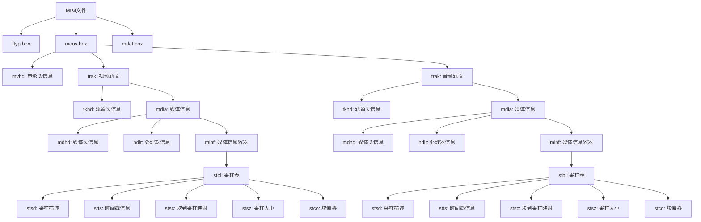
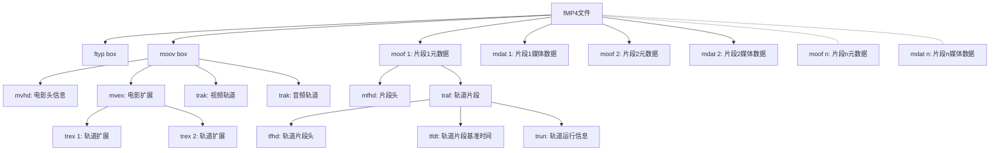
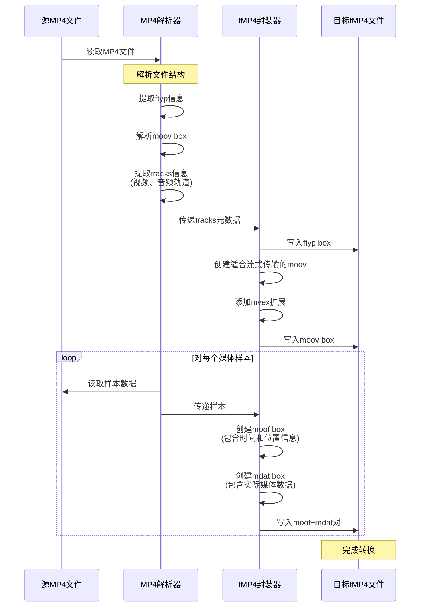
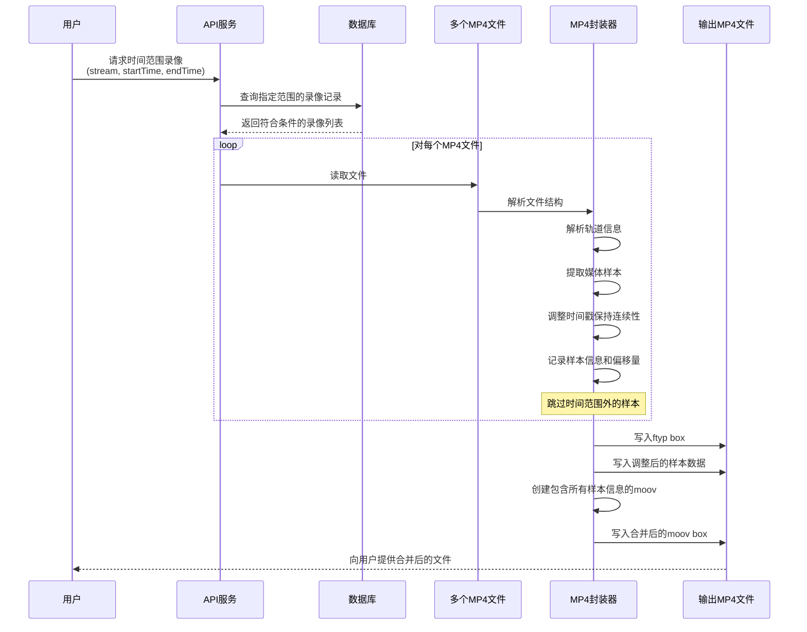
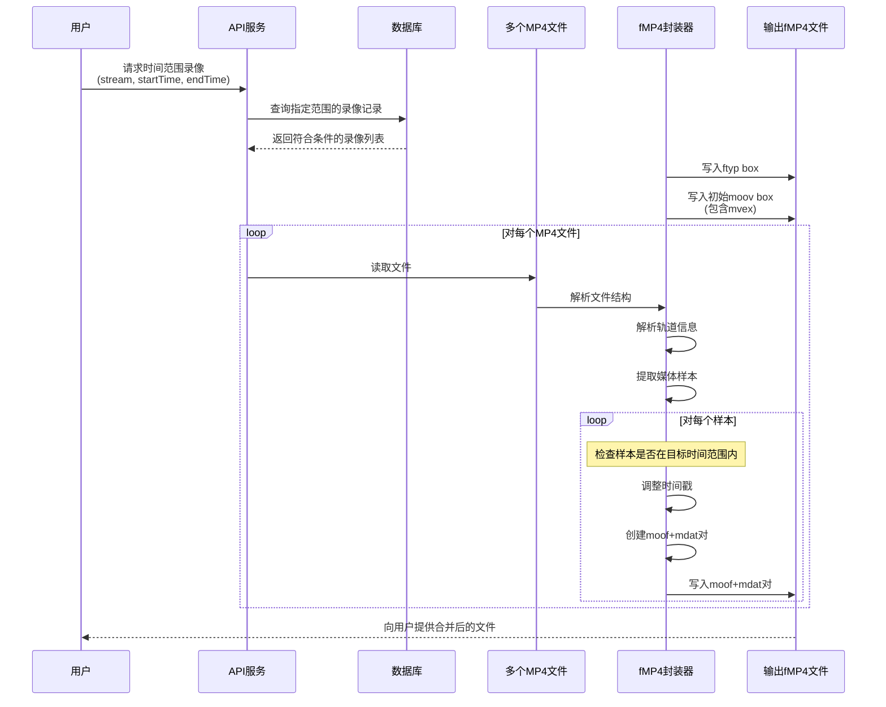
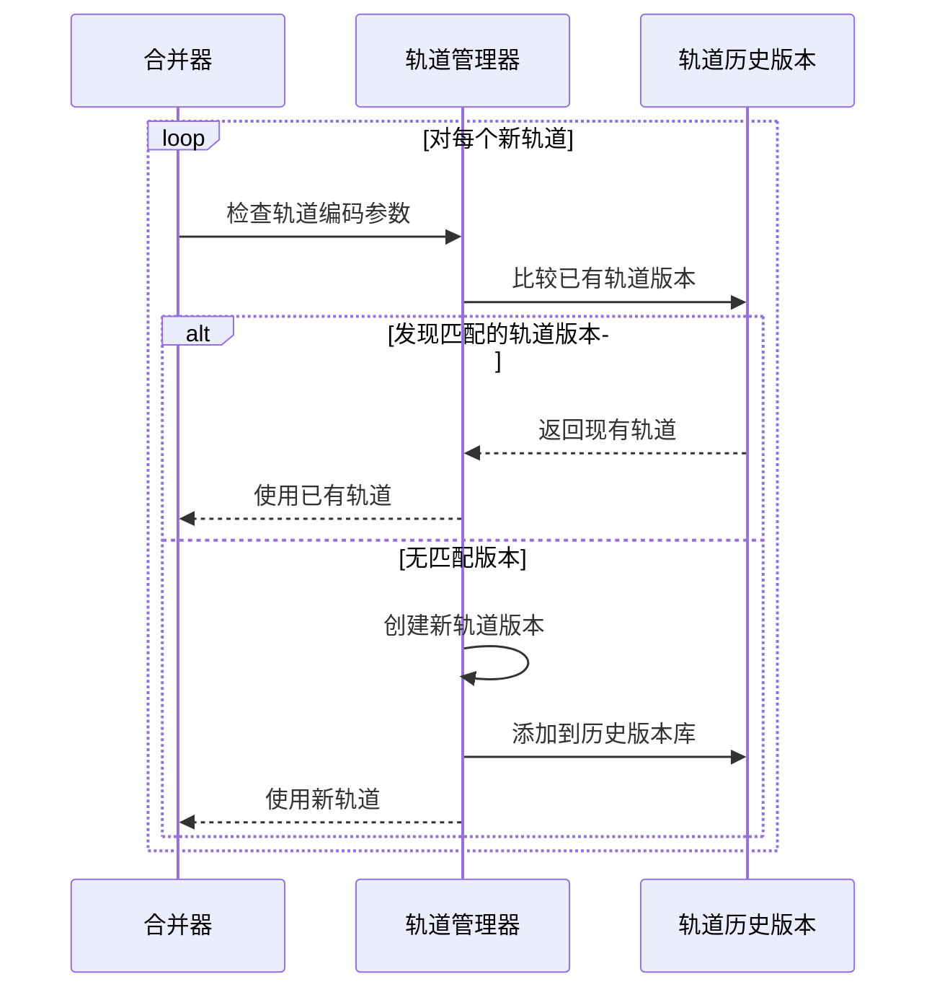
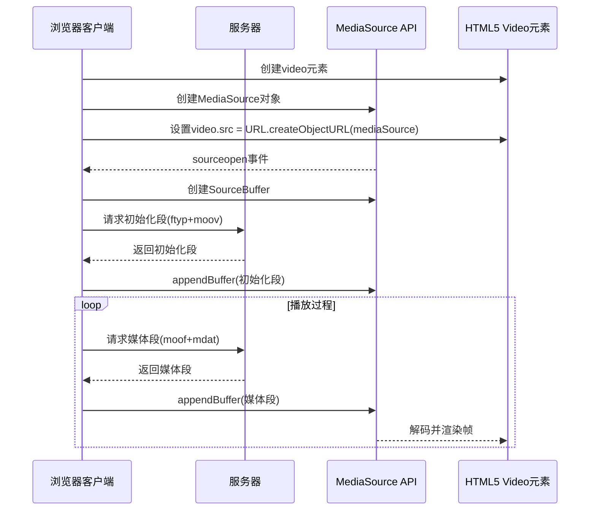
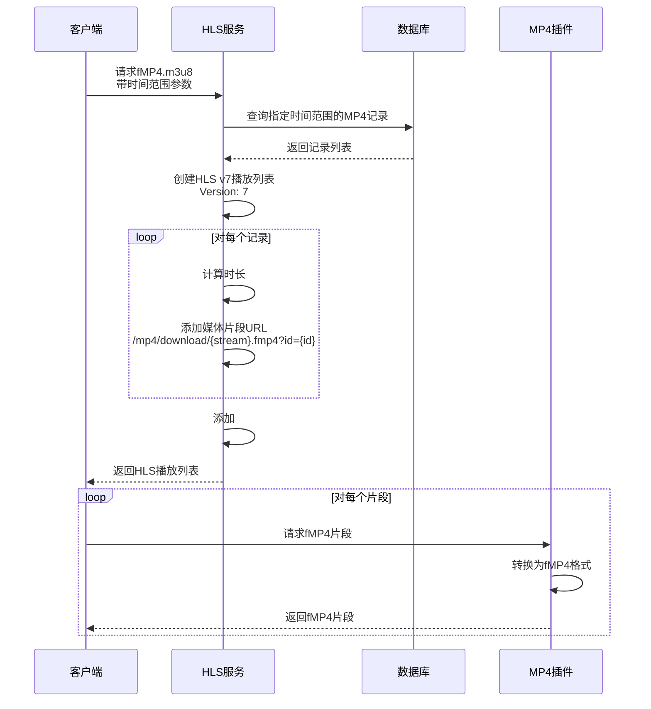

# 基于HLS v7的fMP4技术实现与应用

## 作者前言

作为Monibuca流媒体服务器的开发者，我们一直在寻求提供更高效、更灵活的流媒体解决方案。随着Web前端技术的发展，特别是Media Source Extensions (MSE) 的广泛应用，我们逐渐认识到传统的流媒体传输方案已难以满足现代应用的需求。在探索与实践中，我们发现fMP4(fragmented MP4)技术能够很好地连接传统媒体格式与现代Web技术，为用户提供更流畅的视频体验。

Monibuca项目在MP4插件的实现中，我们面临着如何将已录制的MP4文件高效转换为支持MSE播放的格式这一挑战。通过深入研究HLS v7协议和fMP4容器格式，我们最终实现了一套完整的解决方案，支持MP4到fMP4的实时转换、多段MP4的无缝合并，以及针对前端MSE播放的优化。本文将分享我们在这一过程中的技术探索和实现思路。

## 引言

随着流媒体技术的发展，视频分发方式不断演进。从传统的整体式下载到渐进式下载，再到现在广泛使用的自适应码率流媒体技术，每一步演进都极大地提升了用户体验。本文将探讨基于HLS v7的fMP4（fragmented MP4）技术实现，以及它如何与现代Web前端中的媒体源扩展（Media Source Extensions, MSE）结合，打造高效流畅的视频播放体验。

## HLS协议演进与fMP4的引入

### 传统HLS与其局限性

HTTP Live Streaming (HLS)是由Apple公司开发的HTTP自适应比特率流媒体通信协议。在早期版本中，HLS主要使用TS(Transport Stream)切片作为媒体容器格式。虽然TS格式具有良好的容错性和流式传输特性，但也存在一些局限性：

1. 相比于MP4等容器格式，TS文件体积较大
2. 每个TS切片都需要包含完整的初始化信息，导致冗余
3. 与Web技术栈的其他部分集成度不高

### HLS v7与fMP4

HLS v7版本引入了对fMP4(fragmented MP4)切片的支持，这是HLS协议的一个重大进步。fMP4作为媒体容器格式相比TS具有以下优势：

1. 文件体积更小，传输效率更高
2. 与DASH等其他流媒体协议共享相同的底层容器格式，有利于统一技术栈
3. 更好地支持现代编解码器
4. 与MSE(Media Source Extensions)有更好的兼容性

在HLS v7中，通过在播放列表中使用`#EXT-X-MAP`标签指定初始化片段，可以实现fMP4切片的无缝播放。

## MP4文件结构与fMP4的基本原理

### 传统MP4结构

传统的MP4文件遵循ISO Base Media File Format(ISO BMFF)规范，主要由以下几个部分组成：

1. **ftyp** (File Type Box): 指示文件的格式和兼容性信息
2. **moov** (Movie Box): 包含媒体的元数据信息，如轨道信息、编解码器参数等
3. **mdat** (Media Data Box): 包含实际的媒体数据

在传统MP4中，`moov`通常位于文件开头或结尾，包含了整个视频的所有元信息和索引数据。这种结构对于流式传输不友好，因为播放器需要先获取完整的`moov`才能开始播放。

以下是MP4文件的box结构示意图：



### fMP4的结构特点

fMP4(fragmented MP4)对传统MP4格式进行了重构，主要特点是：

1. 将媒体数据分割成多个片段(fragments)
2. 每个片段包含自己的元数据和媒体数据
3. 文件结构更适合流式传输

fMP4的主要组成部分：

1. **ftyp**: 与传统MP4相同，位于文件开头
2. **moov**: 包含整体的轨道信息，但不包含具体的样本信息
3. **moof** (Movie Fragment Box): 包含特定片段的元数据
4. **mdat**: 包含与前面的moof相关联的媒体数据

以下是fMP4文件的box结构示意图：



这种结构允许播放器在接收到初始的`ftyp`和`moov`后，可以立即开始处理后续接收到的`moof`+`mdat`片段，非常适合流式传输和实时播放。

## MP4到fMP4的转换原理

MP4到fMP4的转换过程可以通过以下时序图来说明：



从上图可以看出，转换过程主要包含三个关键步骤：

1. **解析源MP4文件**：读取并解析原始MP4文件的结构，提取出视频轨、音频轨的相关信息，包括编解码器类型、帧率、分辨率等元数据。

2. **创建fMP4的初始化部分**：构建文件头和初始化部分，包括ftyp和moov box，它们作为初始化段(initialization segment)，包含了解码器需要的所有信息，但不包含实际的媒体样本数据。

3. **为每个样本创建片段**：逐个读取原始MP4中的样本数据，然后为每个样本（或一组样本）创建对应的moof和mdat box对。

这种转换方式使得原本只适合下载后播放的MP4文件变成了适合流式传输的fMP4格式。

## MP4多段合并技术

### 用户需求：时间范围录像下载

在视频监控、课程回放和直播录制等场景中，用户经常需要下载特定时间范围内的录像内容。例如，一个安防系统的操作员可能只需要导出包含特定事件的视频片段，或者一个教育平台的学生可能只想下载课程中的重点部分。然而，由于系统通常按照固定时长（如30分钟或1小时）或特定事件（如直播开始/结束）来分割录制文件，用户需要的时间范围往往横跨多个独立的MP4文件。

在Monibuca项目中，我们针对这一需求，开发了基于时间范围查询和多文件合并的解决方案。用户只需指定所需内容的起止时间，系统会：

1. 查询数据库，找出所有与指定时间范围重叠的录像文件
2. 从每个文件中提取相关的时间片段
3. 将这些片段无缝合并为单个下载文件

这种方式极大地提升了用户体验，使其能够精确获取所需内容，而不必下载和浏览大量无关的视频内容。

### 数据库设计与时间范围查询

为支持时间范围查询，我们的录像文件元数据在数据库中包含以下关键字段：

- 流路径（StreamPath）：标识视频源
- 开始时间（StartTime）：录像片段的开始时间
- 结束时间（EndTime）：录像片段的结束时间
- 文件路径（FilePath）：实际录像文件的存储位置
- 文件类型（Type）：文件格式，如"mp4"

当用户请求特定时间范围的录像时，系统执行类似以下的查询：

```sql
SELECT * FROM record_streams 
WHERE stream_path = ? AND type = 'mp4' 
AND start_time <= ? AND end_time >= ?
```

这将返回所有与请求时间范围有交集的录像片段，然后系统需要从中提取相关部分并合并。

### 多段MP4合并的技术挑战

合并多个MP4文件并非简单的文件拼接，而是需要处理以下技术挑战：

1. **时间戳连续性**：确保合并后视频的时间戳连续，没有跳跃或重叠
2. **编解码一致性**：处理不同MP4文件可能使用不同编码参数的情况
3. **元数据合并**：正确合并各文件的moov box信息
4. **精确剪切**：从每个文件中精确提取用户指定时间范围的内容

在实际应用中，我们实现了两种合并策略：普通MP4合并和fMP4合并。这两种策略各有优势，适用于不同的应用场景。

### 普通MP4合并流程



这种方式下，合并过程主要是将不同MP4文件的媒体样本连续排列，并调整时间戳确保连续性。最后，重新生成一个包含所有样本信息的`moov` box。这种方法的优点是兼容性好，几乎所有播放器都能正常播放合并后的文件，适合用于下载和离线播放场景。

特别值得注意的是，在代码实现中，我们会处理参数中时间范围与实际录像时间的重叠关系，只提取用户真正需要的内容：

```go
if i == 0 {
    startTimestamp := startTime.Sub(stream.StartTime).Milliseconds()
    var startSample *box.Sample
    if startSample, err = demuxer.SeekTime(uint64(startTimestamp)); err != nil {
        tsOffset = 0
        continue
    }
    tsOffset = -int64(startSample.Timestamp)
}

// 在最后一个文件中，超出结束时间的帧会被跳过
if i == streamCount-1 && int64(sample.Timestamp) > endTime.Sub(stream.StartTime).Milliseconds() {
    break
}
```

### fMP4合并流程



fMP4的合并更加灵活，每个样本都被封装成独立的`moof`+`mdat`片段，保持了可独立解码的特性，更有利于流式传输和随机访问。这种方式特别适合与MSE和HLS结合，为实时流媒体播放提供支持，让用户能够在浏览器中直接高效地播放合并后的内容，而无需等待整个文件下载完成。

### 合并中的编解码兼容性处理

在多段录像合并过程中，我们面临的一个关键挑战是处理不同文件可能存在的编码参数差异。例如，在长时间录制过程中，摄像头可能因环境变化调整了视频分辨率，或者编码器可能重新初始化导致编码参数变化。

为了解决这一问题，Monibuca实现了一个智能的轨道版本管理系统，通过比较编码器特定数据(ExtraData)来识别变化：



这种设计确保了即使原始录像中存在编码参数变化，合并后的文件也能保持正确的解码参数，为用户提供流畅的播放体验。

### 性能优化

在处理大型视频文件或大量并发请求时，合并过程的性能是一个重要考量。我们采取了以下优化措施：

1. **流式处理**：逐帧处理样本，避免将整个文件加载到内存
2. **并行处理**：对多个独立任务(如文件解析)采用并行处理
3. **智能缓存**：缓存常用的编码参数和文件元数据
4. **按需读取**：仅读取和处理目标时间范围内的样本

这些优化使得系统能够高效处理大规模的录像合并请求，即使是跨越数小时或数天的长时间录像，也能在合理的时间内完成处理。

多段MP4合并功能极大地增强了Monibuca作为流媒体服务器的灵活性和用户体验，使用户能够精确获取所需的录像内容，无论原始录像如何分段存储。

## 媒体源扩展(MSE)与fMP4的兼容实现

### MSE技术概述

媒体源扩展(Media Source Extensions, MSE)是一种JavaScript API，允许网页开发者直接操作媒体流数据。它使得自定义的自适应比特率流媒体播放器可以完全在浏览器中实现，无需依赖外部插件。

MSE的核心工作原理是：
1. 创建一个MediaSource对象
2. 创建一个或多个SourceBuffer对象
3. 将媒体片段追加到SourceBuffer中
4. 浏览器负责解码和播放这些片段

### fMP4与MSE的完美适配

fMP4格式与MSE有着天然的兼容性，主要体现在：

1. fMP4的每个片段都可以独立解码
2. 初始化段和媒体段的清晰分离符合MSE的缓冲区管理模型
3. 时间戳的精确控制使得无缝拼接成为可能

以下时序图展示了fMP4如何与MSE配合工作：



在Monibuca的实现中，我们针对MSE进行了特殊优化：为每一帧创建独立的moof和mdat。这种实现方式尽管会增加一些开销，但提供了极高的灵活性，特别适合于低延迟的实时流媒体场景和精确的帧级操作。

## HLS与fMP4在实际应用中的集成

在实际应用中，我们将fMP4技术与HLS v7协议结合，实现了基于时间范围的点播功能。系统可以根据用户指定的时间范围，从数据库中查找对应的MP4记录，然后生成fMP4格式的HLS播放列表：



通过这种方式，我们在保持兼容现有HLS客户端的同时，利用了fMP4格式的优势，提供了更高效的流媒体服务。

## 结论

fMP4作为一种现代媒体容器格式，结合了MP4的高效压缩和流媒体传输的灵活性，非常适合现代Web应用中的视频分发需求。通过与HLS v7和MSE技术的结合，可以实现更高效、更灵活的流媒体服务。

在Monibuca项目的实践中，我们通过实现MP4到fMP4的转换、多段MP4文件的合并，以及针对MSE优化fMP4片段生成，成功构建了一套完整的流媒体解决方案。这些技术的应用使得我们的系统能够提供更好的用户体验，包括更快的启动时间、更平滑的画质切换以及更低的带宽消耗。

随着视频技术的不断发展，fMP4作为连接传统媒体格式与现代Web技术的桥梁，将继续在流媒体领域发挥重要作用。而Monibuca项目也将持续探索和优化这一技术，为用户提供更优质的流媒体服务。 