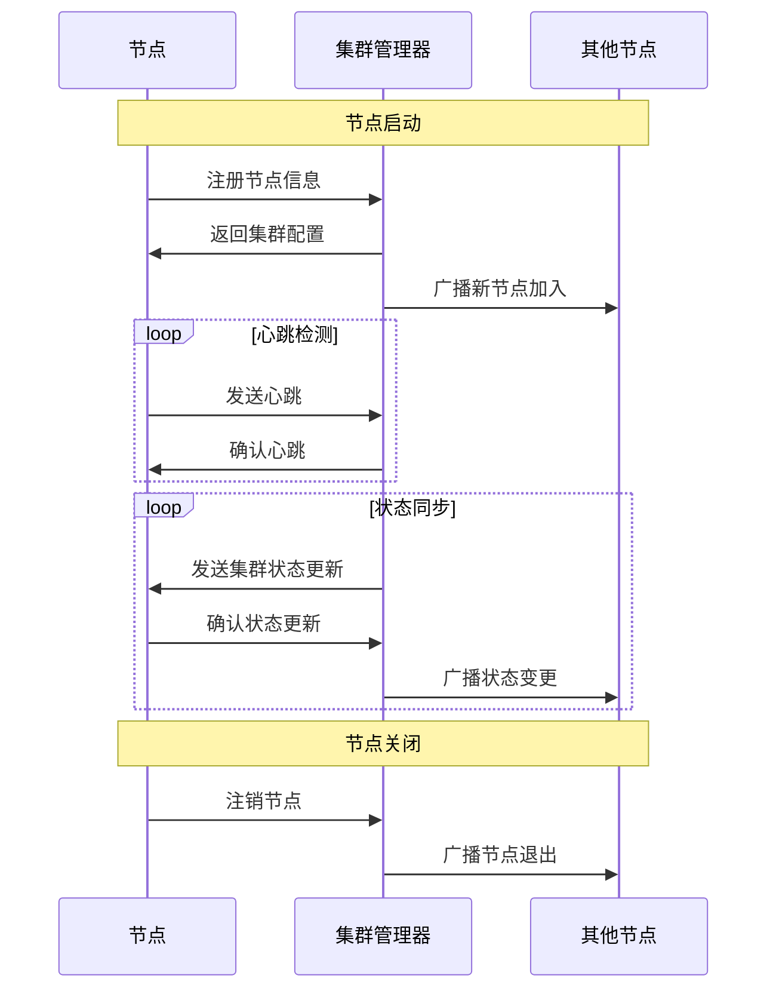
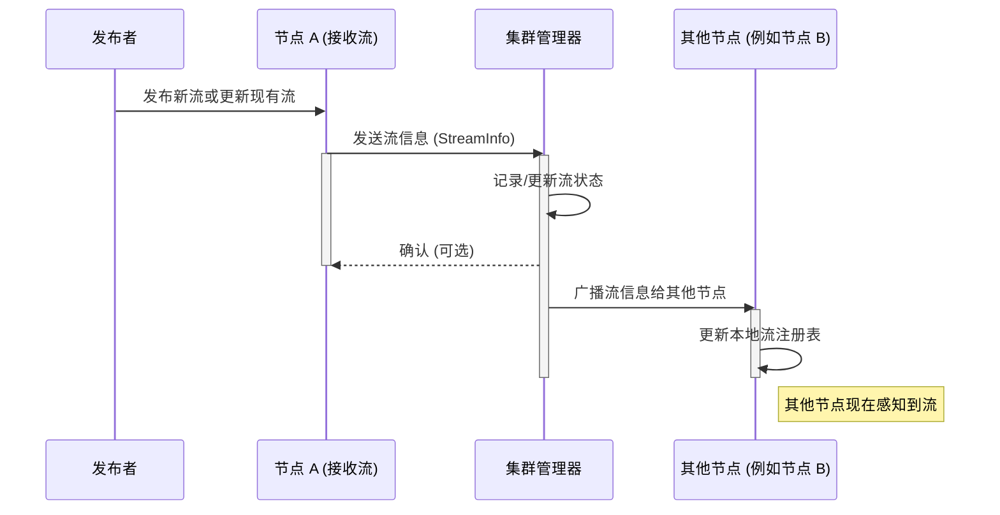

# Cluster Plugin

Cluster 是 Monibuca v5 的一个集群插件，提供了媒体服务器节点的集群管理、负载均衡、健康监控和资源优化功能。

## 功能

- **节点管理**：节点注册、注销、心跳检测和状态监控
- **集群管理**：集群状态维护、节点间通信和配置同步
- **负载均衡**：为发布者和订阅者选择最优节点
- **流同步**：节点间的流信息同步和冲突解决
- **资源优化**：基于节点负载和资源情况进行流迁移和资源分配
- **健康监控**：节点健康状态检查和故障处理

## 目录结构

- `cluster.go`: 插件主结构和初始化逻辑
- `node_agent.go`: 节点代理实现，负责节点的注册和心跳
- `cluster_manager.go`: 集群管理器实现，负责集群状态维护
- `connection_handlers.go`: 连接处理器，处理节点间通信
- `load_balancer.go`: 负载均衡器，实现节点选择算法
- `stream_sync_service.go`: 流同步服务，处理节点间流信息同步
- `resource_optimizer.go`: 资源优化器，优化集群资源分配
- `health_monitor.go`: 健康监控器，检测节点健康状态
- `pb/`: Protocol Buffers 定义文件和生成的 Go 代码
  - `common.proto`: 通用数据结构定义
  - `node.proto`: 节点管理相关接口定义
  - `stream.proto`: 流管理相关接口定义
  - `cluster.proto`: 集群管理、监控和资源优化相关接口定义
  - `Makefile`: 用于生成 Protocol Buffers 代码

## 安装和使用

### 安装

```bash
go get m7s.live/v5/plugin/cluster
```

### 配置

在 Monibuca 配置文件中添加 Cluster 插件配置：

```yaml
cluster:
  mode: "manager"  # 或 "node"
  managerAddress: "localhost:2222"  # 如果 mode 为 "node"，则需要提供
  listenAddress: ":2222"            # 如果 mode 为 "manager"，则需要提供
  authToken: "your-secure-token"    # 认证令牌
  syncInterval: "60s"               # 同步间隔
  heartbeatInterval: "10s"          # 心跳间隔
  healthCheckInterval: "30s"        # 健康检查间隔
  resourceCheckInterval: "120s"     # 资源检查间隔
```

### 作为集群管理器使用

```bash
m7s -c config.yaml
```

### 作为节点使用

```bash
m7s -c node_config.yaml
```

## API 接口

Cluster 插件提供了以下 API 接口：

- `/cluster/api/nodes` - 获取所有节点信息
- `/cluster/api/streams` - 获取所有流信息
- `/cluster/api/status` - 获取集群状态
- `/cluster/api/optimize` - 触发资源优化
- `/cluster/api/migrate` - 迁移指定流

详细 API 文档请参考 [API 文档](docs/api.md)。

## 节点同步时序图



## 流信息同步时序图



## Protocol Buffers

Cluster 使用 Protocol Buffers 定义组件间通信的数据结构和接口。要生成 Go 代码，进入 `pb` 目录并执行：

```bash
cd pb && make
```

更多关于 Protocol Buffers 的信息，请参考 [pb/README.md](pb/README.md)。

## 单元测试

运行单元测试：

```bash
go test -v ./...
```

## 贡献

欢迎提交 Pull Request 或 Issue 来帮助我们改进 Cluster 插件。