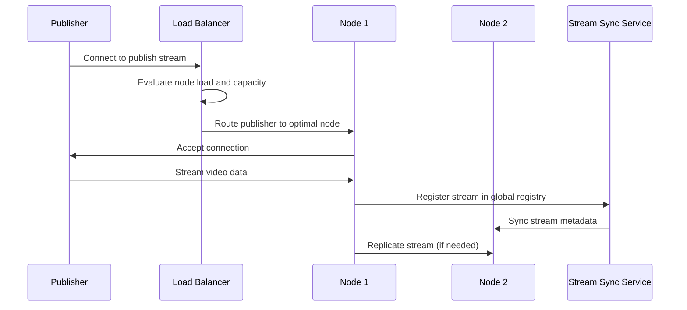
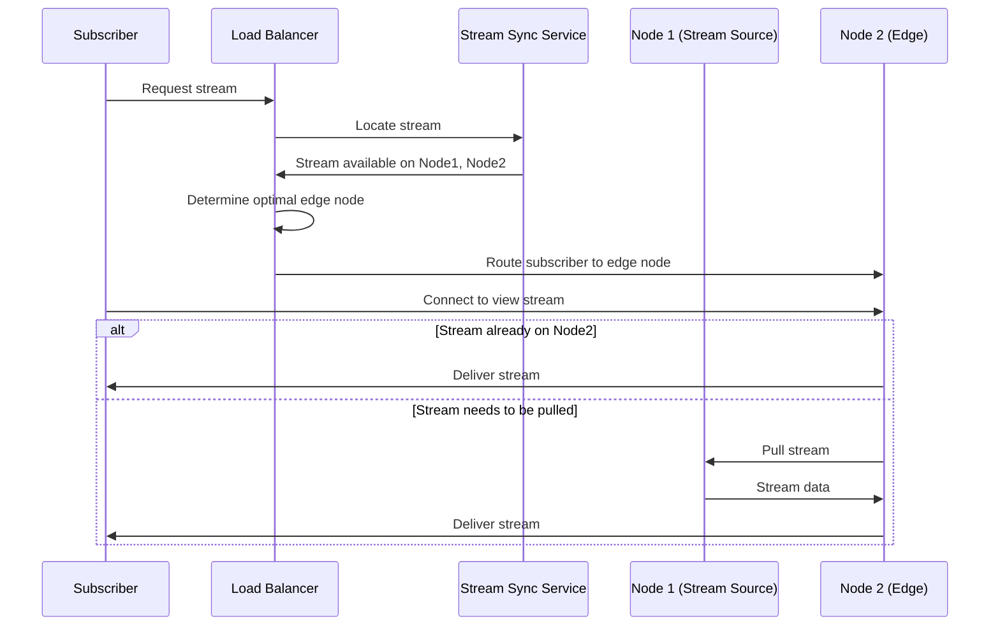
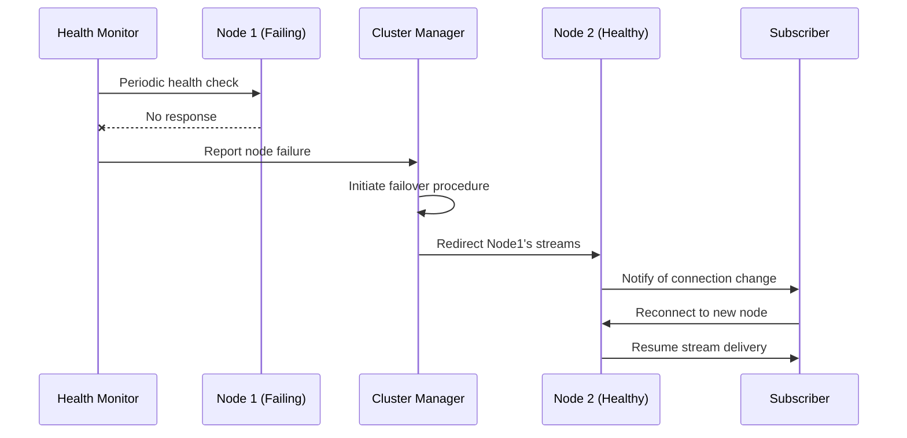
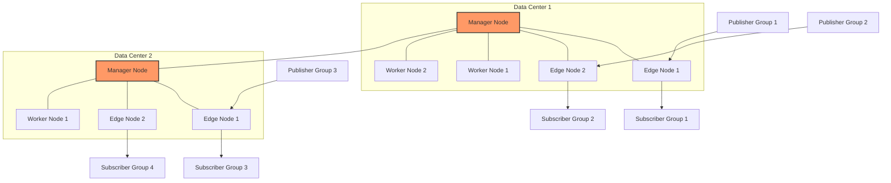

# Cluster Architecture Diagram

```mermaid
graph TD
    subgraph "Cluster Management Layer"
        CM[Cluster Manager] --> HA[High Availability Module]
        CM --> LB[Load Balancer]
        CM --> RO[Resource Optimizer]
        CM --> SSS[Stream Synchronization Service]
        CM --> HM[Health Monitor]
        CM <--> API[Management API]
    end

    subgraph "Node 1 (Manager)"
        CM
        N1_NA[Node Agent]
        N1_SM[Stream Manager]
        N1_RM[Resource Monitor]
        N1_PB[Publisher Balancer]
        N1_SB[Subscriber Balancer]
        
        N1_NA --> N1_SM
        N1_NA --> N1_RM
        N1_NA --> N1_PB
        N1_NA --> N1_SB
        N1_NA <--> CM
    end

    subgraph "Node 2 (Edge)"
        N2_NA[Node Agent]
        N2_SM[Stream Manager]
        N2_RM[Resource Monitor]
        N2_PB[Publisher Balancer]
        N2_SB[Subscriber Balancer]
        
        N2_NA --> N2_SM
        N2_NA --> N2_RM
        N2_NA --> N2_PB
        N2_NA --> N2_SB
        N2_NA <--> CM
    end

    subgraph "Node 3 (Worker)"
        N3_NA[Node Agent]
        N3_SM[Stream Manager]
        N3_RM[Resource Monitor]
        N3_PB[Publisher Balancer]
        N3_SB[Subscriber Balancer]
        
        N3_NA --> N3_SM
        N3_NA --> N3_RM
        N3_NA --> N3_PB
        N3_NA --> N3_SB
        N3_NA <--> CM
    end

    subgraph "External Systems"
        P1[Publisher 1] --> N1_PB
        P2[Publisher 2] --> N2_PB
        P3[Publisher 3] --> N3_PB
        
        N1_SB --> S1[Subscriber 1]
        N2_SB --> S2[Subscriber 2]
        N3_SB --> S3[Subscriber 3]
        
        API <--> UI[Admin UI]
        API <--> AS[Alerting System]
    end

    %% Data Flow
    P1 -- "Video Stream" --> N1_SM
    P2 -- "Video Stream" --> N2_SM
    P3 -- "Video Stream" --> N3_SM
    
    N1_SM -- "Stream Metadata" --> SSS
    N2_SM -- "Stream Metadata" --> SSS
    N3_SM -- "Stream Metadata" --> SSS
    
    N1_RM -- "Resource Metrics" --> RO
    N2_RM -- "Resource Metrics" --> RO
    N3_RM -- "Resource Metrics" --> RO
    
    N1_RM -- "Health Data" --> HM
    N2_RM -- "Health Data" --> HM
    N3_RM -- "Health Data" --> HM
    
    LB -- "Load Balancing Decisions" --> N1_PB
    LB -- "Load Balancing Decisions" --> N2_PB
    LB -- "Load Balancing Decisions" --> N3_PB
    
    LB -- "Load Balancing Decisions" --> N1_SB
    LB -- "Load Balancing Decisions" --> N2_SB
    LB -- "Load Balancing Decisions" --> N3_SB
    
    %% Cross-Node Streaming
    N1_SM -- "Stream Replication" --> N2_SM
    N2_SM -- "Stream Replication" --> N3_SM
    N3_SM -- "Stream Replication" --> N1_SM

    style CM fill:#f96,stroke:#333,stroke-width:2px
    style LB fill:#9cf,stroke:#333,stroke-width:2px
    style RO fill:#9cf,stroke:#333,stroke-width:2px
    style SSS fill:#9cf,stroke:#333,stroke-width:2px
    style HM fill:#9cf,stroke:#333,stroke-width:2px
    style HA fill:#9cf,stroke:#333,stroke-width:2px
```

## Component Interactions

### 1. Stream Publishing Flow

```mermaid
sequenceDiagram
    participant Publisher
    participant LB as Load Balancer
    participant Node1 as Node 1
    participant Node2 as Node 2
    participant SSS as Stream Sync Service
    
    Publisher->>LB: Connect to publish stream
    LB->>LB: Evaluate node load and capacity
    LB->>Node1: Route publisher to optimal node
    Node1->>Publisher: Accept connection
    Publisher->>Node1: Stream video data
    Node1->>SSS: Register stream in global registry
    SSS->>Node2: Sync stream metadata
    Node1->>Node2: Replicate stream (if needed)
```

### 2. Stream Consumption Flow

```mermaid
sequenceDiagram
    participant Subscriber
    participant LB as Load Balancer
    participant SSS as Stream Sync Service
    participant Node1 as Node 1 (Stream Source)
    participant Node2 as Node 2 (Edge)
    
    Subscriber->>LB: Request stream
    LB->>SSS: Locate stream
    SSS->>LB: Stream available on Node1, Node2
    LB->>LB: Determine optimal edge node
    LB->>Node2: Route subscriber to edge node
    Subscriber->>Node2: Connect to view stream
    alt Stream already on Node2
        Node2->>Subscriber: Deliver stream
    else Stream needs to be pulled
        Node2->>Node1: Pull stream
        Node1->>Node2: Stream data
        Node2->>Subscriber: Deliver stream
    end
```

### 3. Node Failure Handling

```mermaid
sequenceDiagram
    participant HM as Health Monitor
    participant Node1 as Node 1 (Failing)
    participant CM as Cluster Manager
    participant Node2 as Node 2 (Healthy)
    participant Subscriber
    
    HM->>Node1: Periodic health check
    Node1--xHM: No response
    HM->>CM: Report node failure
    CM->>CM: Initiate failover procedure
    CM->>Node2: Redirect Node1's streams
    Node2->>Subscriber: Notify of connection change
    Subscriber->>Node2: Reconnect to new node
    Node2->>Subscriber: Resume stream delivery
```

## Physical Deployment View

```mermaid
graph TD
    subgraph "Data Center 1"
        DC1_M[Manager Node] --- DC1_E1[Edge Node 1]
        DC1_M --- DC1_E2[Edge Node 2]
        DC1_M --- DC1_W1[Worker Node 1]
        DC1_M --- DC1_W2[Worker Node 2]
    end
    
    subgraph "Data Center 2"
        DC2_M[Manager Node] --- DC2_E1[Edge Node 1]
        DC2_M --- DC2_E2[Edge Node 2]
        DC2_M --- DC2_W1[Worker Node 1]
    end
    
    DC1_M --- DC2_M
    
    P1[Publisher Group 1] --> DC1_E1
    P2[Publisher Group 2] --> DC1_E2
    P3[Publisher Group 3] --> DC2_E1
    
    DC1_E1 --> S1[Subscriber Group 1]
    DC1_E2 --> S2[Subscriber Group 2]
    DC2_E1 --> S3[Subscriber Group 3]
    DC2_E2 --> S4[Subscriber Group 4]
    
    style DC1_M fill:#f96,stroke:#333,stroke-width:2px
    style DC2_M fill:#f96,stroke:#333,stroke-width:2px
``` 