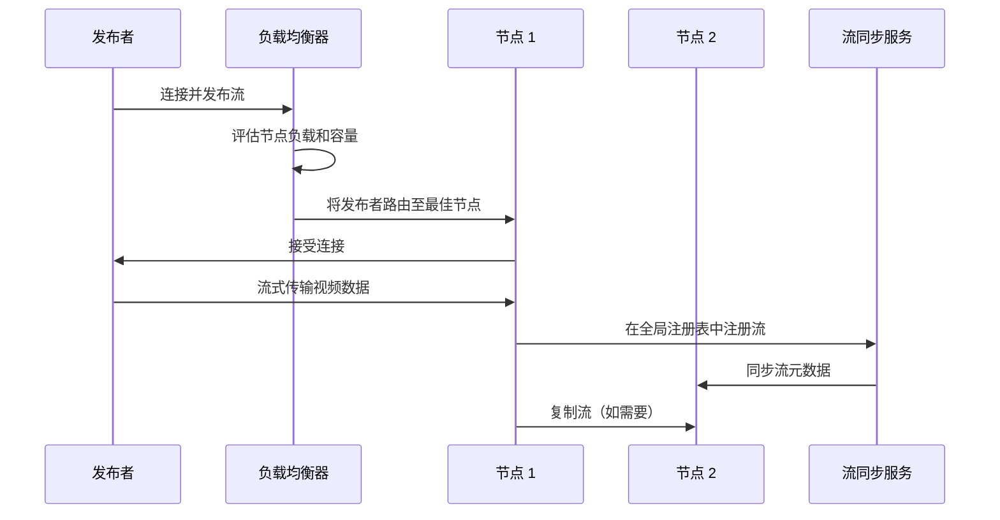
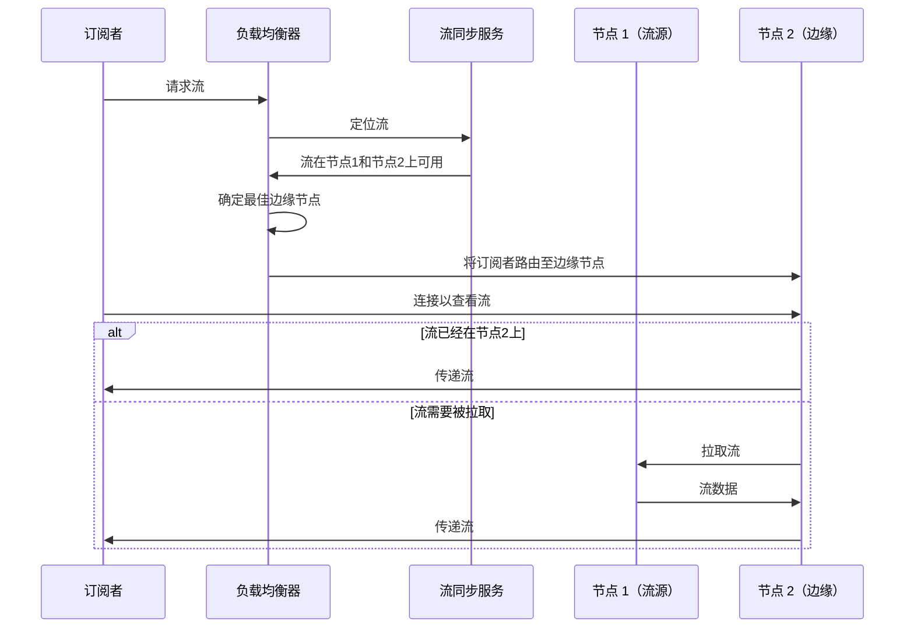
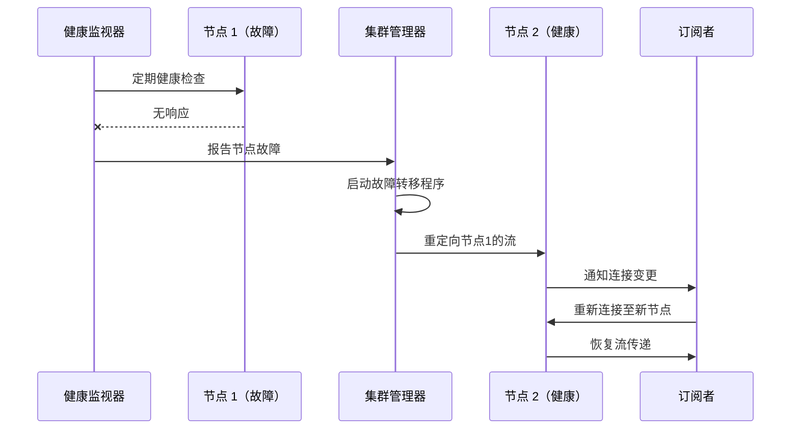
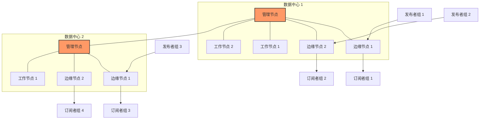

# Cluster 架构图

```mermaid
graph TD
    subgraph "集群管理层"
        CM[集群管理器] --> HA[高可用性模块]
        CM --> LB[负载均衡器]
        CM --> RO[资源优化器]
        CM --> SSS[流同步服务]
        CM --> HM[健康监视器]
        CM <--> API[管理 API]
    end

    subgraph "节点 1 (管理器)"
        CM
        N1_NA[节点代理]
        N1_SM[流管理器]
        N1_RM[资源监视器]
        N1_PB[发布者均衡器]
        N1_SB[订阅者均衡器]
        
        N1_NA --> N1_SM
        N1_NA --> N1_RM
        N1_NA --> N1_PB
        N1_NA --> N1_SB
        N1_NA <--> CM
    end

    subgraph "节点 2 (边缘)"
        N2_NA[节点代理]
        N2_SM[流管理器]
        N2_RM[资源监视器]
        N2_PB[发布者均衡器]
        N2_SB[订阅者均衡器]
        
        N2_NA --> N2_SM
        N2_NA --> N2_RM
        N2_NA --> N2_PB
        N2_NA --> N2_SB
        N2_NA <--> CM
    end

    subgraph "节点 3 (工作器)"
        N3_NA[节点代理]
        N3_SM[流管理器]
        N3_RM[资源监视器]
        N3_PB[发布者均衡器]
        N3_SB[订阅者均衡器]
        
        N3_NA --> N3_SM
        N3_NA --> N3_RM
        N3_NA --> N3_PB
        N3_NA --> N3_SB
        N3_NA <--> CM
    end

    subgraph "外部系统"
        P1[发布者 1] --> N1_PB
        P2[发布者 2] --> N2_PB
        P3[发布者 3] --> N3_PB
        
        N1_SB --> S1[订阅者 1]
        N2_SB --> S2[订阅者 2]
        N3_SB --> S3[订阅者 3]
        
        API <--> UI[管理界面]
        API <--> AS[告警系统]
    end

    %% 数据流
    P1 -- "视频流" --> N1_SM
    P2 -- "视频流" --> N2_SM
    P3 -- "视频流" --> N3_SM
    
    N1_SM -- "流元数据" --> SSS
    N2_SM -- "流元数据" --> SSS
    N3_SM -- "流元数据" --> SSS
    
    N1_RM -- "资源指标" --> RO
    N2_RM -- "资源指标" --> RO
    N3_RM -- "资源指标" --> RO
    
    N1_RM -- "健康数据" --> HM
    N2_RM -- "健康数据" --> HM
    N3_RM -- "健康数据" --> HM
    
    LB -- "负载均衡决策" --> N1_PB
    LB -- "负载均衡决策" --> N2_PB
    LB -- "负载均衡决策" --> N3_PB
    
    LB -- "负载均衡决策" --> N1_SB
    LB -- "负载均衡决策" --> N2_SB
    LB -- "负载均衡决策" --> N3_SB
    
    %% 跨节点流传输
    N1_SM -- "流复制" --> N2_SM
    N2_SM -- "流复制" --> N3_SM
    N3_SM -- "流复制" --> N1_SM

    style CM fill:#f96,stroke:#333,stroke-width:2px
    style LB fill:#9cf,stroke:#333,stroke-width:2px
    style RO fill:#9cf,stroke:#333,stroke-width:2px
    style SSS fill:#9cf,stroke:#333,stroke-width:2px
    style HM fill:#9cf,stroke:#333,stroke-width:2px
    style HA fill:#9cf,stroke:#333,stroke-width:2px
```

## 组件交互

### 1. 流发布流程

```mermaid
sequenceDiagram
    participant Publisher as 发布者
    participant LB as 负载均衡器
    participant Node1 as 节点 1
    participant Node2 as 节点 2
    participant SSS as 流同步服务
    
    Publisher->>LB: 连接并发布流
    LB->>LB: 评估节点负载和容量
    LB->>Node1: 将发布者路由至最佳节点
    Node1->>Publisher: 接受连接
    Publisher->>Node1: 流式传输视频数据
    Node1->>SSS: 在全局注册表中注册流
    SSS->>Node2: 同步流元数据
    Node1->>Node2: 复制流（如需要）
```

### 2. 流消费流程

```mermaid
sequenceDiagram
    participant Subscriber as 订阅者
    participant LB as 负载均衡器
    participant SSS as 流同步服务
    participant Node1 as 节点 1（流源）
    participant Node2 as 节点 2（边缘）
    
    Subscriber->>LB: 请求流
    LB->>SSS: 定位流
    SSS->>LB: 流在节点1和节点2上可用
    LB->>LB: 确定最佳边缘节点
    LB->>Node2: 将订阅者路由至边缘节点
    Subscriber->>Node2: 连接以查看流
    alt 流已经在节点2上
        Node2->>Subscriber: 传递流
    else 流需要被拉取
        Node2->>Node1: 拉取流
        Node1->>Node2: 流数据
        Node2->>Subscriber: 传递流
    end
```

### 3. 节点故障处理

```mermaid
sequenceDiagram
    participant HM as 健康监视器
    participant Node1 as 节点 1（故障）
    participant CM as 集群管理器
    participant Node2 as 节点 2（健康）
    participant Subscriber as 订阅者
    
    HM->>Node1: 定期健康检查
    Node1--xHM: 无响应
    HM->>CM: 报告节点故障
    CM->>CM: 启动故障转移程序
    CM->>Node2: 重定向节点1的流
    Node2->>Subscriber: 通知连接变更
    Subscriber->>Node2: 重新连接至新节点
    Node2->>Subscriber: 恢复流传递
```

## 物理部署视图

```mermaid
graph TD
    subgraph "数据中心 1"
        DC1_M[管理节点] --- DC1_E1[边缘节点 1]
        DC1_M --- DC1_E2[边缘节点 2]
        DC1_M --- DC1_W1[工作节点 1]
        DC1_M --- DC1_W2[工作节点 2]
    end
    
    subgraph "数据中心 2"
        DC2_M[管理节点] --- DC2_E1[边缘节点 1]
        DC2_M --- DC2_E2[边缘节点 2]
        DC2_M --- DC2_W1[工作节点 1]
    end
    
    DC1_M --- DC2_M
    
    P1[发布者组 1] --> DC1_E1
    P2[发布者组 2] --> DC1_E2
    P3[发布者组 3] --> DC2_E1
    
    DC1_E1 --> S1[订阅者组 1]
    DC1_E2 --> S2[订阅者组 2]
    DC2_E1 --> S3[订阅者组 3]
    DC2_E2 --> S4[订阅者组 4]
    
    style DC1_M fill:#f96,stroke:#333,stroke-width:2px
    style DC2_M fill:#f96,stroke:#333,stroke-width:2px
``` 