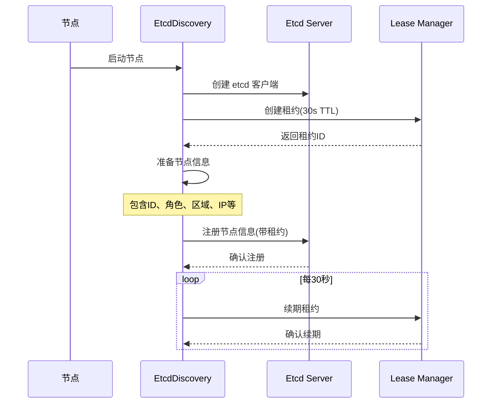
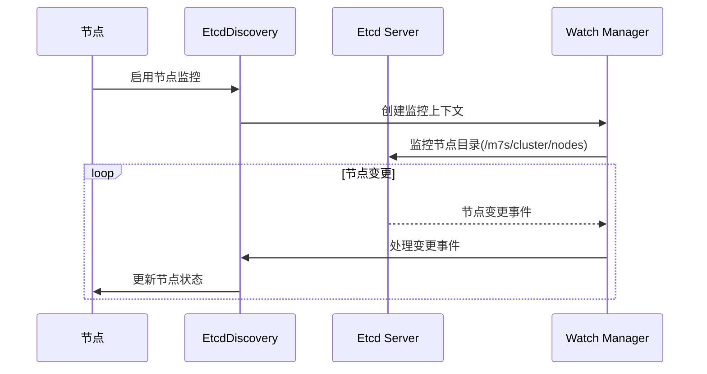
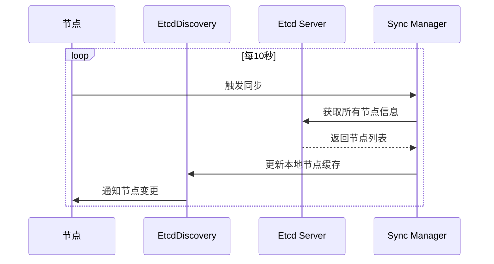
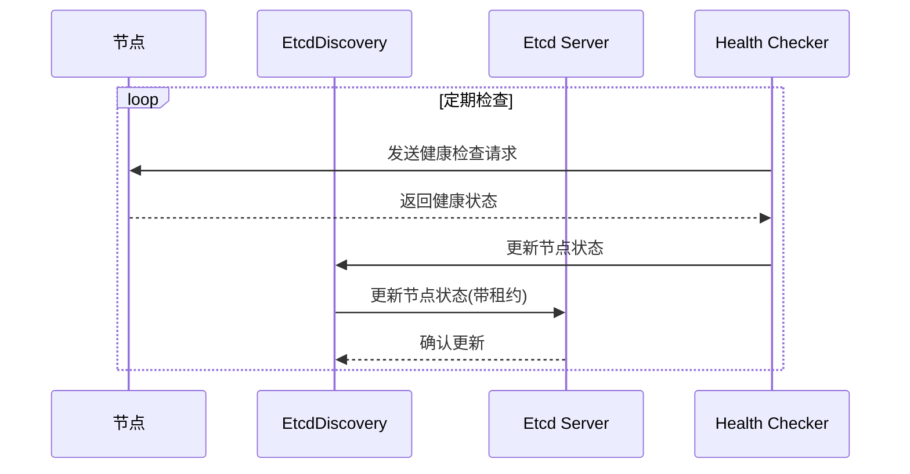
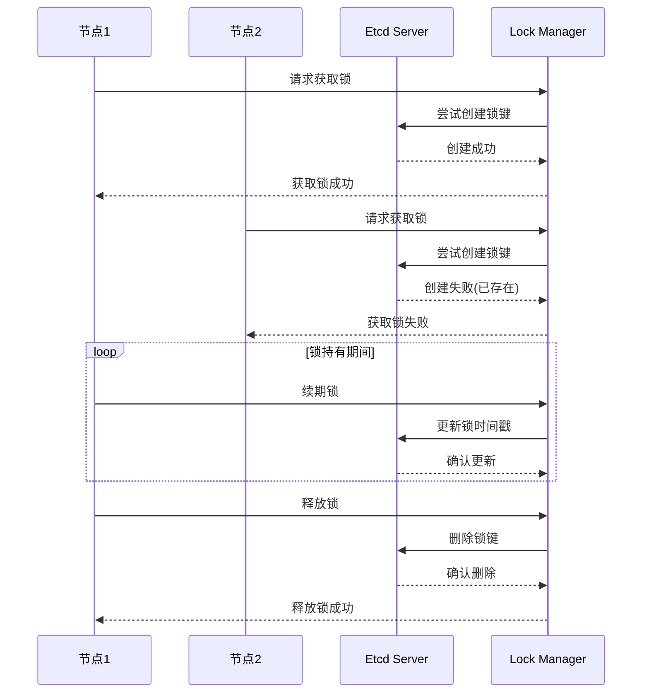

# Etcd 技术文档

## 简介

Etcd 是一个高可用的分布式键值存储系统，主要用于配置管理和服务发现。在 Claster 中，我们使用 Etcd 作为集群管理的核心组件，负责存储和管理集群的配置信息、节点状态以及服务发现等功能。

## 架构设计

### 核心组件

1. **EtcdDiscovery**
   - 实现基于 etcd 的服务发现
   - 管理节点注册和状态同步
   - 处理节点健康检查

2. **EtcdServer**
   - 内嵌的 etcd 服务器
   - 支持单节点和集群模式
   - 提供数据持久化

### 核心功能

1. **配置管理**
   - 存储集群配置信息
   - 管理节点配置
   - 配置变更通知

2. **服务发现**
   - 节点注册与发现
   - 健康检查
   - 服务状态同步

3. **分布式锁**
   - 集群操作互斥
   - 资源竞争控制

### 数据模型

Etcd 使用层级化的键值存储结构：

```
/m7s/cluster
  /nodes
    /{node-id}
      /status
      /config
      /metadata
  /services
    /{service-name}
      /instances
      /config
  /locks
    /{lock-name}
```

## 使用说明

### 配置

在 `config.yaml` 中配置 Etcd 连接信息：

```yaml
etcd:
  enabled: true
  endpoints:
    - http://localhost:2379
  username: root
  password: root
  dial_timeout: 5s
  request_timeout: 5s
  node_key_ttl: 30s
  auto_sync_interval: 10s
  enable_watcher: true
  key_prefix: /m7s/cluster
  server:
    enabled: false
    data_dir: data/etcd
    listen_client_urls:
      - http://localhost:2379
    advertise_client_urls:
      - http://localhost:2379
    listen_peer_urls:
      - http://localhost:2380
    advertise_peer_urls:
      - http://localhost:2380
    initial_cluster: ""
    initial_cluster_state: new
    initial_cluster_token: ""
    snapshot_count: 10000
    auto_compaction_mode: revision
    auto_compaction_retention: 1000
    quota_backend_bytes: 0
```

### 节点信息结构

```go
type NodeInfo struct {
    ID            string
    Role          string
    Region        string
    IP            string
    JoinTime      time.Time
    LastHeartbeat time.Time
    Online        bool
    Status        string
    Version       string
    Streams       map[string]StreamInfo
    Tags          map[string]string
    Capacity      ResourceCapacity
}

type ResourceCapacity struct {
    MaxConcurrentStreams int
    MaxBandwidthMbps     int
    ReserveCPUPercent    int
    ReserveMemoryGB      int
}
```

### 主要功能实现

1. **节点注册**
   ```go
   // 注册节点信息
   func (d *EtcdDiscovery) registerNode() error {
       // 准备节点信息
       nodeInfo := &NodeInfo{
           ID:            d.plugin.NodeID,
           Role:          d.plugin.Role,
           Region:        d.plugin.Region,
           IP:            d.plugin.ListenAddress,
           JoinTime:      time.Now(),
           LastHeartbeat: time.Now(),
           Online:        true,
           Status:        "healthy",
           Version:       "1.0.0",
           Streams:       make(map[string]StreamInfo),
           Tags:          make(map[string]string),
       }
       // ... 设置资源容量和写入 etcd
   }
   ```

2. **租约管理**
   ```go
   // 保持租约
   func (d *EtcdDiscovery) keepAlive() {
       ch, err := d.client.KeepAlive(d.Context, d.leaseID)
       if err != nil {
           d.Error("Failed to keep lease alive:", err)
           return
       }
       // ... 处理租约保持响应
   }
   ```

3. **节点监控**
   ```go
   // 开始监控其他节点
   func (d *EtcdDiscovery) startWatch() {
       ctx, cancel := context.WithCancel(d.Context)
       d.cancelFunc = cancel
       watchPath := path.Join(d.keyPrefix, "nodes")
       // ... 设置监控和处理事件
   }
   ```

## 最佳实践

1. **连接管理**
   - 使用连接池管理 Etcd 客户端连接
   - 实现自动重连机制
   - 配置合适的超时时间（默认 5s）

2. **错误处理**
   - 实现优雅的错误处理机制
   - 添加重试逻辑
   - 记录详细的错误日志

3. **性能优化**
   - 使用批量操作减少网络请求
   - 合理设置 watch 超时时间
   - 避免频繁的配置更新

4. **安全性**
   - 启用 TLS 加密
   - 实现访问控制
   - 定期更新认证信息

## 常见问题

1. **连接超时**
   - 检查网络连接
   - 验证 Etcd 服务状态
   - 调整超时配置（dial_timeout 和 request_timeout）

2. **数据不一致**
   - 检查版本冲突
   - 验证数据同步状态
   - 实现数据一致性检查

3. **性能问题**
   - 优化批量操作
   - 减少不必要的 watch
   - 调整缓存策略

## 监控与维护

1. **监控指标**
   - 连接状态
   - 操作延迟
   - 错误率
   - 内存使用

2. **维护建议**
   - 定期备份数据
   - 监控集群健康状态
   - 及时处理告警信息

## 核心流程时序图

### 节点注册流程



### 节点监控流程



### 节点同步流程



### 节点健康检查流程



### 分布式锁流程

