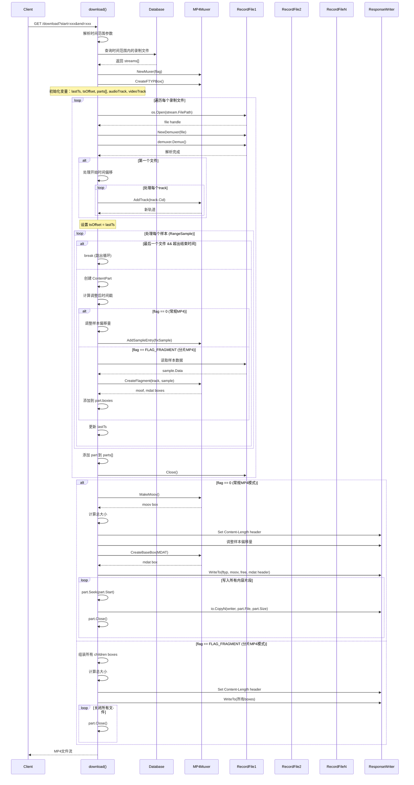

# MP4 plugin for m7s

## 功能列表

- [x] 支持 MP4 录制（支持分片,支持自定义文件名）
- [x] 支持 HTTP 拉流
- [x] 支持 录制 拉流（可从指定时间开始）
- [x] 支持 MP4 文件拉流
- [x] 支持下载指定时间段 MP4 文件（拼装）

### 录制
支持正则表达式替换录制文件名
配置示例：
```yaml
mp4:
  onpub:
    record:
      ^live/(.+)$:
        fragment: 10s
        filepath: record/$1
```

### MP4 文件拉流

mp4 文件拉流是指读取 MP4 文件，然后转换成 m7s 的流，从而可以订阅该流从而观看该 MP4 文件视频。

例如：

```yaml
mp4:
  pull:
    live/test: /Users/dexter/Movies/test.mp4
```
此时，启动 m7s 后，会生成一条流 `live/test`，可以订阅该流从而观看该 MP4 文件视频。

### 录制拉流

录制拉流指的是从录制的 MP4 文件中拉流，支持从指定时间开始拉流。拉流后，会在服务器中产生一条流，可以订阅该流从而观看录像。
步骤：
1. 录制 mp4 通常采用分片录制方式，每次录制一个文件都会在数据库中存储信息
2. 配置按需拉流，录制拉流通常采用按需拉流方式

按需拉流就是由订阅驱动发布，例如：

```yaml
mp4:
  onsub:
    pull:
      vod/test: live/test
```

此时如果有人订阅了 vod/test 流，那么就会从数据库中查询streamPath 为 `live/test` 录制文件，并且根据拉流参数中的 start 和 end（可选） 参数筛选录制文件。

例如使用 ffplay 播放：

```shell
ffplay rtmp://localhost/vod/test?start=2021-01-01T00:00:00
```

如果需要配置一个更通用的录制拉流，可以使用正则表达式：

```yaml
mp4:
  onsub:
    pull:
      ^vod/(.+)$: live/$1
```

如果不同的订阅者希望看到不同时间的录像，就需要使得拉流的名称变成唯一的：

```yaml
mp4:
  onsub:
    pull:
      ^vod/([^/]+)/([^/]+)$: live/$1
```

此时如果有人订阅了 vod/test/123 流，那么就会从数据库中查询streamPath 为 `live/test` 录制文件，并且根据拉流参数中的 start 参数筛选录制文件。
此时 123 就是某个订阅者的唯一标识。


## 拼装逻辑
