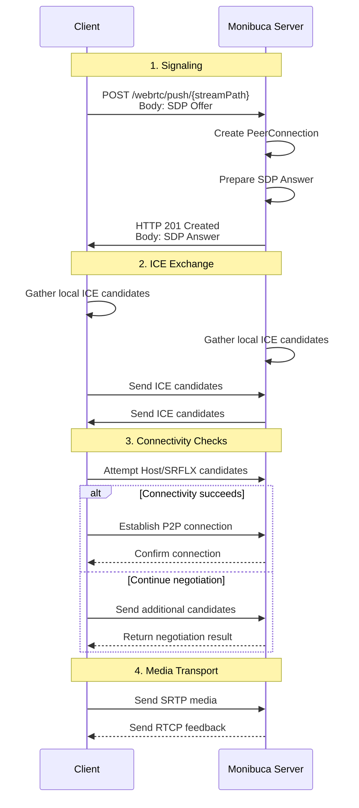
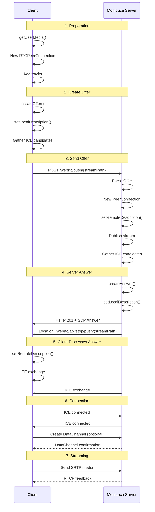
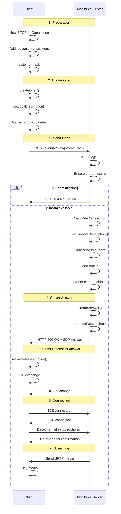

# WebRTC Plugin Guide

## Table of Contents

- [Introduction](#introduction)
- [Plugin Overview](#plugin-overview)
- [Configuration](#configuration)
- [Basic Usage](#basic-usage)
- [Publishing](#publishing)
- [Playing](#playing)
- [WHIP/WHEP Support](#whipwhep-support)
- [Advanced Features](#advanced-features)
- [Docker Notes](#docker-notes)
- [STUN/TURN Reference](#stunturn-reference)
- [FAQ](#faq)

## Introduction

WebRTC (Web Real-Time Communication) is an open standard jointly developed by W3C and IETF for real-time audio/video communication in browsers and mobile apps. Key characteristics include:

### Highlights

1. **Peer-to-Peer Communication** – Direct browser-to-browser connections reduce server load and latency.
2. **Low Latency** – UDP transport and modern codecs deliver millisecond-level latency.
3. **Adaptive Bitrate** – Automatically adjusts quality based on network conditions.
4. **NAT Traversal** – ICE negotiation handles NAT/firewall traversal automatically.

### WebRTC Flow

1. **Signaling** – Exchange SDP (Session Description Protocol) and ICE candidates via HTTP/WebSocket, etc.
2. **ICE Candidate Gathering** – Collect local and remote network candidates.
3. **Connection Establishment** – Use ICE to traverse NAT and set up the P2P link.
4. **Media Transport** – Stream encrypted audio/video over SRTP.

### Connection Sequence Diagram



## Plugin Overview

The Monibuca WebRTC plugin is built on Pion WebRTC v4 and provides complete WebRTC publishing/playing capabilities:

- ✅ Publishing via WHIP
- ✅ Playback via WHEP
- ✅ Video codecs: H.264, H.265, AV1, VP9
- ✅ Audio codecs: Opus, PCMA, PCMU
- ✅ TCP/UDP transport
- ✅ ICE server configuration
- ✅ DataChannel fallback
- ✅ Built-in test pages

## Configuration

### Basic Configuration

Example `config.yaml` snippet:

```yaml
webrtc:
  # Optional ICE servers. See "STUN/TURN Reference" for details.
  iceservers: []

  # Listening port options:
  # - tcp:9000 (TCP port)
  # - udp:9000 (UDP port)
  # - udp:10000-20000 (UDP port range)
  port: tcp:9000

  # Interval for sending PLI after video packet loss
  pli: 2s

  # Enable DataChannel fallback when codecs are unsupported
  enabledc: false

  # MimeType filter; empty means no restriction
  mimetype:
    - video/H264
    - video/H265
    - audio/PCMA
    - audio/PCMU
```

### Parameter Details

#### ICE Servers

Configure the ICE server list for negotiation. See the [STUN/TURN Reference](#stunturn-reference) section for full details and examples.

#### Port Configuration

1. **TCP Port** – Suitable for restrictive firewalls.
   ```yaml
   port: tcp:9000
   ```
2. **UDP Port** – Lower latency.
   ```yaml
   port: udp:9000
   ```
3. **UDP Range** – Allocate ports per session.
   ```yaml
   port: udp:10000-20000
   ```

#### PLI Interval

Duration between Picture Loss Indication (PLI) requests, default 2s.

#### DataChannel

Fallback transport for unsupported codecs (e.g., MP4A). Data is sent as FLV over DataChannel.

#### MimeType Filter

Restrict allowed codec types. Leave empty to accept all supported codecs.

#### Public IP Configuration

Required when the server is behind NAT (e.g., Docker, private network).

##### Public IP Workflow

```yaml
webrtc:
  publicip: 203.0.113.1        # IPv4 address
  publicipv6: 2001:db8::1      # Optional IPv6 address

  port: tcp:9000
  pli: 2s
  enabledc: false
```

##### Diagram

```
┌─────────────────────────────────────────────────────────┐
│                         Public Internet                 │
│                                                         │
│  ┌──────────────┐                                       │
│  │    Client    │                                       │
│  │              │                                       │
│  └──────┬───────┘                                       │
│         │                                               │
│         │ 1. Obtain public address information          │
│         │    (via STUN/TURN if needed)                  │
│         │                                               │
└─────────┼───────────────────────────────────────────────┘
          │
┌─────────▼───────────────────────────────────────────────┐
│                       NAT / Firewall                    │
│                                                         │
│  ┌──────────────┐                                       │
│  │  Monibuca    │                                       │
│  │   Server     │                                       │
│  │              │                                       │
│  │  Private IP: │                                       │
│  │  192.168.1.100                                       │
│  │              │                                       │
│  │  PublicIP:   203.0.113.1                             │
│  └──────────────┘                                       │
│                                                         │
│  2. Use PublicIP when creating ICE candidates           │
│  3. SDP answer contains public address                  │
│  4. Client connects via public address                  │
└─────────────────────────────────────────────────────────┘
```

##### Notes

1. Always configure `publicip` if the server sits behind NAT.
2. Ensure the IP matches the actual public address.
3. Verify port forwarding when using Docker or reverse proxies.
4. Set both IPv4 and IPv6 if dual-stack connectivity is required.

## Basic Usage

### Start the Service

After enabling the WebRTC plugin, Monibuca exposes the following endpoints:

- `POST /webrtc/push/{streamPath}` – WHIP publish endpoint
- `POST /webrtc/play/{streamPath}` – WHEP playback endpoint
- `GET /webrtc/test/{name}` – Built-in test pages

### Test Pages

- Publish test: `http://localhost:8080/webrtc/test/publish`
- Subscribe test: `http://localhost:8080/webrtc/test/subscribe`
- Screen share test: `http://localhost:8080/webrtc/test/screenshare`

## Publishing

### Using the Test Page

1. Visit `http://localhost:8080/webrtc/test/publish`.
2. Allow camera/microphone permissions.
3. Select a camera if multiple devices are available.
4. The page automatically starts WebRTC publishing.

### Custom Publishing

#### JavaScript Example

```javascript
const mediaStream = await navigator.mediaDevices.getUserMedia({
  video: true,
  audio: true,
});

const pc = new RTCPeerConnection({
  // Configure ICE servers if needed, see STUN/TURN reference
  iceServers: [],
});

mediaStream.getTracks().forEach(track => {
  pc.addTrack(track, mediaStream);
});

const offer = await pc.createOffer();
await pc.setLocalDescription(offer);

const response = await fetch('/webrtc/push/live/test', {
  method: 'POST',
  headers: { 'Content-Type': 'application/sdp' },
  body: offer.sdp,
});

const answerSdp = await response.text();
await pc.setRemoteDescription(
  new RTCSessionDescription({ type: 'answer', sdp: answerSdp })
);
```

#### Forcing H.265

```javascript
const transceiver = pc.getTransceivers().find(
  t => t.sender.track && t.sender.track.kind === 'video'
);

if (transceiver) {
  const capabilities = RTCRtpSender.getCapabilities('video');
  const h265 = capabilities.codecs.find(
    c => c.mimeType.toLowerCase() === 'video/h265'
  );
  if (h265) {
    transceiver.setCodecPreferences([h265]);
  }
}
```

Add `?h265` to the test page URL to attempt H.265 publishing: `/webrtc/test/publish?h265`.

### Publish URL Parameters

- `streamPath` – e.g., `live/test`
- `bearer` – Bearer token for authentication

Example:

```
POST /webrtc/push/live/test?bearer=token
```

### Stop Publishing

```javascript
pc.close();
```

## Playing

### Using the Test Page

1. Ensure a stream is already publishing.
2. Visit `http://localhost:8080/webrtc/test/subscribe?streamPath=live/test`.
3. The page automatically starts playback.

### Custom Playback

#### JavaScript Example

```javascript
const pc = new RTCPeerConnection({
  // Configure ICE servers if needed, see STUN/TURN reference
  iceServers: [],
});

pc.ontrack = event => {
  if (event.streams.length > 0) {
    videoElement.srcObject = event.streams[0];
    videoElement.play();
  }
};

pc.addTransceiver('video', { direction: 'recvonly' });
pc.addTransceiver('audio', { direction: 'recvonly' });

const offer = await pc.createOffer();
await pc.setLocalDescription(offer);

const response = await fetch('/webrtc/play/live/test', {
  method: 'POST',
  headers: { 'Content-Type': 'application/sdp' },
  body: offer.sdp,
});

const answerSdp = await response.text();
await pc.setRemoteDescription(
  new RTCSessionDescription({ type: 'answer', sdp: answerSdp })
);
```

### Playback URL Parameters

- `streamPath` – e.g., `live/test`

Example:

```
POST /webrtc/play/live/test
```

### Stop Playback

```javascript
pc.close();
```

## WHIP/WHEP Support

### WHIP (WebRTC-HTTP Ingestion Protocol)

#### Workflow

1. Client creates PeerConnection and Offer.
2. Client `POST /webrtc/push/{streamPath}` with SDP Offer.
3. Server returns SDP Answer (HTTP 201 Created).
4. Client sets Answer.
5. Media streaming starts.

#### Sequence Diagram



#### Client Example

```javascript
const pc = new RTCPeerConnection();
// Add tracks, create offer...
```

### WHEP (WebRTC HTTP Egress Protocol)

#### Workflow

1. Client creates PeerConnection and Offer (recvonly tracks).
2. Client `POST /webrtc/play/{streamPath}` with SDP Offer.
3. Server returns SDP Answer.
4. Client sets Answer.
5. Media streaming starts.

#### Sequence Diagram



## Acting as WHIP/WHEP Client

### Pull via WHEP

```yaml
pull:
  streams:
    - url: https://whep.example.com/play/stream1
      streamPath: live/stream1
```

### Push via WHIP

```yaml
push:
  streams:
    - url: https://whip.example.com/push/stream1
      streamPath: live/stream1
```

## Advanced Features

### Codec Support

- **Video**: H.264, H.265/HEVC, AV1, VP9
- **Audio**: Opus, PCMA (G.711 A-law), PCMU (G.711 μ-law)

### DataChannel Transport

Enable DataChannel for unsupported codecs (e.g., MP4A audio) by setting `enabledc: true`. Data is encapsulated in FLV over the DataChannel.

### NAT Traversal

Configure `publicip`/`publicipv6` when running behind NAT; see [Public IP Configuration](#public-ip-configuration).

### Multi-stream Support

Use `http://localhost:8080/webrtc/test/batchv2` to test multi-stream scenarios.

#### BatchV2 Mode

- **Signaling channel**: WebSocket endpoint `ws(s)://{host}/webrtc/batchv2` (upgrade from HTTP).
- **Initial handshake**:
  1. Create a `RTCPeerConnection`, run `createOffer`/`setLocalDescription`.
  2. Send `{ "type": "offer", "sdp": "..." }` over the WebSocket.
  3. Server replies `{ "type": "answer", "sdp": "..." }`; call `setRemoteDescription`.
- **Common commands** (all JSON text frames):
  - `getStreamList`
    ```json
    { "type": "getStreamList" }
    ```
    Response example: `{ "type": "streamList", "streams": [{ "path": "live/cam1", "codec": "H264", "width": 1280, "height": 720, "fps": 25 }] }`.
  - `subscribe`
    ```json
    {
      "type": "subscribe",
      "streamList": ["live/cam1", "live/cam2"],
      "offer": "SDP..."
    }
    ```
    Server renegotiates and returns `{ "type": "answer", "sdp": "..." }`; call `setRemoteDescription` again.
  - `unsubscribe` – same structure as `subscribe`, with `streamList` containing the streams to remove.
  - `publish`
    ```json
    {
      "type": "publish",
      "streamPath": "live/cam3",
      "offer": "SDP..."
    }
    ```
    Server responds with a new SDP answer that must be applied client-side.
  - `unpublish`
    ```json
    { "type": "unpublish", "streamPath": "live/cam3" }
    ```
    Triggers renegotiation; server returns a fresh answer.
  - `ping`: `{ "type": "ping" }` keeps the connection alive; server answers with `pong`.
- **Media scope**: current implementation subscribes video only (`SubAudio` disabled). Extend as needed if audio tracks are required.
- **Client helper**: `web/BatchV2Client.ts` implements the browser-side workflow; see `webrtc/test/batchv2` for a functional demo (stream list, publish, subscribe management).
- **Troubleshooting**:
  - Errors arrive as `{ "type": "error", "message": "..." }`; inspect browser console/WebSocket inspector for details.
  - Each `subscribe`/`publish` triggers a new SDP cycle; ensure the app performs `setLocalDescription` → send message → `setRemoteDescription` without skipping.

### Connection Monitoring

```javascript
pc.oniceconnectionstatechange = () => {
  console.log('ICE State:', pc.iceConnectionState);
  // new, checking, connected, completed, failed, disconnected, closed
};

pc.onconnectionstatechange = () => {
  console.log('Connection State:', pc.connectionState);
};
```

## Docker Notes

### 1. Network Mode

Prefer `host` mode:

```bash
docker run --network host monibuca/monibuca
```

When using `bridge` mode:

- Map WebRTC ports (TCP/UDP)
- Configure correct public IP
- Ensure port mapping matches plugin config

```bash
docker run -p 8080:8080 -p 9000:9000/udp monibuca/monibuca
```

### 2. Port Mapping

**TCP mode**

```bash
docker run -p 8080:8080 -p 9000:9000/tcp monibuca/monibuca
```

**UDP mode**

```bash
docker run -p 8080:8080 -p 9000:9000/udp monibuca/monibuca
```

**UDP range**

```bash
docker run -p 8080:8080 -p 10000-20000:10000-20000/udp monibuca/monibuca
```

> Note: Mapping large UDP ranges can be tricky; prefer a single UDP port or `host` mode when possible.

### 3. Public IP

Always set `publicip` when running inside Docker (container IPs are private).

```bash
curl ifconfig.me
dig +short myip.opendns.com @resolver1.opendns.com
```

Example configuration:

```yaml
webrtc:
  publicip: 203.0.113.1
  port: udp:9000
```

### 4. Docker Compose Example

```yaml
version: '3.8'

services:
  monibuca:
    image: monibuca/monibuca:latest
    network_mode: host  # recommended
    # Or bridge mode:
    # ports:
    #   - "8080:8080"
    #   - "9000:9000/udp"
    volumes:
      - ./config.yaml:/app/config.yaml
      - ./logs:/app/logs
    environment:
      - PUBLICIP=203.0.113.1
```

### 5. Common Docker Issues

- **Connection failures** – Configure `publicip`, prefer `host` network, verify port mapping.
- **Unstable UDP mapping** – Prefer `host` mode or TCP mode (`port: tcp:9000`); inspect firewall rules.
- **Multiple instances** – Assign different ports (e.g., `tcp:9000`, `tcp:9001`) and map accordingly.

### 6. Best Practices

1. Prefer `host` network for better performance.
2. Always provide `publicip`/`publicipv6` when behind NAT.
3. Switch to TCP mode if UDP mapping is problematic.
4. Monitor WebRTC logs to track connection states.
5. Configure TURN servers as a fallback to improve success rates.

## STUN/TURN Reference

### Why STUN/TURN Matters

- **STUN (Session Traversal Utilities for NAT)** helps endpoints discover public addresses and ports.
- **TURN (Traversal Using Relays around NAT)** relays media when direct connectivity fails (e.g., symmetric NAT).
- STUN is sufficient for most public/home networks; enterprise/mobile scenarios often require TURN fallback.

### Configuration Example

```yaml
webrtc:
  iceservers:
    - urls:
        - stun:stun.l.google.com:19302
    - urls:
        - turn:turn.example.com:3478
      username: user
      credential: password
```

- `urls` accepts multiple entries, mixing `stun:`, `turn:`, `turns:` URIs.
- Rotate TURN credentials regularly; consider short-lived tokens (e.g., coturn REST API).

### Deployment Tips

1. **Deploy close to users** – Lower latency boosts stability.
2. **Reserve bandwidth** – TURN relays bidirectional media streams.
3. **Secure access** – Protect TURN credentials with authentication or token mechanisms.
4. **Monitor usage** – Track sessions, bandwidth, failure rates, and alert on anomalies.
5. **Multi-region redundancy** – Provide regional STUN/TURN nodes for global coverage.

## FAQ

### 1. Connection Fails

**Problem**: WebRTC connection cannot be established.

**Solutions**:
- Verify ICE server configuration.
- Ensure firewall rules allow the configured ports.
- Try TCP mode: `port: tcp:9000`.
- Configure TURN as a relay fallback.

### 2. Video Not Displayed

**Problem**: Connection succeeds but no video is shown.

**Solutions**:
- Check browser console errors.
- Confirm the stream path is correct.
- Ensure the codec is supported.
- Test with the built-in subscribe page.
- Inspect the Network panel to confirm SDP responses and track creation.
- Run `pc.getReceivers().map(r => r.track)` in the console and verify tracks are `live`.
- Review server logs to confirm the subscriber receives video frames.
- Use `chrome://webrtc-internals` or `edge://webrtc-internals` for detailed stats (bitrate, frame rate, ICE state).

### 3. H.265 Unsupported

**Problem**: Browser lacks H.265 decoding support.

**Solutions**:
- Enable DataChannel fallback: `enabledc: true`.
- Publish H.264 instead.
- Wait for browser support (Chrome 113+ provides partial support).

### 4. CORS Issues

**Problem**: Requests are blocked due to CORS.

**Solutions**:
- Configure correct CORS headers.
- Deploy under the same origin.
- Use a reverse proxy.

### 5. Port Already in Use

**Problem**: Configured port is unavailable.

**Solutions**:
- Change the port: `port: tcp:9001`.
- Check whether other services occupy the port.
- Use a UDP range: `port: udp:10000-20000`.

### 6. Docker Connection Issues

**Problem**: WebRTC fails when running inside Docker.

**Solutions**:
- Configure `publicip` correctly.
- Prefer `host` network mode.
- Double-check port mappings (remember `/udp`).
- Ensure firewall rules allow the traffic.
- Review the [Docker Notes](#docker-notes).

### 7. PublicIP Not Working

**Problem**: Configured `publicip`, but clients still cannot connect.

**Solutions**:
- Verify the value matches the actual public address.
- Ensure port forwarding aligns with the plugin configuration.
- Test with `host` network mode.
- Inspect firewall/NAT rules.
- Check server logs to confirm ICE candidates include the public IP.

### 8. AAC Audio Not Playing

**Problem**: Audio unavailable when the source uses AAC/MP4A.

**Solutions**:
- The plugin currently supports Opus, PCMA, and PCMU.
- Options:
  - Publish Opus instead of AAC.
  - Enable DataChannel (`enabledc: true`) to transport FLV with AAC.
  - Transcode audio to a supported codec before publishing.

## Summary

The Monibuca WebRTC plugin delivers full WHIP/WHEP functionality for low-latency real-time streaming in modern browsers. Follow the configuration, deployment, and troubleshooting guidance above to integrate WebRTC publishing and playback into your Monibuca deployment quickly.

Further reading:
- [WebRTC official site](https://webrtc.org/)
- [WHIP draft](https://datatracker.ietf.org/doc/html/draft-ietf-wish-whip)
- [WHEP draft](https://datatracker.ietf.org/doc/html/draft-murillo-whep)
