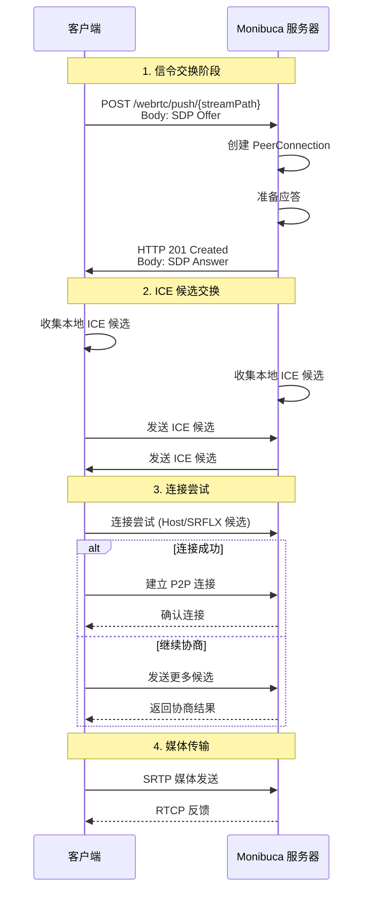
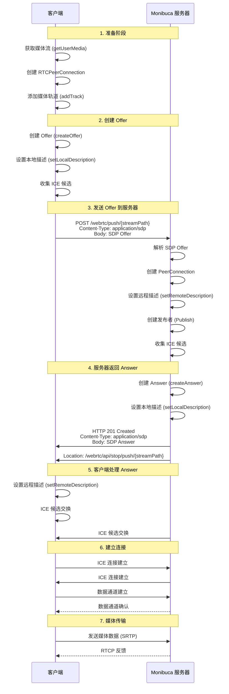
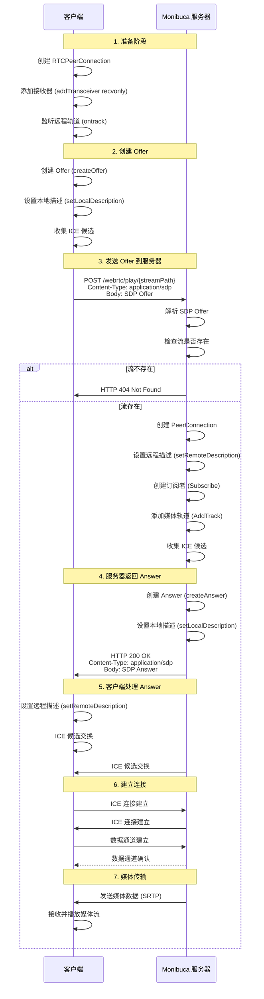

# WebRTC 插件使用教程

## 目录

- [WebRTC 简介](#webrtc-简介)
- [插件概述](#插件概述)
- [配置说明](#配置说明)
- [基本使用](#基本使用)
- [推流（Publish）](#推流publish)
- [拉流（Play）](#拉流play)
- [WHIP/WHEP 协议支持](#whipwhep-协议支持)
- [高级功能](#高级功能)
- [Docker 使用注意事项](#docker-使用注意事项)
- [STUN/TURN 服务器说明](#stunturn-服务器说明)
- [常见问题](#常见问题)

## WebRTC 简介

WebRTC（Web Real-Time Communication）是一个由 W3C 和 IETF 共同制定的开放标准，用于在浏览器和移动应用中实现实时音视频通信。WebRTC 的核心特点包括：

### 核心特性

1. **点对点通信（P2P）**：WebRTC 允许浏览器之间直接建立连接，减少服务器负载和延迟
2. **低延迟**：通过 UDP 传输和优化的编解码器，实现毫秒级延迟
3. **自适应码率**：根据网络状况自动调整视频质量
4. **NAT 穿透**：通过 ICE（Interactive Connectivity Establishment）协议自动处理 NAT 和防火墙

### WebRTC 工作流程

1. **信令交换（Signaling）**：通过 HTTP/WebSocket 等协议交换 SDP（Session Description Protocol）和 ICE 候选
2. **ICE 候选收集**：收集本地和远程的网络地址信息
3. **连接建立**：通过 ICE 协商完成 NAT 穿透并建立 P2P 连接
4. **媒体传输**：使用 SRTP（Secure Real-time Transport Protocol）加密传输音视频数据

### WebRTC 连接建立时序图



## 插件概述

Monibuca 的 WebRTC 插件基于 Pion WebRTC v4 实现，提供了完整的 WebRTC 推拉流功能。插件支持：

- ✅ 推流（WHIP 协议）
- ✅ 拉流（WHEP 协议）
- ✅ 多种视频编解码器（H.264、H.265、AV1、VP9）
- ✅ 多种音频编解码器（Opus、PCMA、PCMU）
- ✅ TCP/UDP 传输支持
- ✅ ICE 服务器配置
- ✅ DataChannel 备用传输
- ✅ 内置测试页面

## 配置说明

### 基本配置

在 `config.yaml` 中配置 WebRTC 插件：

```yaml
webrtc:
  # ICE 服务器配置（可选）。如需配置 STUN/TURN，请参见“STUN/TURN 服务器说明”。
  iceservers: []
  
  # 监听端口配置
  # 支持格式：
  # - tcp:9000 (TCP 端口)
  # - udp:9000 (UDP 端口)
  # - udp:10000-20000 (UDP 端口范围)
  port: tcp:9000
  
  # PLI 请求间隔（视频丢包后请求关键帧）
  pli: 2s
  
  # 是否启用 DataChannel（用于不支持编码格式时的备用传输）
  enabledc: false
  
  # MimeType 过滤列表（为空则不过滤）
  mimetype:
    - video/H264
    - video/H265
    - audio/PCMA
    - audio/PCMU
```

### 配置参数详解

#### ICE 服务器（ICEServers）

用于配置用于 ICE 协商的服务器列表。详细说明与示例请参见文末的“STUN/TURN 服务器说明”。

#### 端口配置（Port）

支持三种端口配置方式：

1. **TCP 端口**：使用 TCP 传输，适合防火墙限制严格的环境
   ```yaml
   port: tcp:9000
   ```

2. **UDP 端口**：使用 UDP 传输，延迟更低
   ```yaml
   port: udp:9000
   ```

3. **UDP 端口范围**：为每个连接分配不同的端口
   ```yaml
   port: udp:10000-20000
   ```

#### PLI 间隔（PLI）

PLI（Picture Loss Indication）用于在视频丢包时请求关键帧。默认 2 秒发送一次 PLI 请求。

#### DataChannel（EnableDC）

当客户端不支持某些编码格式（如 H.265）时，可以启用 DataChannel 作为备用传输方式。DataChannel 会将媒体数据封装为 FLV 格式传输。

#### MimeType 过滤（MimeType）

限制允许的编解码器类型。如果为空，则不进行过滤，支持所有编解码器。

#### 公网 IP 配置（PublicIP）

当 Monibuca 服务器部署在 NAT 后面（如 Docker 容器、内网服务器）时，需要配置公网 IP 地址，以便客户端能够正确建立 WebRTC 连接。

##### PublicIP 的作用原理

在 NAT 环境中，服务器只能获取到内网 IP 地址（如 `192.168.1.100`），但客户端需要知道服务器的公网 IP 地址才能建立连接。`PublicIP` 配置的作用是：

1. **NAT 1:1 IP 映射**：通过 `SetNAT1To1IPs` 方法，将内网 IP 映射到公网 IP
2. **ICE 候选生成**：在生成 ICE 候选时，使用配置的公网 IP 而不是内网 IP
3. **SDP 中的 IP 地址**：SDP Answer 中的 `c=` 行和 ICE 候选中的 IP 地址会使用公网 IP

##### 配置示例

```yaml
webrtc:
  # WebRTC 插件的公网地址配置
  publicip: 203.0.113.1        # IPv4 公网 IP
  publicipv6: 2001:db8::1      # IPv6 公网 IP（可选）

  # 其他常见配置...
  port: tcp:9000
  pli: 2s
  enabledc: false
```

##### 工作原理示意图

```
┌─────────────────────────────────────────────────────────┐
│                     公网环境                            │
│                                                         │
│  ┌──────────────┐                                       │
│  │   客户端     │                                       │
│  │              │                                       │
│  └──────┬───────┘                                       │
│         │                                               │
│         │ 1. 获取可用公网地址信息                       │
│         │   （可通过 STUN/TURN，见说明章节）            │
│         │                                               │
└─────────┼───────────────────────────────────────────────┘
          │
┌─────────▼───────────────────────────────────────────────┐
│                     NAT/防火墙                          │
│                                                         │
│  ┌──────────────┐                                       │
│  │  Monibuca    │                                       │
│  │  服务器      │                                       │
│  │              │                                       │
│  │  内网 IP:    │                                       │
│  │  192.168.1.100                                       │
│  │              │                                       │
│  │  配置 PublicIP: 203.0.113.1                          │
│  └──────────────┘                                       │
│                                                         │
│  2. 服务器使用配置的 PublicIP 生成 ICE 候选             │
│  3. SDP Answer 中包含公网 IP                            │
│  4. 客户端根据公网 IP 与服务器建立连接                  │
└─────────────────────────────────────────────────────────┘
```

##### 注意事项

1. **必须配置**：如果服务器在 NAT 后面，必须配置正确的公网 IP，否则客户端无法连接
2. **IP 地址准确性**：确保配置的公网 IP 是服务器实际对外的公网 IP
3. **端口映射**：如果使用 Docker 或端口转发，确保公网端口已正确映射
4. **IPv6 支持**：如果服务器有 IPv6 地址，可以同时配置 `publicipv6`

## 基本使用

### 启动服务

确保 WebRTC 插件已启用，启动 Monibuca 服务后，插件会自动注册以下 HTTP 端点：

- `POST /webrtc/push/{streamPath}` - 推流端点（WHIP）
- `POST /webrtc/play/{streamPath}` - 拉流端点（WHEP）
- `GET /webrtc/test/{name}` - 测试页面

### 测试页面

插件提供了内置的测试页面，方便快速测试功能：

- **推流测试**：`http://localhost:8080/webrtc/test/publish`
- **拉流测试**：`http://localhost:8080/webrtc/test/subscribe`
- **屏幕共享**：`http://localhost:8080/webrtc/test/screenshare`

## 推流（Publish）

### 使用测试页面推流

1. 打开浏览器访问：`http://localhost:8080/webrtc/test/publish`
2. 浏览器会请求摄像头和麦克风权限
3. 选择摄像头设备（如果有多个）
4. 页面会自动创建 WebRTC 连接并开始推流

### 自定义推流实现

#### JavaScript 示例

```javascript
// 获取媒体流
const mediaStream = await navigator.mediaDevices.getUserMedia({
  video: true,
  audio: true
});

// 创建 PeerConnection
const pc = new RTCPeerConnection({
  // 如需配置 STUN/TURN，请参见“STUN/TURN 服务器说明”
  iceServers: []
});

// 添加媒体轨道
mediaStream.getTracks().forEach(track => {
  pc.addTrack(track, mediaStream);
});

// 创建 Offer
const offer = await pc.createOffer();
await pc.setLocalDescription(offer);

// 发送 Offer 到服务器
const response = await fetch('/webrtc/push/live/test', {
  method: 'POST',
  headers: { 'Content-Type': 'application/sdp' },
  body: offer.sdp
});

// 接收 Answer
const answerSdp = await response.text();
await pc.setRemoteDescription(
  new RTCSessionDescription({ type: 'answer', sdp: answerSdp })
);
```

#### 支持 H.265 推流

如果浏览器支持 H.265，可以在推流时指定使用 H.265：

```javascript
// 添加视频轨道后，设置编解码器偏好
const videoTransceiver = pc.getTransceivers().find(
  t => t.sender.track && t.sender.track.kind === 'video'
);

if (videoTransceiver) {
  const capabilities = RTCRtpSender.getCapabilities('video');
  const h265Codec = capabilities.codecs.find(
    c => c.mimeType.toLowerCase() === 'video/h265'
  );
  
  if (h265Codec) {
    videoTransceiver.setCodecPreferences([h265Codec]);
  }
}
```

访问测试页面时添加 `?h265` 参数即可：`/webrtc/test/publish?h265`

### 推流 URL 参数

推流端点支持以下 URL 参数：

- `streamPath`：流路径，例如 `live/test`
- `bearer`：Bearer Token（用于认证）

示例：
```
POST /webrtc/push/live/test?bearer=your_token
```

### 停止推流

关闭 PeerConnection 即可停止推流：

```javascript
pc.close();
```

## 拉流（Play）

### 使用测试页面拉流

1. 确保已有流在推流（使用推流测试页面或其他方式）
2. 打开浏览器访问：`http://localhost:8080/webrtc/test/subscribe?streamPath=live/test`
3. 页面会自动创建 WebRTC 连接并开始播放

### 自定义拉流实现

#### JavaScript 示例

```javascript
// 创建 PeerConnection
const pc = new RTCPeerConnection({
  // 如需配置 STUN/TURN，请参见“STUN/TURN 服务器说明”
  iceServers: []
});

// 监听远程轨道
pc.ontrack = (event) => {
  if (event.streams.length > 0) {
    videoElement.srcObject = event.streams[0];
    videoElement.play();
  }
};

// 添加接收器
pc.addTransceiver('video', { direction: 'recvonly' });
pc.addTransceiver('audio', { direction: 'recvonly' });

// 创建 Offer
const offer = await pc.createOffer();
await pc.setLocalDescription(offer);

// 发送 Offer 到服务器
const response = await fetch('/webrtc/play/live/test', {
  method: 'POST',
  headers: { 'Content-Type': 'application/sdp' },
  body: offer.sdp
});

// 接收 Answer
const answerSdp = await response.text();
await pc.setRemoteDescription(
  new RTCSessionDescription({ type: 'answer', sdp: answerSdp })
);
```

### 拉流 URL 参数

拉流端点支持以下 URL 参数：

- `streamPath`：流路径，例如 `live/test`

示例：
```
POST /webrtc/play/live/test
```

### 停止拉流

关闭 PeerConnection 即可停止拉流：

```javascript
pc.close();
```

## WHIP/WHEP 协议支持

### WHIP（WebRTC-HTTP Ingestion Protocol）

WHIP 是一个基于 HTTP 的 WebRTC 推流协议，Monibuca 的 WebRTC 插件完全支持 WHIP 协议。

#### WHIP 推流流程

1. 客户端创建 PeerConnection 和 Offer
2. 客户端发送 `POST /webrtc/push/{streamPath}` 请求，Body 为 SDP Offer
3. 服务器返回 SDP Answer（HTTP 201 Created）
4. 客户端设置 Answer，建立连接
5. 开始传输媒体数据

#### WHIP 推流时序图



#### WHIP 客户端实现

```javascript
const pc = new RTCPeerConnection();
// ... 添加轨道和创建 Offer ...

const response = await fetch('http://server:8080/webrtc/push/live/test', {
  method: 'POST',
  headers: { 'Content-Type': 'application/sdp' },
  body: offer.sdp
});

if (response.status === 201) {
  const answerSdp = await response.text();
  await pc.setRemoteDescription(
    new RTCSessionDescription({ type: 'answer', sdp: answerSdp })
  );
}
```

### WHEP（WebRTC HTTP Egress Protocol）

WHEP 是一个基于 HTTP 的 WebRTC 拉流协议，Monibuca 的 WebRTC 插件完全支持 WHEP 协议。

#### WHEP 拉流流程

1. 客户端创建 PeerConnection 和 Offer（包含 recvonly 轨道）
2. 客户端发送 `POST /webrtc/play/{streamPath}` 请求，Body 为 SDP Offer
3. 服务器返回 SDP Answer
4. 客户端设置 Answer，建立连接
5. 开始接收媒体数据

#### WHEP 拉流时序图



#### WHEP 客户端实现

```javascript
const pc = new RTCPeerConnection();
pc.addTransceiver('video', { direction: 'recvonly' });
pc.addTransceiver('audio', { direction: 'recvonly' });

const offer = await pc.createOffer();
await pc.setLocalDescription(offer);

const response = await fetch('http://server:8080/webrtc/play/live/test', {
  method: 'POST',
  headers: { 'Content-Type': 'application/sdp' },
  body: offer.sdp
});

const answerSdp = await response.text();
await pc.setRemoteDescription(
  new RTCSessionDescription({ type: 'answer', sdp: answerSdp })
);
```

### 作为 WHIP/WHEP 客户端

Monibuca 的 WebRTC 插件也可以作为客户端，从其他 WHIP/WHEP 服务器拉流或推流。

#### 配置拉流（WHEP）

在 `config.yaml` 中配置：

```yaml
pull:
  streams:
    - url: https://whep-server.example.com/play/stream1
      streamPath: live/stream1
```

#### 配置推流（WHIP）

在 `config.yaml` 中配置：

```yaml
push:
  streams:
    - url: https://whip-server.example.com/push/stream1
      streamPath: live/stream1
```

## 高级功能

### 编解码器支持

插件支持以下编解码器：

#### 视频编解码器

- **H.264**：最广泛支持的视频编解码器
- **H.265/HEVC**：更高效的视频编解码器（需要浏览器支持）
- **AV1**：新一代开源视频编解码器
- **VP9**：Google 开发的视频编解码器

#### 音频编解码器

- **Opus**：现代音频编解码器，质量高
- **PCMA**：G.711 A-law，常用于电话系统
- **PCMU**：G.711 μ-law，常用于电话系统

### DataChannel 传输

当客户端不支持某些编码格式时，可以启用 DataChannel 作为备用传输方式。DataChannel 会将媒体数据封装为 FLV 格式传输。

启用 DataChannel：

```yaml
webrtc:
  enabledc: true
```

### NAT 穿透配置

如果服务器部署在 NAT 后面，需要配置公网 IP。详细原理请参考 [公网 IP 配置（PublicIP）](#公网-ip-配置publicip) 部分。

### Docker 使用注意事项

在 Docker 环境中使用 WebRTC 插件时，需要注意以下事项：

#### 1. 网络模式配置

推荐使用 `host` 网络模式，这样可以避免端口映射问题：

```bash
docker run --network host monibuca/monibuca
```

如果必须使用 `bridge` 网络模式，需要：

- 映射 WebRTC 端口（TCP 或 UDP）
- 配置正确的公网 IP
- 确保端口映射正确

```bash
# 使用 bridge 模式
docker run -p 8080:8080 -p 9000:9000/udp monibuca/monibuca
```

#### 2. 端口映射配置

##### TCP 模式

如果使用 TCP 模式（`port: tcp:9000`），需要映射 TCP 端口：

```bash
docker run -p 8080:8080 -p 9000:9000/tcp monibuca/monibuca
```

##### UDP 模式

如果使用 UDP 模式（`port: udp:9000`），需要映射 UDP 端口：

```bash
docker run -p 8080:8080 -p 9000:9000/udp monibuca/monibuca
```

##### UDP 端口范围

如果使用端口范围（`port: udp:10000-20000`），需要映射整个端口范围：

```bash
docker run -p 8080:8080 -p 10000-20000:10000-20000/udp monibuca/monibuca
```

**注意**：Docker 的端口范围映射可能有限制，建议使用单个 UDP 端口或 `host` 网络模式。

#### 3. PublicIP 配置

在 Docker 环境中，**必须配置公网 IP**，因为容器内的 IP 地址是内网地址。

##### 获取公网 IP

可以通过以下方式获取服务器的公网 IP：

```bash
# 方法 1: 使用 curl
curl ifconfig.me

# 方法 2: 使用 dig
dig +short myip.opendns.com @resolver1.opendns.com

# 方法 3: 查看服务器配置
# 在云服务商控制台查看
```

##### 配置示例

```yaml
# config.yaml
publicip: 203.0.113.1  # 替换为实际公网 IP

webrtc:
  port: udp:9000
```

#### 4. Docker Compose 配置示例

```yaml
version: '3.8'

services:
  monibuca:
    image: monibuca/monibuca:latest
    network_mode: host  # 推荐使用 host 模式
    # 或者使用 bridge 模式
    # ports:
    #   - "8080:8080"
    #   - "9000:9000/udp"
    volumes:
      - ./config.yaml:/app/config.yaml
      - ./logs:/app/logs
    environment:
      - PUBLICIP=203.0.113.1  # 如果通过环境变量配置
```

#### 5. 常见问题

##### 问题 1: 连接失败

**原因**：Docker 容器内的 IP 地址是内网地址，客户端无法直接连接。

**解决方案**：
- 配置正确的 `publicip`
- 使用 `host` 网络模式
- 确保端口映射正确

##### 问题 2: UDP 端口无法映射

**原因**：Docker 的 UDP 端口映射在某些情况下可能不稳定。

**解决方案**：
- 使用 `host` 网络模式
- 使用 TCP 模式：`port: tcp:9000`
- 检查防火墙规则

##### 问题 3: 多容器部署

如果需要在同一台服务器上部署多个 Monibuca 实例：

```yaml
# 实例 1
webrtc:
  port: tcp:9000

# 实例 2
webrtc:
  port: tcp:9001
```

然后分别映射不同的端口：

```bash
docker run -p 8080:8080 -p 9000:9000/tcp monibuca1
docker run -p 8081:8081 -p 9001:9001/tcp monibuca2
```

#### 6. 最佳实践

1. **使用 host 网络模式**：避免端口映射问题，性能更好
2. **配置 PublicIP**：确保客户端能够正确连接
3. **使用 TCP 模式**：在 Docker 环境中更稳定
4. **监控连接状态**：通过日志监控 WebRTC 连接状态
5. **配置 TURN 服务器**：作为备用方案，提高连接成功率

### 多路流支持

插件支持在单个 WebRTC 连接中传输多个流，通过 BatchV2 API 实现。

访问批量流页面：`http://localhost:8080/webrtc/test/batchv2`

#### BatchV2 多流模式

- **信令通道**：通过 WebSocket 与服务器的 `/webrtc/batchv2` Endpoint 通信（HTTP → WebSocket Upgrade）。
- **初始握手**：
  1. 客户端创建 `RTCPeerConnection`，执行 `createOffer`/`setLocalDescription`。
  2. 通过 WebSocket 发送 `{ "type": "offer", "sdp": "..." }`。
  3. 服务器返回 `{ "type": "answer", "sdp": "..." }`，客户端执行 `setRemoteDescription`。
- **常用指令**（全部为 JSON 文本帧）：
  - `getStreamList`：`{ "type": "getStreamList" }` → 服务器返回 `{ "type": "streamList", "streams": [{ "path": "live/cam1", "codec": "H264", "width": 1280, "height": 720, "fps": 25 }, ...] }`。
  - `subscribe`：向现有连接追加拉流，消息格式
    ```json
    {
      "type": "subscribe",
      "streamList": ["live/cam1", "live/cam2"],
      "offer": "SDP..."
    }
    ```
    服务器完成重协商后返回 `{ "type": "answer", "sdp": "..." }`，需再次 `setRemoteDescription`。
  - `unsubscribe`：移除指定流，结构与 `subscribe` 相同（`streamList` 填写需移除的流列表）。
  - `publish`：在同一连接中推流
    ```json
    {
      "type": "publish",
      "streamPath": "live/cam3",
      "offer": "SDP..."
    }
    ```
    服务器返回应答后设置远端描述即可开始发送。
  - `unpublish`：`{ "type": "unpublish", "streamPath": "live/cam3" }`，服务器会返回新的 SDP 应答。
  - `ping`：`{ "type": "ping" }`，服务器回 `pong` 维持在线状态。
- **媒体限制**：当前订阅侧默认只拉取视频轨道（`SubAudio` 关闭），如需音频需自行扩展。
- **客户端工具**：`web/BatchV2Client.ts` 提供了完整的浏览器端实现，示例页面 `webrtc/test/batchv2` 演示了多路拉流、推流与流列表操作。
- **失败排查**：
  - 若服务器返回 `error`，消息体中包含 `message` 字段，可在前端控制台或 WebSocket 调试工具中查看。
  - 每次 `subscribe`/`publish` 都会触发新的 SDP，确保在应用层完成 `setLocalDescription` → 发送 → `setRemoteDescription` 的协商流程。

### 连接状态监控

可以通过监听 PeerConnection 的状态事件来监控连接：

```javascript
pc.oniceconnectionstatechange = () => {
  console.log('ICE Connection State:', pc.iceConnectionState);
  // 可能的值：
  // - new: 新建连接
  // - checking: 正在检查连接
  // - connected: 已连接
  // - completed: 连接完成
  // - failed: 连接失败
  // - disconnected: 连接断开
  // - closed: 连接关闭
};

pc.onconnectionstatechange = () => {
  console.log('Connection State:', pc.connectionState);
};
```

## STUN/TURN 服务器说明

### 为什么需要 STUN/TURN

- **STUN（Session Traversal Utilities for NAT）**：帮助 WebRTC 终端获知自身的公网地址与端口，用于打洞和构建 ICE 候选。
- **TURN（Traversal Using Relays around NAT）**：在双方均无法直接穿透 NAT/防火墙时提供中继服务，保证连接成功率。
- 在大多数公网或家庭网络环境下，STUN 足以完成 P2P 建立；但在企业网络、移动网络或对称 NAT 场景下，需要 TURN 作为兜底。

### 配置示例

在 `config.yaml` 中配置 STUN/TURN 服务器列表：

```yaml
webrtc:
  iceservers:
    - urls:
        - stun:stun.l.google.com:19302
    - urls:
        - turn:turn.example.com:3478
      username: user
      credential: password
```

- `urls` 支持同时配置多个地址，可混合 `stun:`、`turn:`、`turns:` 等 URI。
- TURN 服务器通常需要用户名、密码，建议使用长期凭据或临时 Token（如使用 [coturn](https://github.com/coturn/coturn)）。

### 部署建议

1. **优选就近节点**：STUN/TURN 延迟会直接影响媒体传输质量，建议部署在离客户端较近的区域。
2. **保证带宽**：TURN 会中继双向媒体流，应为其预留足够的带宽与并发资源。
3. **安全控制**：TURN 用户名、密码应定期轮换；若提供给外部用户，建议结合鉴权或令牌机制。
4. **监控告警**：建议监控连接数、带宽和失败率，便于快速发现穿透异常。
5. **多区域容灾**：为全球用户提供服务时，可按地域部署多套 STUN/TURN，并通过 DNS 或业务逻辑选择最优节点。

## 常见问题

### 1. 连接失败

**问题**：WebRTC 连接无法建立

**解决方案**：
- 检查 ICE 服务器配置是否正确
- 检查防火墙是否开放了相应端口
- 尝试使用 TCP 模式：`port: tcp:9000`
- 配置 TURN 服务器作为中继

### 2. 视频无法显示

**问题**：连接成功但视频无法显示

**解决方案**：
- 检查浏览器控制台是否有错误
- 确认流路径是否正确
- 检查编解码器是否支持
- 尝试使用测试页面验证
- 打开浏览器开发者工具的 Network 面板，确认 SDP 应答正常返回且媒体流轨道已创建
- 在浏览器控制台执行 `pc.getReceivers().map(r => r.track)`，确认远端轨道状态是否为 `live`
- 查看服务器日志，确认对应的订阅者已成功获取视频帧
- 在 Chrome 中访问 `chrome://webrtc-internals`（或 Edge 中访问 `edge://webrtc-internals`），查看对应 PeerConnection 的统计信息与远端流状态，排查码率、帧率及 ICE 状态问题

### 3. H.265 不支持

**问题**：浏览器不支持 H.265

**解决方案**：
- 启用 DataChannel：`enabledc: true`
- 使用 H.264 编解码器
- 等待浏览器支持 H.265（Chrome 113+ 已支持）

### 4. 跨域问题

**问题**：跨域请求被阻止

**解决方案**：
- 配置 CORS 头
- 使用同源部署
- 配置代理服务器

### 5. 端口被占用

**问题**：端口已被占用

**解决方案**：
- 更改端口配置：`port: tcp:9001`
- 检查是否有其他服务占用端口
- 使用端口范围：`port: udp:10000-20000`

### 6. Docker 环境连接失败

**问题**：在 Docker 环境中 WebRTC 连接失败

**解决方案**：
- 配置正确的 `publicip`
- 使用 `host` 网络模式：`docker run --network host`
- 确保端口映射正确（UDP 端口需要 `/udp` 后缀）
- 检查防火墙是否开放端口
- 参考 [Docker 使用注意事项](#docker-使用注意事项) 部分

### 7. PublicIP 配置无效

**问题**：配置了 PublicIP 但客户端仍无法连接

**解决方案**：
- 确认 PublicIP 是服务器实际对外的公网 IP
- 检查端口映射是否正确（Docker 环境）
- 使用 `host` 网络模式测试
- 检查防火墙和 NAT 规则
- 查看服务器日志确认 ICE 候选中的 IP 地址

### 8. AAC 音频无法播放

**问题**：拉流时音频不可用，日志显示 AAC 或 MP4A 编解码不受支持。

**解决方案**：
- WebRTC 插件当前仅支持 Opus、PCMA、PCMU 等音频编码。
- 如源流为 AAC（MP4A），可选择：
  - 在编码端改用 Opus；
  - 启用 DataChannel（`enabledc: true`），通过 DataChannel 传输 FLV 封装的 AAC 音频；
  - 在推流前进行音频转码（如通过其他插件或外部转码流程）。

## 总结

Monibuca 的 WebRTC 插件提供了完整的 WebRTC 推拉流功能，支持标准的 WHIP/WHEP 协议，可以轻松集成到现有的 Web 应用中。通过合理的配置和优化，可以实现低延迟、高质量的实时音视频传输。

更多信息请参考：
- [WebRTC 官方文档](https://webrtc.org/)
- [WHIP 协议规范](https://datatracker.ietf.org/doc/html/draft-ietf-wish-whip)
- [WHEP 协议规范](https://datatracker.ietf.org/doc/html/draft-murillo-whep)

